# RCA Pipeline — Flowchart
**Date**: April 21, 2026
**Baseline**: Orchestrator v3.2 · Schema set v3.2
**Companion documents**: `RCA_workflow_april_2.md` (formal spec) · `RCA_Data_Management_Strategy.md` (data layer)

---

## Legend

| Shape / Color | Meaning |
|---------------|---------|
| Blue rectangle | Pipeline stage (executable code) |
| Green rectangle | JSON artifact produced by a stage |
| Yellow cylinder | Data store (Chroma, file system) |
| Grey italic | External plant system |
| Purple | Optional stage / future component |
| Orange | Post-pipeline output |

---

## Full Pipeline Flowchart

```mermaid
flowchart TD
    classDef stage      fill:#2563eb,stroke:#1d4ed8,color:#fff,font-weight:bold
    classDef artifact   fill:#f0fdf4,stroke:#16a34a,color:#166534
    classDef store      fill:#fef3c7,stroke:#d97706,color:#92400e
    classDef ext        fill:#f1f5f9,stroke:#94a3b8,color:#475569,font-style:italic
    classDef optional   fill:#fdf4ff,stroke:#a855f7,color:#7e22ce
    classDef postpipe   fill:#fff7ed,stroke:#ea580c,color:#9a3412

    %% ── EXTERNAL PLANT SYSTEMS ──────────────────────────────────────
    subgraph EXT["  Plant Systems (external)  "]
        direction LR
        NEO4J[("Neo4j KG\nequipment register\nfailure modes · doc links")]:::ext
        CMMS[("CMMS\nMaximo · SAP PM · GE SAP")]:::ext
        EDMS[("EDMS")]:::ext
        ADS[("Plant Anomaly\nDetection System")]:::ext
        OE[("OE LLM APIs\nINPO IRIS · NRC ADAMS\n— future —")]:::optional
    end

    %% ── INPUT ARTIFACT ASSEMBLY ─────────────────────────────────────
    subgraph INP["  Input Assembly — fetched at invocation  "]
        direction LR
        EV["event.json\nasset_id · severity · timestamps\nsymptom_signature"]:::artifact
        TS["telemetry_summary.json\nsignals · anomalies · changepoints\ninstrument_validity_flag"]:::artifact
        OC["operational_context.json\nrecent_alarms · operating_point\nnearby_maintenance"]:::artifact
        PM["pm_compliance.json\npm_checks · last_pm_date"]:::artifact
    end

    CMMS -->|CR record| EV
    CMMS -->|PM records| PM
    CMMS -->|alarm log| OC
    ADS  -->|anomaly API| TS

    %% ── STAGE A — Run Setup ─────────────────────────────────────────
    EV & TS & OC & PM --> A
    A["Stage A — Run Setup & Input Validation
    ────────────────────────────────────
    _stage_a_build_run_context()"]:::stage
    A --> RC["run_context
    run_id · pipeline_version
    input_validation_result"]:::artifact

    %% ── STAGE B — KG Context ────────────────────────────────────────
    RC --> B
    NEO4J --> B
    B["Stage B — KG Context Construction
    ────────────────────────────────────
    Neo4jKGContextBuilder.build()"]:::stage
    B --> KGC["kg_context
    components · failure_modes
    documents · past_events · seed_context
    safety_functions"]:::artifact

    %% ── STAGE 5B — Run-Scoped Data Fetch ───────────────────────────
    KGC --> B5
    CMMS --> B5
    EDMS --> B5
    OE -.->|future| B5
    B5["Stage 5B — Run-Scoped Data Fetch
    ────────────────────────────────────
    CMMSContextBuilder + EDMSAdapter
    [ instance-level + class-level fetch ]"]:::stage
    B5 --> CHROMA[("run-scoped Chroma
    CRs · WOs · SOPs · ECAs
    FMEA docs · OE results
    keyed by run_id")]:::store

    %% ── STAGE C — TSKR Temporal Scoring ────────────────────────────
    KGC & TS --> C
    C["Stage C — TSKR Temporal Scoring
    ────────────────────────────────────
    TSKRTemporalScorerV1.score()"]:::stage
    C --> TSKRP["tskr_patterns
    Allen interval relations · lag estimates
    latency_violation_type · contradiction flags
    pattern confidence per failure mode"]:::artifact

    %% ── STAGE D — Candidate Generation ─────────────────────────────
    KGC & TSKRP & TS & OC & PM --> D
    D["Stage D — Candidate Generation  pre-evidence
    ────────────────────────────────────
    RuleBasedCausalityEngineV32.generate()
    5-dim scoring: structural · temporal
    telemetry · evidence · governance"]:::stage
    D --> CV1["causality_candidates  v1
    candidates scored · ranked · filtered
    recurrence features · common-cause features
    dual threshold: composite ≥ 0.30  evidence ≥ 0.35"]:::artifact

    %% ── STAGE E — Evidence Retrieval ───────────────────────────────
    CV1 & KGC & CHROMA --> E
    E["Stage E — Evidence Retrieval
    ────────────────────────────────────
    ChromaEvidenceRetriever.retrieve()
    hypothesis-guided query plans
    support · contradiction · context roles"]:::stage
    E --> EVB["evidence_bundle
    snippets · support roles · authority scores
    per-candidate: supporting · contradicting counts
    best_support_score · best_contradiction_score"]:::artifact

    %% ── STAGE F — Candidate Refinement ─────────────────────────────
    CV1 & EVB --> F
    F["Stage F — Candidate Refinement  post-evidence
    ────────────────────────────────────
    RuleBasedCausalityEngineV32.refine_with_evidence()
    evidence score update formula
    evidence_posture · review alternative rescue"]:::stage
    F --> CV2["causality_candidates  v2
    refined scores · evidence_posture
    ★ v1 → v2 ranking delta = primary diagnostic signal"]:::artifact

    %% ── STAGE G — Ishikawa (optional) ──────────────────────────────
    KGC & TSKRP & CV2 & EVB & OC & PM --> G
    G["Stage G — Ishikawa Structuring  optional
    ────────────────────────────────────
    HeuristicIshikawaEvaluatorV1.evaluate()
    translation stage — not new inference"]:::optional
    G --> ISH["ishikawa_matrix
    equipment_hardware · process_procedure
    measurement_instrumentation
    environment · maintenance_human_factors
    source links per row"]:::artifact

    %% ── STAGE H — RCA Synthesis ─────────────────────────────────────
    KGC & TSKRP & CV2 & EVB & OC & PM --> H
    ISH -.->|if produced| H
    H["Stage H — RCA Synthesis
    ────────────────────────────────────
    RuleValidatedRCASynthesizerV31.synthesize()
    LLM attempt → deterministic fallback
    confidence calibration · minimum evidence gate
    all_claims_cited check"]:::stage
    H --> CARD["rca_card
    executive_summary · primary_hypothesis
    alternatives · evidence · recommended_actions
    analyst_review · validation_status"]:::artifact

    %% ── STAGE I — Persistence ───────────────────────────────────────
    CARD --> I
    I["Stage I — Artifact Persistence
    ────────────────────────────────────
    FileArtifactStore.save()"]:::stage
    I --> STORED[("output_dir / run_id /
    *.json  +  *__validation.json
    chroma/  archive")]:::store

    %% ── STAGE J — Validation & Manifest ────────────────────────────
    STORED --> J
    J["Stage J — Validation & Run Manifest
    ────────────────────────────────────
    RCAArtifactValidator.validate_run_bundle()
    layer 1: JSON schema · layer 2: cross-artifact
    review hooks: writeback_ready · next_step"]:::stage
    J --> MFT["run_manifest
    schema_valid · all_claims_cited
    writeback_ready · requires_human_review
    next_step: writeback | analyst_review | remediation"]:::artifact

    %% ── POST-PIPELINE ───────────────────────────────────────────────
    MFT --> OVR["analyst_override
    optional — analyst decision applied
    to rca_card post-synthesis"]:::postpipe
    MFT --> CAP["cap_export_package
    future — write recommended actions
    back to CMMS CAP"]:::postpipe
```

---

## Artifact Chain — Quick Reference

| # | Artifact | Produced by | Consumed by |
|---|----------|-------------|-------------|
| 0a | `event.json` | CMMS (input) | A, C, D, E, H |
| 0b | `telemetry_summary.json` | Anomaly Detection System (input) | A, C, D |
| 0c | `operational_context.json` | CMMS + historian (input) | A, D, G, H |
| 0d | `pm_compliance.json` | CMMS (input) | A, D, G, H |
| 1 | `run_context` | Stage A | B |
| 2 | `kg_context` | Stage B | 5B, C, D, E, G, H |
| — | `run-scoped Chroma` | Stage 5B | E |
| 3 | `tskr_patterns` | Stage C | D, G, H |
| 4 | `causality_candidates v1` | Stage D | E, F |
| 5 | `evidence_bundle` | Stage E | F, G, H |
| 6 | `causality_candidates v2` | Stage F | G, H, J |
| 7 | `ishikawa_matrix` | Stage G (optional) | H |
| 8 | `rca_card` | Stage H | I, J |
| — | persisted artifacts | Stage I | J |
| 9 | `run_manifest` | Stage J | analyst, CAP |
| 10 | `analyst_override` | Analyst (post-pipeline) | rca_card update |
| 11 | `cap_export_package` | Post-pipeline (future) | CMMS |

---

## Key Architectural Notes

**Two scoring passes**: candidates are scored twice. Stage D produces v1 (structure + timing + telemetry only). Stage F re-scores after evidence is retrieved to produce v2. The ranking delta between v1 and v2 is the system's primary diagnostic signal — if ranks do not change, evidence retrieval is not discriminating.

**Stage 5B is new**: the existing codebase has Stage 5B for CMMS instance-level fetch only. The full Stage 5B described here extends it with class-level CMMS fetch, EDMS document fetch, FMEA document fetch, and future OE LLM queries.

**Stage G is optional but ordered**: Ishikawa evaluation requires all prior stages to complete. If skipped, Stage H runs without it.

**Stage H always uses deterministic fallback**: the LLM synthesis path exists (`OllamaLLMClient`) but is not validated end-to-end. `_fallback_card()` is the production path. This caps confidence at "medium" — a known calibration issue.

**run-scoped Chroma is ephemeral then archived**: assembled at Stage 5B invocation, queried only by Stage E, archived at Stage I. No persistent index exists between runs.
