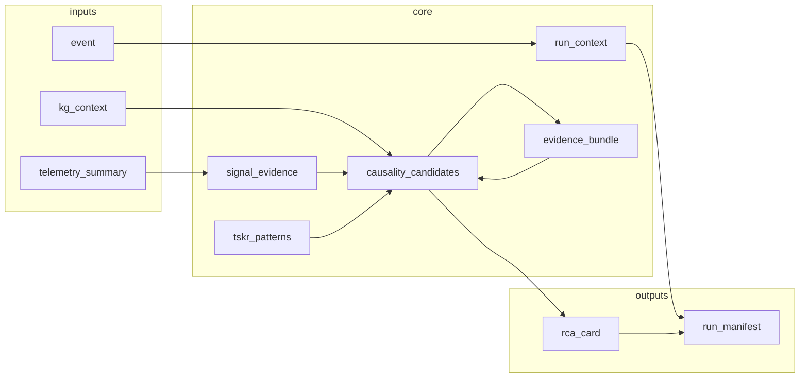

# Automated RCA Workflow — Reference Guide

**Date:** 2026-04-25  
**Audience:** Managers, system engineers, plant data analysts  
**Source materials:** `rca_metamodel.md` (causal categories A–L; **Pattern Recognition** questions), `orchestrators/rca_reasoning_orchestrator.py` (orchestrated run), `orchestrators/causality_engine_v32.py` (scoring and gates)  
**Show-and-tell tests:** `src/dackar/RCA/tests/show_and_tell_test_plan.md`, `test_case_1` … `test_case_7`

**SE-focused summary:** [§1.1 — Central elements](#11-central-elements-what-system-engineers-should-focus-on). **Appendices:** **A** — [Pattern recognition](#appendix-a--pattern-recognition-how-it-works-limitations-and-improvements); **B** — [LLMs in the pipeline](#appendix-b--large-language-models-roles-today-and-possible-futures); **C** — [Similar event search](#appendix-c--similar-event-search-in-the-rca-workflow); **D** — [Show-and-tell test index](#appendix-d--show-and-tell-test-case-index).

This document is **descriptive** (what the pipeline is and what it does). It does not argue for or against particular licensing or deployment choices.

---

## 0. Document Conventions and Code-Documentation Sync

<!-- @doc: rca_workflow_reference_guide | section:0 | @reviewed: 2026-04-25 -->

To keep this guide aligned with implementation over time, major sections are annotated with **HTML comments** (invisible in rendered Markdown) that a small script can parse:

- `<!-- @code: <path> | <class_or_fn> -->` — primary code anchor for the section
- `<!-- @schema: <path> -->` — JSON schema, when applicable
- `<!-- @status: implemented|partial|planned -->` — implementation state at last review
- `<!-- @reviewed: YYYY-MM-DD -->` — last time the section was verified against the repo

**Example** (as it appears in the source file, not the rendered view):

```html
<!-- @code: orchestrators/rca_reasoning_orchestrator.py | RCAReasoningOrchestrator.run -->
```

<!-- @code: diagrams/april_25/check_doc_code_sync.py | main -->

`check_doc_code_sync.py` in this folder (`diagrams/april_25/`) validates `@code` / `@schema` anchors against files under `src/dackar/RCA/`, checks that Python **symbols** exist in the target module (class, method, or `def`), and is safe to use on CI. **Run (from DACKAR repo root):** `python src/dackar/RCA/diagrams/april_25/check_doc_code_sync.py`, or from this directory: `python check_doc_code_sync.py` (optional: `--stale`, `--strict-warnings`). Bullets in the list above that use *placeholder* paths (not real `orchestrators/...` files) are **skipped** (not errors). Avoid putting additional `@code` HTML comments in the middle of a paragraph, or the checker will count them.

**AP-913** completeness and regulatory mapping are **out of scope** for this revision; they will be added when the product owner locks the surface area.

---

## 1. Problem, Purpose, and What the Pipeline Produces

<!-- @code: orchestrators/rca_reasoning_orchestrator.py | RCAReasoningOrchestrator -->

Large nuclear plants generate an enormous volume of time-stamped, multi-system evidence (telemetry, SOE, alarms, CR/WO text, configuration changes, vendor records). Manual root cause analysis under schedule pressure is vulnerable to well-known failure modes: fixation on a salient but non-causal signal, incomplete coverage of common-cause and programmatic contributors, and inconsistent use of plant history. An automated pipeline does not remove the need for a qualified analyst; it **constrains the hypothesis space**, **propagates evidence into scores and gates in a repeatable way**, and **surfaces data gaps and near-ties** in structured artifacts the organization can review.

**Purpose:** The DACKAR RCA pipeline ingests a controlled set of JSON artifacts, runs a deterministic and schema-validated sequence of processing stages, and produces a **result bundle** suitable for review: in particular `rca_card`, `run_manifest`, `causality_candidates` (and optionally `causality_candidates_pre_refine`), `evidence_bundle`, `tskr_patterns`, `ishikawa_matrix` (if enabled in config), `barrier_analysis`, `input_validation` / `output_validation`, and **`reentry_execution`** (reentry no-op or expanded pass; always present in the return dict). When CMMS is wired, **`cmms_context`** may be populated for documents and **past events**; **`similar_event_list`** is embedded in the **manifest** (not a top-level return key) and is built **before** synthesis. The analyst remains accountable for the final safety determination; the pipeline is an **investigative and documentation engine**, not a regulatory sign-off by itself. **Pattern recognition** (degradation trends, recurrence, CCF, signature-to–failure-mode match) is not a single named stage; it is distributed across `telemetry_summary`, `tskr_patterns`, the Allen map, the causality engine, and similar-event / lessons-learned artifacts — see **§2.3**, **Appendix A**, and the metamodel block *Pattern Recognition* in `rca_metamodel.md`.

### 1.1 Central elements (what system engineers should focus on)

These are the **capabilities and reasoning ingredients** the product is built around; they are where reviews, tuning, and integration work tend to land. For execution order, use **§2.2** and **§5**; for limits, use **§10** and the appendices.

| Central element | What it does in the product | Why it draws SE attention |
|-------------------|----------------------------|----------------------------|
| **Typed hypothesis space (KG)** | Components, FMs, applicability, and (when present) `past_events` bound what can be **ranked**; no free-text invention of FMs from tags alone. | Model **coverage**, **staleness**, and **scope of the graph** drive whether a plausible failure is even in the search set (**§3**, **5.2**). |
| **Multi-criteria scoring + gates** | `RuleBasedCausalityEngineV32` **generate** and **refine** combine **structural, temporal, telemetry, evidence, governance** sub-scores; **hard gates** (e.g. timeline, barrier, plausibility) can eliminate candidates. | **Weights, caps** (e.g. CCF, operating point), and **gate policy** are the main levers for plant acceptance (**§5.5**, **5.9**; `causality_engine_v32.py`). |
| **Pattern and temporal layer** | **TSKR** = FM-oriented temporal support; **Allen map** = event-wide signal order from telemetry, alarms, SOE; **refine** can blend Allen into composites when the engine allows. | Distinguishing **precursor vs response**, **recurrence quality**, and **out-of-initial-boundary** precursors (**§2.3**, **5.4**, **5.8**, **5.9**, **5.17**; **Appendix A**). |
| **Document evidence (retrieval)** | Chroma (or in-memory) **retrieval** raises the **evidence** dimension; **refine** re-scores; synthesizer **cites** snippets. | **Corpus, chunking, and query** shape whether operating experience is fairly represented (**§3**, **5.7**). |
| **Scope and investigation boundary** | **Approved scope** filters candidates (**5.6**); **expansion suggestions** and **`resolve_expansion_suggestion`** support analyst-led **re-runs** (**§7**). | Wrong **boundary** either hides a cause or over-expands the problem (**TC-7**). |
| **Similar events and OE** | **Plant** past events scored in-process; **fleet/industry** only if `SimilarEventAdapter` is set (**Appendix C**). | Ties **this event** to **organizational** memory; adapter quality dominates external OE. |
| **Barriers and protection** | `protection_logic_context` feeds **gates** and **barrier analysis**; PLC/SOE pairing is a data-quality theme. | **Safety-significant** story and **instrument / logic** line-up (**5.12**; **TC-2**, **TC-4**). |
| **PM, ops context, environment, vendor, training** | `pm_compliance` (incl. optional **auto-build**), `operational_context`, `environmental_monitoring`, `vendor_supply_chain_records`, `training_records` feed scores, coverage, and HP narrative. | **Programmatic** vs **one-off** failure, **CCF**, and **HFE** defensibility (**5.1**, **5.9**; **TC-5**, **TC-6**). |
| **Metamodel (A–L) and coverage** | Cards carry **metamodel** hooks; the pipeline runs **category coverage** attention. | **Regulatory and utility** narrative alignment (`rca_metamodel.md`, **4**, **5.14**). |
| **Ishikawa (6M-style) bucket** | Optional **keyword** bucketing of themes when `enable_ishikawa` and an evaluator are configured. | Cross-checks **process / program** vs **equipment** without replacing FM ranking (**5.11**). |
| **Synthesis and narrative** | **Structured** `rca_card` from **LLM** or **deterministic template**; deterministic **post** steps for safety routing and CCF block. | **Traceability of IDs** vs free text; governance of **LLM** use (**5.14**; **Appendix B**). |
| **Audit, replay, and operations** | `run_id` correlation; `run_manifest` with **data coverage**, **sensitivity**, **scope**, `signal_lessons_learned`, **workflow dispatch** hooks; **optional reentry** and **Chroma archive** policies. | **Repeatability**, **CI/CD**, and **IT** ownership of stores and strict policies (**5.10**, **5.16**, **5.18**). |

**Alignment check:** The table above is consistent with `RCAReasoningOrchestrator` dependencies (`orchestrators/rca_reasoning_orchestrator.py`: `cmms_adapter`, `similar_event_adapter`, `evidence_retriever`, `tskr_temporal_scorer`, `ishikawa_evaluator`, `causality_engine`, `rca_synthesizer`, `config.extra` flags) and the **V32** engine (`orchestrators/causality_engine_v32.py`, including **past event analogs** via `_build_past_event_candidates` inside **generate**).

---

## 2. Workflow at a Glance

<!-- @code: orchestrators/rca_reasoning_orchestrator.py | RCAReasoningOrchestrator.run -->

### 2.1 Input data inventory

The public entry point is `RCAReasoningOrchestrator.run(...)`; each parameter (except the always-required `event` and `telemetry_summary`) is optional and, when absent, is recorded in the run manifest with an appropriate “not assessed” or “missing” coverage status.

| `run()` parameter | Schema (typical) | Role in the pipeline |
|------------------|------------------|----------------------|
| `event` | `event.json` | Event identity, asset, time window, symptom text |
| `telemetry_summary` | `telemetry_summary.json` | Anomaly features per tag; feeds scoring and TSKR |
| `operational_context` | `operational_context.json` | Mode, power, recent ops — feeds operating-point and context scoring |
| `pm_compliance` | `pm_compliance.json` | PM/inspection status — supports degradation and program-gap hypotheses |
| `kg_context` | `kg_context.json` | Components, failure modes, past events — **hypothesis space** (see §3) |
| `signal_evidence` | (built if omitted) | Aggregated per-signal structure used by scoping and similar-event logic |
| `tskr_patterns` | `tskr_patterns.json` or built | Allen-adjacent temporal support for failure modes |
| `causality_candidates` | (built if omitted) | **Engine output**; usually produced by `RuleBasedCausalityEngineV32` |
| `evidence_bundle` | `evidence_bundle.json` or Chroma | Retrieved document snippets — **refinement and synthesis** (see §3) |
| `soe_log` | `soe_log.json` | SOE for timeline / pairing checks |
| `alarm_log` | `alarm_log.json` | Alarms; feeds timeline and coverage |
| `protection_logic_context` | `protection_logic_context.json` | PLC / barrier state — **barrier logic gate**; also SOE/PLC pairing |
| `configuration_change_records` | `configuration_change_records.json` | Change control / WO linkage |
| `environmental_monitoring` | `environmental_monitoring.json` | Ambient and environmental context |
| `vendor_supply_chain_records` | `vendor_supply_chain_records.json` | Lot, vendor, advisory linkage — **CCF (Category C) structural delta** |
| `training_records` | `training_records.json` | Human performance assessment inputs |

**Show-and-tell cross-reference (breadth of inputs):** `show_and_tell_test_plan.md` — *Input Data Element Coverage Matrix*.

### 2.2 High-level reasoning process

End-to-end flow (order matches `RCAReasoningOrchestrator.run`; `kg_governance` is computed in **2** and may be **refreshed** after reentry; see **§5.10**):

1. **Validate, optional auto-PM, `run_context`, input guards** (§5.1).  
2. **Build/load `kg_context`**, **KG governance**, **optional CMMS** augmentation, **enrich** `past_events` for temporal search (§5.2).  
3. **`signal_evidence`** (§5.3).  
4. **`tskr_patterns`** (§5.4). *Pattern content from telemetry/TSKR **feeds** `generate` (next step). The **event-wide** Allen map is **not** built until **after** the first evidence bundle is available; see **8** and §2.3.*  
5. **`causality_engine.generate`** (§5.5).  
6. **Scope boundary** filter if an **approved** investigation boundary exists (§5.6).  
7. **Retrieve** `evidence_bundle` (or accept pre-built) (§5.7).  
8. **`_build_allen_relation_map`**, then **`refine_with_evidence`** (when the engine implements it) (§5.8–5.9).  
9. **Reentry** (optional) (§5.10).  
10. **Ishikawa** (if `enable_ishikawa`), **barrier analysis**, **`similar_event_list`** (§5.11–5.13).  
11. **`rca_synthesizer.synthesize`**, then **attention** patches on the card (§5.14).  
12. **Output validation** (§5.15).  
13. **Chroma archive** (Stage I, when enabled) (§5.16).  
14. **Scope expansion** signal detection and injection (§5.17).  
15. **`run_manifest` finalization** (incl. `signal_lessons_learned`, pre-computed Allen + similar list); **workflow dispatch** merge; **persist** `run_manifest` (§5.18).  
16. **Return** dict to the caller; **`run_status` artifact** updated to `run_complete: True` in the **artifact store** (not a key on the return dict). Optional **Chroma hard-abort** `RuntimeError` if strict archive policy fails **after** the manifest save (see `run` tail).*

Mermaid (logical **only**; not the full `run()` branch order, see list above and **§5**):



### 2.3 Pattern recognition (metamodel alignment)

`rca_metamodel.md` groups four **pattern recognition** questions. Below: what each means for an SE, and where it is implemented in this codebase (not a separate `PatternRecognition` class — **cross-cutting behavior**).

| Metamodel question | Pipeline mechanism | Primary artifacts / code |
|--------------------|--------------------|-------------------------|
| **Degradation trend and timescale** | Per-tag **anomaly types and windows** in `telemetry_summary` (e.g. `gradual_drift`, `sustained_exceedance`, `step_rise`); TSKR **duration / lag** fields on patterns; **Allen** relations from SOE/alarm/telemetry in `_build_allen_relation_map` | `telemetry_summary`, `tskr_patterns` (§5.4), `pre_refine_allen_map` (§5.8); feeds **5.5** scoring and **5.8** / **5.9** |
| **First occurrence vs recurrence; prior CA effectiveness** | **Past event** nodes in `kg_context`; **event analog** pool from **`causality_engine_v32`**: `_build_past_event_candidates` (inside `generate`); **similar event list** pre-synthesis; optional **fleet/adapter** | `kg_context.past_events`, `causality_candidates` (analog pool), `similar_event_list` (§5.13), **§2.5** |
| **Common cause across trains/components** | **Category C** in FM metadata; `common_cause_score` and **structural CCF delta** in `causality_engine_v32`; **vendor / lot** records | `kg_context` CCF structure, `vendor_supply_chain_records`, **TC-5** |
| **Anomaly signature vs known failure mode** | **Symptom** match to FM and event text; **telemetry** sub-score; **structural** component↔FM binding from KG | `RuleBasedCausalityEngineV32` generate/refine, **§5.5** / **§5.9** |

**`signal_lessons_learned` (Step 3.5 in backlog):** During `_stage_g_finalize_manifest`, the orchestrator calls `_build_signal_lessons_learned` to derive a compact artifact from `tskr_patterns` (e.g. novel-pattern flags, match counts) — it **summarizes** temporal pattern content for the manifest, not a second independent model.

**Show-and-tell:** **TC-3** / **TC-4** (trend + sequence), **TC-5** (identical pattern across trains), **TC-7** (precursor **outside** initial scope on Allen/TSKR side). **Appendix A** expands how each metamodel *pattern* class is realized, with limitations and improvement directions.

### 2.4 Analyst interaction points

| Interaction | When | Typical mechanism |
|-------------|------|-------------------|
| **Scope** | A signal or FM sits outside the current investigation boundary | `run_context.scope_management` — expansion suggestions; analyst accepts/rejects; re-run with `active_scope_version > 0` | See **TC-7** |
| **SOE/PLC consistency** | SOE present but protection logic absent (pairing “violated”) | `analyst_decisions_required` in manifest; supply `protection_logic_context` | **TC-2** (bonus cell) |
| **Data backfill** | Sensitivity table flags a source that could change ranking | Re-run with additional JSON inputs | **TC-3**, **TC-7** (missing SOE/alarm) |
| **Final sign-off** | Synthesizer and validator pass but human review still required | `run_manifest.review_hooks` (e.g. `requires_human_review`) | **TC-1** |

`resolve_expansion_suggestion` (or equivalent) on the orchestrator, if present, is the programmatic hook between Run 1 and Run 2 in scope demos — see `run_test_case_7.ipynb` for the development note on API alignment. **Appendix C** documents how similar events are *searched* and scored in code (plant tier, optional fleet/industry).

### 2.5 Fleet, plant, and industry OE (similar events)

<!-- @code: orchestrators/rca_reasoning_orchestrator.py | _build_similar_event_list -->

The orchestrator’s **`_build_similar_event_list`** (called before `rca_synthesizer.synthesize`) assembles a **plant-local** list primarily from `kg_context` past events (IDs, text, optional similarity fields). A **`SimilarEventAdapter`** may be installed via `set_similar_event_adapter` to attach **fleet or industry** retrieval (NPRDS-style databases, INPO/owner-group SOER digests, etc.) as an extension point; behavior depends on the adapter implementation in deployment.

| Layer | Default behavior | Extension |
|-------|------------------|-----------|
| **Plant** | `past_events` inside `kg_context.json` | Always available when the KG neighborhood includes history |
| **Fleet / OE** | None unless an adapter is wired | Injected adapter returns additional rows for the manifest and card |

**Show-and-tell cross-reference:** past-event match and `any_plant_match` are exercised in **TC-7** (and TC-3 where applicable).

---

## 3. Data Structures: Knowledge Graph (Neo4j) and Chroma (Vector Store)

The pipeline uses two different persistence **paradigms**: a **graph** for structured equipment and failure-mode relationships, and a **vector store** for **unstructured** document retrieval. They are not interchangeable.

### 3.1 Knowledge Graph (Neo4j) — production intent

<!-- @code: (deployment) kg query layer | @status: environment-specific -->

**Role:** The KG is the **typed hypothesis space**. Nodes typically represent **components**, **systems**, and **failure modes**; edges represent **applicability** (“this FM is attached to this component”) and, where modeled, support relationships. The causality engine does not invent failure modes in free form from raw tags alone; it **binds** candidates to `failure_mode_id` and `component_id` records that came from the graph (or from an equivalent pre-built `kg_context` JSON snapshot).

| Aspect | Description |
|--------|-------------|
| **Input to pipeline** | `kg_context` — often the serialized result of a Cypher (or similar) query scoped to the event asset and time window |
| **Consumed by** | `RuleBasedCausalityEngineV32.generate`, Ishikawa evaluator, similar-event building, scope boundary checks |
| **What it is not** | A full RCM database for every possible document; that lives in CMMS/EDMS, with optional document refs on KG nodes |

**Show-and-tell cross-reference:** Every test case with `kg_context.json` demonstrates loading a “KG slice” for one event.

#### 3.1a Offline / test path (clearly separated)

When `kg_context` is **passed in full** to `run()`, the orchestrator **does not** call the live `kg_context_builder.build(...)`. The show-and-tell helper uses a no-op builder so Neo4j is not required:

```text
# @code: tests/shared/run_helpers.py | _StubKGContextBuilder
```

`test_case_1` can alternatively use `build_dev_orchestrator` with a real **Py2Neo** client; that path is for integration-style runs, not the default for CI-style notebooks.

### 3.2 Chroma (vector store) — production intent

<!-- @code: orchestrators/evidence_retriever.py | ChromaEvidenceRetriever -->

**Role:** Chroma (or a compatible store implementing the `EvidenceStore` protocol) holds **pre-indexed** document chunks. During **evidence retrieval**, the `ChromaEvidenceRetriever` issues **queries** (often per candidate, derived from failure mode text and event context) and returns a ranked list of chunks. Those become `evidence_bundle["results"]` (or merge into the bundle structure the validator expects), feeding:

- `refine_with_evidence` on the causality engine (score adjustments, confidence),
- the RCA **synthesizer** (citations, narrative),
- and optional attention flags on the card.

| Aspect | Description |
|--------|-------------|
| **Query side** | `query_text` + optional metadata filters (asset, system, doc type) |
| **Embedding** | Pluggable `encode()` on a sentence encoder (see `EvidenceRetrieverConfig` in code) |
| **Output** | Snippets with `doc_id`, section, relevance metadata |

**Show-and-tell cross-reference:** Any case with a rich `evidence_bundle.json` (e.g. **TC-4**, **TC-5**, **TC-6**) shows the shape of pre-retrieved evidence; live Chroma is not required for those runs.

#### 3.2a Offline / test path (clearly separated)

For fixture-only and notebook runs without a Chroma service:

- **`InMemoryEvidenceStore`** is constructed inside `ChromaEvidenceRetriever` in `build_fixture_orchestrator` and populated only if the test loads documents into the store; in most show-and-tell cases the **`evidence_bundle` is pre-supplied**, so the retriever’s live query path is **skipped** (`if evidence_bundle is None: retrieve(...)`).

```text
# @code: tests/shared/run_helpers.py | build_fixture_orchestrator
# @code: orchestrators/llm_clients.py | DummyLLMClient  (synthesizer falls back to rules)
```

### 3.3 How KG and Chroma interact

- **KG** answers: *Which failure modes are even on the table for this component and this plant context?*  
- **Chroma** answers: *What did prior CRs, procedures, and vendor text say that bears on this candidate?*  
- **Together** they support **structural** (graph + symptoms) and **evidence** (retrieval) dimensions of the composite score, plus post-refine gates. Neither replaces physical inspection, thermal imaging, or metallurgy.

---

## 4. Causal Taxonomy (Categories A–L) — Reference Table

**Authoritative detail:** `diagrams/april_25/rca_metamodel.md`. This table is a **one-screen** index for SEs; category boundaries (especially G vs I) are defined there.

| Cat | Name (short) | What it captures | Example driver data |
|-----|----------------|------------------|---------------------|
| A | Equipment-internal | Intrinsic degradation of the component | Telemetry, FMEA FM nodes |
| B | Support unavailable | Required support system degraded | Ancillary system tags, KG links |
| C | Upstream / common cause | Inlet/window/lot common-mode | Vendor records, `kg_context` CCF, **TC-5** |
| D | Downstream | Discharge / backpressure / demand | Process topology, telemetry |
| E | Mission / demand | Off-design or transient operation | `operational_context` |
| F | External hazard | Environmental / EMI / external event | `environmental_monitoring`, evidence |
| G | Human execution | Error vs procedure | WO text, `training_records` (qualification, not root) — **TC-6** |
| H | Design deficiency | Inadequate design for duty | Design docs, evidence |
| I | Config / change control | Baseline wrong even if work “as directed” | `configuration_change_records` — **TC-6** (procedure gap) |
| J | Inspection / test gap | Program couldn’t see the failure | PM program structure |
| K | Supply chain / OEM | Part / lot / certification | `vendor_supply_chain_records` |
| L | Organizational / OE | Systemic, recurrence, cap program | OE, prior CR effectiveness |

**Show-and-tell cross-reference:** metamodel compliance and category coverage are exercised across **TC-2**–**TC-7**; **TC-1** is hypothesis-light by design.

---

## 5. Workflow Steps in Detail (System Engineer View)

<!-- @code: orchestrators/rca_reasoning_orchestrator.py | RCAReasoningOrchestrator.run -->

Subsections **5.1–5.18** follow the **exact execution order** inside `RCAReasoningOrchestrator.run`. Nothing is merged: if a block exists in code, it has its own subsection so you can map failures, logs, and artifacts to a single stage.

**Backlog cross-walk** (`rca_workflow_development_backlog_april_25.md` — conceptual “Step 0–6”):

| Backlog (concept) | §5 subsections |
|-------------------|----------------|
| Step 0 — Scoping | **5.1** (initial scope revision in `run_context`), **5.6** (approved boundary filter), **5.17** (post-hoc expansion suggestions) |
| Step 1 — Data | **5.1** (guards), **5.7**–**5.9** (evidence + coverage) |
| Step 2 — KG | **5.2** |
| **Metamodel: Pattern recognition** (see `rca_metamodel.md`, **§2.3** here) | **5.3** (per-signal / historian), **5.4** (TSKR patterns), **5.5** (symptom–FM and CCF match), **5.8** (Allen order), **5.13** (recurrence), **`signal_lessons_learned` inside 5.18** / manifest |
| Step 2c / temporal / Allen | **5.4** (TSKR), **5.8** (Allen map — distinct stage in `run`) |
| Step 3.5 — Signal pattern summary | **`signal_lessons_learned`** from `tskr_patterns` in **`_stage_g_finalize_manifest`** (§**5.18**), not a separate `run()` block |
| Step 4 / 5 — Candidates + evidence | **5.5**, **5.7**–**5.9** |
| Step 6 — Conclusion | **5.11**–**5.14** |

**Verification against code:** `RCAReasoningOrchestrator.run` (`orchestrators/rca_reasoning_orchestrator.py`) executes substeps in the same order as **5.1** → **5.18**: validate / run context; KG + CMMS + past-event enrichment; `signal_evidence`; `tskr_patterns`; `causality_engine.generate`; scope filter; `evidence` retrieval; Allen map; `refine_with_evidence` (if implemented); reentry; Ishikawa; barrier; similar-event list; `rca_synthesizer.synthesize` + card attention patches; output validation; Chroma archive; scope expansion signals; `run_manifest` finalization; workflow-dispatch transport merge; return bundle. (Workflow **dispatch** is built and executed *after* `_stage_g_finalize_manifest` returns, then merged into the manifest before the final `run_manifest` save — see **5.18**.) Gaps: if a new block is added to `run()` without a new §5 subsection, treat the mapping as **stale** until the guide is updated.

**Appendix cross-reference:** **A** — pattern-recognition mechanisms; **B** — LLM vs deterministic paths; **C** — similar-event query and tiers.

Each subsection uses the same template: **role**, **operation**, **inputs**, **processing**, **outputs**, **pseudocode**, **parameters / thresholds**, **SE notes** (dependencies, failure modes), **test case**.

---

### 5.1 — `run_id`, optional PM build, input validation, run context, input guards

**Role** Initialize the run, prove inputs are structurally valid, and freeze **investigation identity** (`run_id`, `run_label`, initial scope revision at version 0).

**Operation** A `run_status` stub is written first. If `pm_compliance` is absent, the orchestrator calls `_build_pm_compliance_if_needed(event, operational_context, kg_context)` **before** §5.2: the `kg_context` argument is whatever the **caller** passed to `run()` (often `None` until the builder runs next). If you pass a pre-built `kg_context` into `run()` up front, the PM auto-build can use it; otherwise it relies on `operational_context` export rows (`pm_export_rows` / `pm_rows` / etc.) per `_extract_pm_export_rows`. Modes: `config.extra["pm_compliance_build_mode"]` (`auto`, `off`, `force`); `pm_compliance_look_back_window_days` (default **730**), optional `pm_compliance_primary_fm_id`. `pm_compliance` is validated with `optional=True` so failures accrue in `optional_artifact_failures` instead of aborting. `_validate_bundle(stage="inputs", …)` populates `input_validation`. `build_input_guards` produces a guard structure (cross-checks: event vs telemetry `asset_id`, and related consistency rules). `_stage_a_build_run_context` creates the canonical `run_context` **including** `scope_management` with `active_scope_version: 0`, a first `scope_revisions[0]` record from `_build_initial_scope_revision_record` (systems from `operational_context.recent_alarms` and `alarm_log`; components from `soe_log` and optional CMMS when present). `input_guards` are attached. `_enforce_input_guard_policy` can stop or flag the run per policy. `run_context["pipeline_runtime"]["pm_compliance"]` records the synthetic PM build metadata when PM was auto-generated.

**Inputs** `event`, `telemetry_summary`, `operational_context?`, `soe_log?`, `alarm_log?`, `protection_logic_context?`, `configuration_change_records?` (as passed to `_stage_a_build_run_context`).

**Outputs** `input_validation` dict; `run_context` persisted; `input_guards` on `run_context`.

**Pseudocode**

```python
run_id = str(uuid.uuid4())
artifact_store.save(run_id, "run_status", {..., "run_complete": False})
if pm_compliance is None:
    pm_compliance, pm_compliance_build = _build_pm_compliance_if_needed(
        event, operational_context, kg_context  # kg may still be user-supplied
    )
# validate pm optional
input_validation = _validate_bundle(run_id, stage="inputs", event, telemetry, op_ctx, pm)
input_guards = build_input_guards(event, telemetry, op_ctx, pm)
run_context = _stage_a_build_run_context(
    run_id, event, telemetry, op_ctx, pm, input_validation, input_guards,
    soe_log=soe_log, alarm_log=alarm_log,
    protection_logic_context=protection_logic_context,
    configuration_change_records=configuration_change_records,
)
run_context["pipeline_runtime"]["pm_compliance"] = pm_compliance_build
artifact_store.save(run_id, "run_context", run_context)
_enforce_input_guard_policy(run_id, run_context, input_guards)
```

**Parameters** `RCAArtifactValidator` mode (`compat` vs strict) from `OrchestratorConfig`; `stop_on_validation_error`.

**SE notes** Required artifacts must pass validation; optional ones fill `optional_artifact_failures`. The **initial** scope is not a filter on candidates until an analyst approves a later revision — see **5.6** and **5.17**.

**Test case** **TC-1**; any case with `operational_context` + alarms populates `systems_in_scope` in the first scope revision.

---

### 5.2 — Knowledge graph context: build, validate, govern, optional CMMS, past-event enrichment

**Role** Materialize the **hypothesis space** (components, failure modes, past events) that all downstream scoring will reference.

**Operation** If `kg_context` is `None`, `kg_context_builder.build(...)` runs (live Neo4j or deployment-specific builder). The artifact is validated and persisted. `kg_governance = _compute_kg_governance` runs; `_enforce_kg_governance_policy` may **abort** a red run depending on `OrchestratorConfig.extra` (e.g. `hard_abort_on_kg_red_state`). If `cmms_adapter` is set, `build_cmms_context` fetches event-scoped CR/WO, then `_augment_kg_context_with_cmms_documents` and `_augment_kg_context_with_cmms_past_events` **rewrite** `kg_context`; re-validate. `_enrich_past_events_temporal_metadata` normalizes time relationships for later temporal reasoning.

**Inputs** `event`, `telemetry_summary`, `operational_context?`, `pm_compliance?`, `run_context`.

**Outputs** `kg_context` (final for the rest of the run); optional `cmms_context`; `kg_governance` state used later for attention flags.

**Pseudocode**

```python
if kg_context is None:
    kg_context = kg_context_builder.build(
        event, telemetry, op_ctx, pm, run_context
    )
validate_and_persist(run_id, "kg_context", kg_context)
kg_governance = _compute_kg_governance(event, kg_context)
_enforce_kg_governance_policy(run_id, kg_governance)
if self.cmms_adapter is not None:
    try:
        cmms_context = build_cmms_context(run_id, event, kg_context)
        kg_context = _augment_kg_context_with_cmms_documents(kg_context, cmms_context)
        kg_context = _augment_kg_context_with_cmms_past_events(kg_context, cmms_context, event)
        validate_and_persist(run_id, "kg_context", kg_context)
    except Exception:
        LOGGER.error(...);  # continues without CMMS
kg_context = _enrich_past_events_temporal_metadata(kg_context, event)
```

**Parameters** Governance policy flags in `config.extra` on the orchestrator.

**SE notes** Show-and-tell tests pass **pre-built** `kg_context` and a **stub** builder to avoid live Neo4j. CMMS is **optional**; builds log and continue on failure.

**Test case** **TC-2**–**TC-7** (fixture KG); **TC-5** (CCF and vendor in KG).

---

### 5.3 — `signal_evidence` assembly

**Role** Create a **unified, run-scoped** view of per-signal evidence (trends, historian hooks, tag linkage) that downstream **attention flags** and **out-of-boundary** checks consume.

**Operation** If `signal_evidence` is `None`, `_build_signal_evidence` uses `SignalEvidenceBuilder` with a historian **adapter** from `_resolve_signal_evidence_historian_policy` and **optional** `neo4j_client` / `neo4j_database` from the **same** `kg_context_builder` instance (so live runs can join signal tags to graph entities when available). Result is validated and persisted.

**Pattern recognition (§2.3):** this stage materializes **per-signal** context (historian-backed where configured) so downstream steps do not treat `telemetry_summary` as an unstructured blob. It supports the metamodel questions on *which* signals anomalized and *how* they relate to components.

**Inputs** `event`, `telemetry_summary`, `kg_context`, `run_id`.

**Outputs** `signal_evidence` JSON.

**Pseudocode**

```python
if signal_evidence is None:
    signal_evidence = _build_signal_evidence(
        run_id=run_id, event=event, telemetry_summary=telemetry_summary, kg_context=kg_context
    )
validate_and_persist(run_id, "signal_evidence", signal_evidence)
```

**Parameters** Historian policy is internal to `_resolve_signal_evidence_historian_policy`.

**SE notes** In fixture-only mode, the builder may produce a minimal structure from `telemetry_summary` + KG; absence of a historian is **not** a schema failure if the build succeeds.

**Test case** **TC-3**, **TC-4** (rich telemetry + KG).

---

### 5.4 — TSKR temporal patterns (`tskr_patterns`)

**Role** Attach **per–failure-mode / per–component** temporal support (relations, confidence, support) used in `RuleBasedCausalityEngineV32` scoring and in recurrence-quality flags.

**Operation** If `tskr_patterns` is `None`, `_build_tskr_patterns` calls `tskr_temporal_scorer.score(...)` with `event`, `telemetry_summary`, `kg_context`, `operational_context`, `run_context`, `signal_evidence`, and (if the scorer’s signature accepts them) `alarm_log` and `soe_log`. If `self.tskr_temporal_scorer` is `None`, a **synthetic** empty pattern set is returned with `summary.mode: "absent"`. Before scoring, `_apply_tskr_runtime_overrides` can set `simultaneous_epsilon_hours` on the scorer from `config.extra["tskr_simultaneous_epsilon_hours"]`.

**Pattern recognition (§2.3):** TSKR is the primary **engineered output** of temporal **pattern** mining: per-pattern support, confidence, and relation to failure modes / components. It directly addresses *degradation / sequence over time* and *signature vs known FM* when combined with **5.5**.

**Inputs** `event`, `telemetry_summary`, `kg_context`, `operational_context?`, `run_context`, `signal_evidence?`, `alarm_log?`, `soe_log?`.

**Outputs** `tskr_patterns` (validated, persisted). Runtime snapshot is available via `_tskr_runtime_snapshot` for the manifest in some builds.

**Pseudocode**

```python
if tskr_patterns is None:
    tskr_patterns = _build_tskr_patterns(
        event=event, telemetry_summary=telemetry_summary, kg_context=kg_context,
        operational_context=op_ctx, run_context=run_context,
        signal_evidence=signal_evidence, alarm_log=alarm_log, soe_log=soe_log,
    )
validate_and_persist(run_id, "tskr_patterns", tskr_patterns)
```

**Parameters** `tskr_simultaneous_epsilon_hours` (float, hours) when present in `OrchestratorConfig.extra`; scorer-specific `simultaneous_epsilon_hours`, `min_confidence_for_support` (surfaced in `_tskr_runtime_snapshot`).

**SE notes** Causality engine’s `temporal_window_days_cap` (default 3650) applies in **scoring**, not in TSKR build — both matter for different reasons.

**Test case** **TC-2**, **TC-7** (`tskr_patterns.json` fixtures).

---

### 5.5 — Causality engine: `generate` (FM pool + event analogs, pre-refine scores)

**Role** **First** full pass of hypothesis ranking: structural + temporal + telemetry + (initial) evidence + governance, hard gates, threshold + `top_k` retention for the **FM pool**; **separate** threshold-only pool for **past-event analogs** (they never displace FMs in the ranked slots).

**Operation** `causality_engine.generate(...)` in `orchestrators/causality_engine_v32.py`. Each FM candidate gets composite scores, `meets_evidence_threshold`, `hard_gates` (timeline, barrier, plausibility), and optional chain/category metadata. FMs are sorted by `composite_score` then `candidate_id`; `passed_threshold` list is trimmed to `config.top_k_candidates`. Failed candidates go to a compact filtered list with reason. **This stage does not** read the `evidence_bundle` from Chroma if you passed `causality_candidates` in from outside — the engine’s internal “evidence” dimension may still be low until **5.9**.

**Pattern recognition (§2.3):** **structural** (KG topology), **temporal** (TSKR + event time), **telemetry** (symptom fit), and **governance** blend into `composite_score`; event analogs implement **recurrence** comparison; **Category C** + vendor-side **common_cause** inputs implement **CCF** pattern recognition before document retrieval.

**Inputs** `event`, `telemetry_summary`, `kg_context`, `tskr_patterns`, `operational_context?`, `pm_compliance?`, `run_context`.

**Outputs** `causality_candidates` (dict with `candidates` list, screening metadata, `scoring_config` echo).

**Pseudocode**

```python
if causality_candidates is None:
    causality_candidates = self.causality_engine.generate(
        event, telemetry, kg_context, tskr_patterns, op_context, pm, run_context
    )
validate_and_persist(run_id, "causality_candidates", causality_candidates)
```

**Key thresholds (defaults, `CausalityEngineConfigV32`)**  

| Name | Default | Meaning |
|------|---------|---------|
| `weights` | 0.30/0.20/0.20/0.20/0.10 (structural/temporal/telemetry/evidence/gov) | Weighted sum → composite (before any refine) |
| `minimum_composite_threshold` | 0.30 | Floor on composite to retain a candidate (with evidence flag — see engine) |
| `minimum_pre_evidence_threshold` | 0.10 | Initial evidence sub-score threshold for `meets_evidence_threshold` |
| `top_k_candidates` | 10 | Max FM rows **after** threshold pass |
| `CCF_DELTA_CAP` (code constant) | 0.10 | Scales CCF `common_cause_score` for category **C** into structural sub-score |
| `OP_DELTA_CAP` (code constant) | 0.12 | Scales operating-point score (category **E** modifier) |

**SE notes** Ingesting a **pre-built** `causality_candidates.json` (TC-1 style) **skips** the engine entirely — use only for harness tests. Normal operation lets the engine run.

**Test case** **TC-4** (gates on NI vs CRD), **TC-5** (CCF), **TC-6** (competing FMs).

---

### 5.6 — Scope boundary filter (post-`generate`, pre-evidence in `run` order)

**Role** If an investigation has **approved** a non-zero scope version, **remove** (rule out) candidates whose `component_id` is outside the approved component set so downstream evidence and the card do not treat them as active hypotheses.

**Operation** `_resolve_approved_scope_boundary(run_context)` returns a boundary or `None`. If present, `_apply_scope_boundary_filter` moves non-matching candidates to a ruled-out structure and sets `causality_candidates["scope_filter_filtered_count"]` and related fields. `run_context["pipeline_runtime"]["scope_filter"]` records `applied`, `approved_scope_version`, `filtered_count`, `filtered_component_ids`. If no boundary, `scope_filter.applied` is `False` and version stays `0`.

**Inputs** `causality_candidates`, `run_context` (`scope_management`, `active_scope_version`).

**Outputs** Filtered `causality_candidates`; updated `run_context` pipeline runtime.

**Pseudocode**

```python
_scope_boundary = _resolve_approved_scope_boundary(run_context)
if _scope_boundary is not None:
    _scope_version = int((run_context.get("scope_management") or {}).get("active_scope_version") or 1)
    causality_candidates = _apply_scope_boundary_filter(causality_candidates, _scope_boundary, _scope_version)
    run_context["pipeline_runtime"]["scope_filter"] = {..., "applied": True, ...}
else:
    run_context["pipeline_runtime"]["scope_filter"] = {..., "applied": False, ...}
validate_and_persist(run_id, "causality_candidates", causality_candidates)
```

**Parameters** None (logic is in helpers); driven entirely by `run_context`.

**SE notes** First run in discovery is usually **5.5 without** a boundary; after analyst accepts expansion and re-injects `run_context` with version ≥ 1, **re-run** hits **5.6** and filters. **TC-7**.

**Test case** **TC-7**

---

### 5.7 — Evidence retrieval (Chroma path)

**Role** If no **pre-computed** evidence bundle was supplied, retrieve **relevant text chunks** for the current candidate set to populate the `evidence` score dimension and the synthesizer’s citations.

**Operation** `if evidence_bundle is None: self.evidence_retriever.retrieve(event, kg_context, causality_candidates, operational_context, run_context)` — implemented by `ChromaEvidenceRetriever` + vector store. Persisted. If `evidence_bundle` was already provided, this stage is a **no-op** (typical in fixture-driven tests).

**Inputs** `event`, `kg_context`, `causality_candidates` (possibly scope-filtered), `operational_context?`, `run_context`.

**Outputs** `evidence_bundle` dict with `results` (and schema-aligned fields).

**Pseudocode**

```python
if evidence_bundle is None:
    evidence_bundle = self.evidence_retriever.retrieve(
        event, kg_context, causality_candidates, op_ctx, run_context
    )
validate_and_persist(run_id, "evidence_bundle", evidence_bundle)
```

**Parameters** `OrchestratorConfig.top_k_evidence` and retriever’s `EvidenceRetrieverConfig` (`top_k_total`, `top_k_per_query` in `build_fixture_orchestrator`).

**SE notes** See §3 for production Chroma vs `InMemoryEvidenceStore` in tests. Pre-supplied `evidence_bundle` **bypasses** all retrieval I/O.

**Test case** **TC-2**–**TC-6** (fixture bundles)

---

### 5.8 — Allen relation map (single shared object)

**Role** One **pre-refine** map from telemetry + `alarm_log` + `soe_log` that is reused for: (1) `refine_with_evidence` composite blending, (2) later **scope expansion** signal detection, (3) manifest packaging — **not rebuilt** downstream.

**Operation** `pre_refine_allen_map = _build_allen_relation_map(event, telemetry_summary, alarm_log, soe_log)` immediately **after** evidence is available (or supplied). The map is not persisted as its own top-level return key; it is threaded into `refine_with_evidence` and `_stage_g_finalize_manifest` as `pre_computed_allen_map` / `pre_computed_...`.

**Pattern recognition (§2.3):** **ordering** and interval relations between signals and events (precursor vs response, **cause vs consequence**) at the *whole-event* level — complementary to TSKR’s **FM-anchored** patterns.

**Inputs** `event`, `telemetry_summary`, `alarm_log?`, `soe_log?`.

**Outputs** In-memory `pre_refine_allen_map` (and passed forward).

**Pseudocode**

```python
pre_refine_allen_map = _build_allen_relation_map(
    event=event, telemetry_summary=telemetry_summary, alarm_log=alarm_log, soe_log=soe_log
)
```

**Parameters** None fixed in orchestrator; relation logic is internal.

**SE notes** This is **not** the same object as TSKR patterns: Allen map is **event-wide** signal–signal timing; TSKR is **FM-aligned** support from the external scorer. **TC-4** (timeline) depends on both SOE + consistent timestamps in fixtures.

**Test case** **TC-4**; **TC-7** (precursor outside scope on Allen/TSKR side)

---

### 5.9 — `refine_with_evidence` and pre-refine snapshot

**Role** **Second** pass on the candidate list: re-score with retrieved evidence, **data coverage** posture, and Allen-based blending; re-run **hard gates**; optionally persist `causality_candidates_pre_refine` for **diffs** and reentry.

**Operation** If `self.causality_engine` has `refine_with_evidence`: deep-copy current candidates to `causality_candidates_pre_refine` when `persist_intermediate_artifacts` or validation is enabled. `coverage_summary_for_refine = _build_data_coverage_summary(...)` includes `kg`, `tskr`, `evidence`, `candidates`, `run_context`, `environmental_monitoring`, `vendor_supply_chain_records`, `training_records`. The orchestrator **introspects** the engine’s method signature and passes `coverage_summary`, `allen_relation_map`, and `protection_logic_context` only if supported. Refined `causality_candidates` replace the in-run variable and are persisted. If the engine has no `refine_with_evidence`, this block is skipped.

**Inputs** `causality_candidates`, `evidence_bundle`, `signal_evidence`, `pre_refine_allen_map`, `protection_logic_context?`, `environmental_monitoring?`, `vendor_supply_chain_records?`, `training_records?`, `run_context`, plus the coverage inputs above.

**Outputs** Refined `causality_candidates`; optional `causality_candidates_pre_refine` + validation sidecars on disk.

**Pseudocode**

```python
if hasattr(causality_engine, "refine_with_evidence"):
    causality_candidates_pre_refine = copy.deepcopy(causality_candidates)
    coverage_summary = _build_data_coverage_summary(
        kg, tskr, evidence_bundle, candidates, run_context,
        environmental_monitoring, vendor_supply_chain, training_records,
    )
    refine_kwargs = {..., "causality_candidates", "evidence_bundle", "signal_evidence"}
    # add coverage_summary, allen_relation_map, protection_logic_context if signature allows
    causality_candidates = causality_engine.refine_with_evidence(**refine_kwargs)
    validate_and_persist(run_id, "causality_candidates", causality_candidates)
```

**Parameters** Same threshold family as **5.5** for post-refine re-screening inside the engine; `config.persist_intermediate_artifacts`.

**SE notes** `causality_candidates_pre_refine` is what **reentry** and **rank inversion** attention compare against.

**Test case** **TC-2** (PLC in refine), **TC-5** (vendor in coverage + refine)

---

### 5.10 — Auto reentry

**Role** Optional **second iteration** of context/candidates when the `_compute_reentry_hook` heuristics say the KG or candidate set should be **expanded** (e.g. low confidence with fixable context).

**Operation** `_run_auto_reentry_if_needed(...)`. Controlled by `config.extra["enable_auto_reentry"]` (orchestrator default in code: **true**; **false** in `build_fixture_orchestrator` in `tests/shared/run_helpers.py`) and `auto_reentry_max_attempts` (default 1). If disabled, or no pre-refine snapshot, or hook says do not reenter, returns a no-op `reentry_execution` dict with `attempt_count: 0`. Otherwise may re-invoke **parts** of the pipeline (implementation inside `_run_auto_reentry_if_needed` — re-read the method when debugging live behavior).

**Inputs** `causality_candidates_pre_refine?`, `causality_candidates` (post-refine), `evidence_bundle`, `kg_context`, `signal_evidence`, `tskr_patterns`, `run_context`, `protection_logic_context?`, etc.

**Outputs** `reentry_execution` persisted; possibly updated `kg_context`, `signal_evidence`, `tskr_patterns`, `causality_candidates`, `evidence_bundle`, `reentry_hook`.

**Pseudocode**

```python
reentry_execution = _run_auto_reentry_if_needed(
    run_id, event, telemetry, op_ctx, pm, run_context, kg, signal_evidence, tskr,
    causality_candidates_pre_refine, causality_candidates, evidence_bundle, protection_logic,
)
# unpack all potentially mutated objects from reentry_execution
```

**Parameters** `enable_auto_reentry`, `auto_reentry_max_attempts` in `config.extra`.

**SE notes** Most show-and-tell notebooks set **reentry off** to keep runs deterministic. Treat **5.10** as **conditionally active** in production. The reentry return dict can refresh **`kg_governance`**, which is what **5.14** uses for **KG governance attention flags** on the card (i.e. governance reflects post-reentry state, not only the first **5.2** pass).

**Test case** (integration — when enabled) typically custom; not covered by the minimal show-and-tell set.

---

### 5.11 — Ishikawa matrix (optional but required when `enable_ishikawa` is True)

**Role** Heuristic 6M-style bucketing: map evidence keywords and candidates into categories (e.g. **process / procedure** vs **maintenance**).

**Operation** `ishikawa_evaluator.evaluate(...)`; must not be `None` when `config.enable_ishikawa` is True (orchestrator raises). Persisted with optional validation path.

**Inputs** `event`, `telemetry_summary`, `kg_context`, `tskr_patterns`, `causality_candidates` (refined), `evidence_bundle`, `operational_context?`, `pm_compliance?`, `run_context`.

**Outputs** `ishikawa_matrix` or `None` (if Ishikawa disabled in config — then evaluator not called).

**Pseudocode**

```python
if self.config.enable_ishikawa:
    ishikawa_matrix = self.ishikawa_evaluator.evaluate(...)
    validate_and_persist(..., "ishikawa_matrix", ishikawa_matrix, optional=True, ...)
else:
    ishikawa_matrix = None
```

**Parameters** N/A; evaluator is heuristics.

**SE notes** **TC-6** (procedure / process row); `_apply_ishikawa_skip_attention_flag` on the card if the matrix is empty or skipped.

**Test case** **TC-6**

---

### 5.12 — Barrier analysis

**Role** Summarize **safety / protection** posture from `kg_context` + `protection_logic_context` + candidate `hard_gates.barrier_logic` to produce a structured **barrier_analysis** and a short summary later copied onto the `rca_card`.

**Operation** `_compute_barrier_analysis` — not the same as the **per-candidate** barrier gate in the engine; it aggregates for the run.

**Inputs** `event`, `kg_context`, `causality_candidates`, `evidence_bundle`, `ishikawa_matrix?`.

**Outputs** `barrier_analysis` (persisted); later `rca_card["barrier_analysis"] = _barrier_summary_for_card(...)`.

**Pseudocode**

```python
barrier_analysis = _compute_barrier_analysis(
    event, kg_context, causality_candidates, evidence_bundle, ishikawa_matrix
)
validate_and_persist(run_id, "barrier_analysis", barrier_analysis)
```

**Parameters** None in orchestrator (logic internal).

**SE notes** **TC-2** (PLC + barriers), **TC-4** (RPS), **TC-5** (HPCI barriers `failed`).

**Test case** **TC-2**, **TC-4**, **TC-5**

---

### 5.13 — Similar event list (before synthesis)

**Role** Assemble the **recurrence** and **fleet** narrative **before** the RCA card is written so the synthesizer can add “similar events / unresolved_gaps” content.

**Operation** `similar_event_list_pre = _build_similar_event_list(event, kg_context, causality_candidates)` — primarily **plant** past events from the KG. `SimilarEventAdapter` (if set on the orchestrator) can extend; default path is local.

**Pattern recognition (§2.3):** **recurrence** and *“have we seen this before?”* — the bridge from FM pattern scores to **organizational** memory (past event text, prior CA references in KG or adapter output).

**Inputs** `event`, `kg_context`, `causality_candidates`.

**Outputs** `similar_event_list_pre` (passed into synthesizer, not a top-level return key by name — embedded via manifest in finalize).

**Pseudocode**

```python
similar_event_list_pre = _build_similar_event_list(event, kg_context, causality_candidates)
```

**SE notes** This runs **after** barrier analysis and **before** `synthesize`. **TC-7** `any_plant_match`.

**Test case** **TC-7**; also **TC-3** if past events in KG. **Appendix C** gives the full plant-tier score table, adapter contract, and `status` semantics.

---

### 5.14 — RCA card synthesis and attention flags

**Role** Build the **analyst-facing** `rca_card`: primary / alternatives, **human_performance_assessment** if applicable, `executive_summary` gaps, **metamodel** coverage hints, and citations into `evidence_bundle`. Uses `RuleValidatedRCASynthesizerV31` with `llm_client` (dummy = deterministic rule path).

**Operation** `rca_synthesizer.synthesize(..., similar_event_list=similar_event_list_pre, ...)`. Then a **series** of card patches: rank inversion (pre vs post refine), KG governance, TSKR recurrence quality, `signal_evidence` attention, out-of-KG-boundary, metamodel category coverage, Ishikawa skip, **then** `rca_card["barrier_analysis"]` summary injection. **Persist** `rca_card`. The synthesizer may call an **LLM** for structured `rca_card` JSON or take the **deterministic fallback** path; **Appendix B** covers responsibilities, guardrails, and what stays rule-based in either case.

**Inputs** All major artifacts, `cmms_context?`, `ishikawa_matrix?`, `similar_event_list_pre`.

**Outputs** `rca_card` (the primary human-readable artifact in the return dict).

**Pseudocode**

```python
rca_card = rca_synthesizer.synthesize(
    event, telemetry, kg, tskr, candidates, ev, op, pm,
    ishikawa_matrix, cmms_context, run_context, similar_event_list=similar_list_pre,
)
_apply_rank_inversion_attention_flag(rca_card, pre, post)
# ... (governance, tskr, signal_ev, boundary, metamodel, ishikawa)
rca_card["barrier_analysis"] = _barrier_summary_for_card(barrier_analysis)
validate_and_persist(run_id, "rca_card", rca_card)
```

**Parameters** `max_candidates_in_prompt`, `max_evidence_in_prompt` in `RCASynthesizerConfig`.

**SE notes** The **DummyLLM** path in tests = **rule** synthesis; a real LLM can change only **narrative** text, not the candidate IDs unless the synthesizer is configured to do so.

**Test case** **TC-1** (primary + composite), **TC-6** (HP block)

---

### 5.15 — Output validation

**Role** **Second** `jsonschema` pass: validate **outputs** (card, candidates, etc.) the same way inputs were checked.

**Operation** `_validate_bundle(stage="outputs", event, telemetry, kg, signal_evidence, tskr, candidates, evidence, ishikawa, barrier, rca, op_ctx, pm, cmms?)` → `output_validation` dict. Failures respect `stop_on_validation_error`.

**Inputs** All persisted outputs listed in the `run()` call at this point.

**Outputs** `output_validation`.

**Pseudocode**

```python
output_validation = _validate_bundle(run_id, stage="outputs", event, telemetry, ..., rca_card=rca_card, ...)
```

**SE notes** Catches **schema drift** when code emits new fields the schema does not know — critical for release gates.

**Test case** **TC-1** (`output_ok`)

---

### 5.16 — Chroma archive (Stage I) and hard-abort policy

**Role** Optionally **write** the run’s evidence or embeddings back to a long-lived Chroma collection for **traceability and replay** (deployment-specific).

**Operation** `chroma_archive = _stage_i_archive_chroma(run_id, run_context)` — if archive fails and `_should_hard_abort_for_chroma_archive` is true, the run is marked `aborted` in `run_status` and a `RuntimeError` is raised **after** a nearly complete `rca_card` (strict policy). Otherwise archive errors are **non-fatal** if policy allows. When `config.extra` disables the archive stage, this is effectively a no-op with an empty/negative result.

**Inputs** `run_id`, `run_context`.

**Outputs** `chroma_archive` dict; possible **abort** and exception.

**Pseudocode**

```python
chroma_archive = _stage_i_archive_chroma(run_id, run_context)
if _should_hard_abort_for_chroma_archive(chroma_archive):
    raise RuntimeError("Stage I Chroma archive failed under strict archive policy.")
```

**Parameters** `enable_chroma_archive_stage`, `hard_fail_on_chroma_archive_error` in `config.extra` (as used in `build_fixture_orchestrator` for tests: archive **off**).

**SE notes** In fixture tests, archive is **disabled** so the pipeline never needs a live Chroma **write** path. Production turns it on for audit.

**Test case** (environment-specific integration)

---

### 5.17 — Scope expansion **signals** (post–RCA card)

**Role** **After** the card exists, re-evaluate the **Allen + signal + TSKR** state to list **suggested** scope expansions the analyst can accept on a **subsequent** `run` (does **not** re-filter candidates in the same `run` after this point).

**Operation** `expansion_signals = _detect_scope_expansion_signals(run_context, pre_refine_allen_map, signal_evidence, tskr_patterns)`; if non-empty, `_inject_scope_expansion_signals` merges into `run_context.scope_management` and re-persists `run_context`. This is the hook that **feeds the TC-7** narrative.

**Inputs** `run_context`, `pre_refine_allen_map`, `signal_evidence`, `tskr_patterns`.

**Outputs** Updated `run_context` (saved to artifact store if signals injected).

**Pseudocode**

```python
expansion_signals = _detect_scope_expansion_signals(
    run_context, allen_map=pre_refine_allen_map, signal_evidence, tskr_patterns
)
if expansion_signals:
    run_context = _inject_scope_expansion_signals(run_context, expansion_signals)
    artifact_store.save(run_id, "run_context", run_context)
```

**SE notes** This ordering means **5.6** (filter) uses **analyst-updated** `run_context` from a **previous** execution; **5.17** only **suggests** for the *next* run. See TC-7 notebook for API alignment on approval.

**Test case** **TC-7**

---

### 5.18 — `run_manifest` finalization, workflow dispatch, and return

**Role** Assemble the **auditable** manifest: `artifacts` (data coverage, sensitivity, scope filter, similar events, decision trail, …), `review_hooks` (writeback, human review, workflow queue), `pipeline_config` / `scoring_evolution` if produced. Persist `run_manifest`, run **workflow dispatch** (separate from finalize body), then mark `run_status` complete, and return the **result dict** to the caller.

**Operation** First, `_stage_g_finalize_manifest(..., pre_computed_allen_map, pre_computed_similar_event_list, ... all inputs ...)` — single large call. Internally (among many steps) `signal_lessons_learned = _build_signal_lessons_learned(...)` aggregates **TSKR-centric** pattern **summary** (novelty flags, match counts) for `run_manifest.artifacts` — that is the backlog **Step 3.5** deliverable, **not** a freestanding `run()` stage. **After** `finalize` returns, `run()` calls `_build_workflow_dispatch` and `_execute_workflow_dispatch_transport` and **merges** the result into `run_manifest["review_hooks"]` and `run_manifest["artifacts"]` before the final `artifact_store.save(run_id, "run_manifest", run_manifest)` — so “workflow dispatch” is not nested inside the finalize helper, but is still part of **5.18** for operational readers. A **Chroma archive hard-abort** (if policy demands it) is evaluated **after** that save. Optional `scoring_evolution` sidecar when present. Finally `return { ... }` with the keys below.

**Inputs** Everything from the run; pre-computed Allen and similar list.

**Outputs** `run_manifest`; top-level return:

```text
"run_context", "pm_compliance", "kg_context", "signal_evidence", "tskr_patterns",
"causality_candidates", "causality_candidates_pre_refine", "evidence_bundle",
"ishikawa_matrix", "barrier_analysis", "reentry_execution", "cmms_context",
"rca_card", "input_validation", "output_validation", "run_manifest"
```

**Pseudocode**

```python
run_manifest = _stage_g_finalize_manifest(
    run_context, kg, signal, tskr, candidates, pre_refine, ev, ... event,
    pre_computed_allen_map=pre_refine_allen_map,
    pre_computed_similar_event_list=similar_event_list_pre, ...
)
wf = _execute_workflow_dispatch_transport(_build_workflow_dispatch(...))
# merge into run_manifest["review_hooks"] / run_manifest["artifacts"] ...
save(run_manifest)
save(run_status, run_complete=True)
return {
  "run_context": run_context, "rca_card": rca_card, "run_manifest": run_manifest, ...
}
```

**SE notes** The **entire** `run()` is one transaction from the caller’s view; `run_id` is the correlation ID across logs and the artifact store.

**Test case** **TC-1** (review hooks), **TC-7** (manifest artifacts for scope and sensitivity)

---

## 6. Data Sources, Coverage, and Sensitivity (Analyst / Data View)

`run_manifest.artifacts.data_coverage_summary` and `sensitivity_table` (shape varies by build) are the primary places where **data analysts** see **“what we had”** vs **“what could have changed the answer”**.

- **`not_assessed`**: input not passed to `run()` (distinct from “passed empty”).  
- **`missing` / `partial`**: passed but incomplete or quality-flagged.  
- **SOE/PLC**: If SOE is present and PLC is absent, pairing may be **violated** — see orchestrator and **TC-2** bonus.

**Show-and-tell cross-reference:** **TC-7** (degraded SOE/alarm), **TC-2** (PLC pairing).

---

## 7. Scope Revision Workflow (Narrative)

1. **Discovery** — `active_scope_version == 0` (or no approved boundary). Candidates outside the *initial* narrative boundary may still appear in the KG and Allen map.  
2. **Suggestion** — `_detect_scope_expansion_signals` populates `run_context.scope_management.expansion_suggestions` with out-of-bounds precursors.  
3. **Analyst decision** — accept/reject (programmatic API or re-run with updated `run_context`).  
4. **Re-run** — With `active_scope_version >= 1` and an approved **component** boundary, **scope filter** applies: out-of-bounds FMs are moved to `ruled_out` / filtered counts.

**Show-and-tell cross-reference:** **TC-7** + notebook development note on `resolve_expansion_suggestion`.

---

## 8. Output Artifacts (Reader-Oriented)

| Artifact | Manager use | System engineer use | Data analyst use |
|----------|-------------|----------------------|------------------|
| `rca_card` | One-screen primary story, gaps, decision status | Trace candidate IDs, categories, attention flags | N/A (unless curating features) |
| `run_manifest` | Review hooks, run health, **scope** and **sensitivity** | Stage health, `artifacts` sub-objects, validation links | **Data coverage** and **missing source** list |
| `causality_candidates` / `_pre_refine` | N/A (detail) | **Scores, gates, chain_position** | Provenance to raw inputs |
| `evidence_bundle` | N/A (unless cited in exec summary) | Snippet / doc alignment | Chroma query tuning |
| `tskr_patterns` | “Something preceded something” in plain language | Pattern IDs, Allen support | TSKR data feed QA |
| `ishikawa_matrix` | Programmatic / procedure gaps | Category rows and keywords | N/A |
| `barrier_analysis` | “Which safety function failed” at a high level | PLC consult flags, `degraded_barrier_count` | N/A |
| `input_validation` / `output_validation` | “Safe to use for review” | Schema failures | **Schema drift** after upgrades |
| `reentry_execution` | N/A (ops / tuning) | Whether reentry ran, `kg` / candidate **mutations** and hook output | N/A |
| `pm_compliance` / `cmms_context` | PM and WO narrative when present | **Build provenance** (auto vs provided), CMMS-augmented KG | Source alignment for PM rows |

*Note: **`similar_event_list`**, `signal_lessons_learned`, and **`workflow_dispatch`** details live under **`run_manifest.artifacts` / `review_hooks`**; **`run_id`** is the correlation id in the **artifact store** and `run_status` (see §5.18).*

---

## 9. Human and Organizational Contributors (G / I / L)

- **G** (execution error) and **I** (procedure / config baseline wrong) are **distinguishable** in principle; the product surfaces both when evidence supports them (**TC-6**).  
- **Training records** establish **qualification and recency** — they can **rule in** a human-factors *investigation* but do not by themselves establish root cause.  
- **L** (organizational) requires documentary and often **OE** support — use `SimilarEventAdapter` and fleet data when available.

**Show-and-tell cross-reference:** **TC-6**.

---

## 10. Appropriate Use and Limitations

- The pipeline does **not** perform physical inspection, offline lab analysis, or NRC reporting determinations.  
- **Scores and gates** are **model output**; challenging them with new evidence is the normal scientific process — the manifest is designed to make gaps explicit.  
- **Determinism:** Same code version + same inputs should yield the same *replay-relevant* outputs; LLM-synthesized text may differ if a real LLM is enabled — rule-synthesized paths (Dummy LLM) are more stable. **Appendix B** separates LLM scope from rule-based and retrieval stages. **Appendices A and C** document pattern-matching and similar-event *limitations* in detail.

---

## Appendix A — Pattern recognition: how it works, limitations, and improvements

This appendix speaks to **system engineers** who need more than the §2.3 table: what is *actually* being matched, with what *limits*, and where the product can deepen without pretending to be a full physics or ML lab.

### A.1 What “pattern” means in DACKAR

- **Not** a single `PatternRecognizer` class that outputs a label. The metamodel *Pattern Recognition* questions are **operationalized** as a **set of cross-cutting mechanisms** (telemetry feature shapes, TSKR relations, event-wide Allen timing, causality-engine sub-scores, plant past-event match scores, and manifest `signal_lessons_learned`). That design keeps **provenance** traceable: each sub-score has an inputs–outputs path in code.
- **Separation of concerns:** **FM-anchored** patterns (TSKR) vs **event-wide** signal order (Allen) vs **hypothesis** ranking (causality engine) vs **organizational** recurrence (similar events) are *different* objects. They should not be conflated when debugging a surprising rank or card narrative.

### A.2 Mechanisms (by metamodel question)

| Metamodel idea | What is computed | Main code / artifacts |
|----------------|------------------|------------------------|
| Degradation / timescale | Per-tag **anomaly types** and window hints in `telemetry_summary`; TSKR **durations, lags, relations**; optional historian-backed `signal_evidence` | `telemetry_summary`, `signal_evidence` (§5.3), `tskr_patterns` (§5.4) |
| Precursor / consequence / order | **Allen** interval relations from telemetry, alarms, SOE; blended in refine (if engine accepts map) and used in scope-expansion heuristics | `pre_refine_allen_map` (§5.8), expansion (§5.17) |
| Signature vs known FM | **Structural** (KG binding), **temporal** (TSKR), **telemetry** (symptom), **governance** → `composite_score`; hard gates (timeline, barrier, plausibility) | `RuleBasedCausalityEngineV32` generate + refine (§5.5, §5.9) |
| CCF / common cause | Category **C** and **structural** CCF **delta** in engine; **vendor / lot** records in input JSON | `causality_engine_v32` + `vendor_supply_chain_records` (§5.5, §5.9) |
| Recurrence & “seen before” | **Past event** match on plant tier; top candidates drive query terms; optional fleet/industry adapter | `similar_event_list` (§5.13, **Appendix C**), `_annotate_candidates_with_oe_evidence` when wired |
| Pattern **summary** for audit | TSKR-derived **matched vs novel** pattern lists for manifest | `_build_signal_lessons_learned` inside finalize (§5.18) |

### A.3 Where pattern logic can misfire (limitations)

- **Data boundedness:** TSKR and Allen are only as good as the **time windows and logs** you pass in. Missing SOE, sparse alarms, or a thin `telemetry_summary` yield **low temporal support** without labeling the run “invalid” — the manifest and attention flags are how gaps surface.
- **KG coverage:** If the hypothesis space omits a relevant FM or the graph’s **past_events** are incomplete, *recurrence* and *signature–FM* matches skew toward the **known** set, not the **true** set.
- **Scorer is engineered, not learned:** `CausalityEngineConfigV32` **weights and caps** (e.g. CCF/OP deltas) are hand-tuned for interpretability. They are **not** a trained neural end-to-end model; changing plant priorities may require **config and governance** review, not retraining a single model.
- **No substitute for physics or on-site work:** Distinguishing *instrumentation* vs *real* plant response, or a one-off from a systematic failure, still needs human judgment and often **work management / inspection** data outside this pipeline.
- **TSKR absent path:** If `tskr_temporal_scorer` is `None`, patterns are **synthetic / empty** — downstream still runs, but metamodel *temporal pattern* questions are under-supported.

### A.4 Room for improvement (product and engineering, not promises)

- **Richer TSKR inputs:** Tighter integration with the plant historian and alarm **pairing** quality would raise confidence in relation labels without changing the *architecture* of §5.4.
- **Calibration and feedback:** Closed-loop use of analyst **accept / reject** on primary hypotheses could inform **weight** or **gate** policy over time, while keeping **deterministic replay** a requirement.
- **OE depth:** **Appendix C** — stronger fleet/industry retrieval and **schema** for `similar_event_list` (see `step2d_similar_event_plan_april_25.md`) would strengthen the “have we seen this before?” path.
- **Scope and governance:** Tighter **KG governance** and **scope** UX reduce false confidence when the graph is stale or the investigation boundary is still fluid (**TC-7** narrative).

---

## Appendix B — Large language models: roles today and possible futures

### B.1 What uses an LLM *today* (in this repo)

- **RCA card structured synthesis** — `RuleValidatedRCASynthesizerV31` calls `llm_client.generate_json(...)` to turn a **large, tabular** prompt (candidates, evidence slices, TSKR, Ishikawa, etc.) into **`rca_card` JSON** (`synthesis/rca_synthesizer_v31.py`). If generation fails, validation fails, or the model **invents** a `primary_hypothesis.candidate_id` that is not in the input set, the synthesizer **discards** the LLM output and uses **`_fallback_card`** (deterministic template fill) when `allow_fallback_template_fill` is True.
- **Optional similar-event (fleet / industry) tier** — A deployment may inject `LLMOEAdapter` (`adapters/llm_oe_adapter.py`) as a `SimilarEventAdapter` implementation. That is an **HTTP API to an LLM- or RAG-style service**, not a call inside the causality engine. Plant-tier matching (Appendix C) is **in-memory, non-LLM**.

### B.2 What does *not* use the narrative LLM by default

- **Candidate ranking and hard gates** — `RuleBasedCausalityEngineV32` (rule + score, §5.5, §5.9).
- **Vector retrieval (Chroma)** — Uses **embeddings** and retrieval config; the embedding model is a **separate** concern from the **synthesis** LLM. Do not assume one vendor or one model for both.
- **TSKR temporal scoring** — External scorer or synthetic absence (§5.4).
- **Ishikawa, barrier aggregation, input validation, manifest math** — Deterministic in Python.

### B.3 Guardrails and determinism (SE-relevant)

- **DummyLLMClient** — `generate_json` **raises** on purpose so development runs use **fallback** synthesis (`orchestrators/llm_clients.py`).
- **Hallucination guard** — If the model picks a **primary** `candidate_id` that was **never** an input candidate, the LLM `rca_card` is dropped (see `RuleValidatedRCASynthesizerV31.synthesize`).
- **Post-processing is deterministic** — After either LLM or fallback path, the synthesizer applies **safety / metamodel** postprocessing, **injects** `ccf_summary` and may inject **`human_performance_assessment`** in code, so the **safety story** is not fully delegated to the LLM.
- **Narrative variance** — With a real LLM (e.g. **Ollama** via `OllamaLLMClient`), **wording** and **ordering** in executive text may differ run-to-run at fixed inputs; **IDs and score plumbing** are still constrained as above.

### B.4 Possible futures (design space, not committed roadmap)

- **Assisted red-team / second pass** — A model could critique **gaps** or **contradictions** only after **deterministic** candidates exist, to avoid conflating “safety logic” with “chat.”
- **Stronger RAG** — Tighter coupling between **Chroma** chunks and **citations** in the card, with explicit *no-source* rules for sensitive claims.
- **Governed generation** — Fixed JSON schema, **field-level** allowlists, and temperature **0** for ID-bearing fields; multi-stage generate–validate.
- **Fleet OE** — LLM-backed or hybrid retrieval (Appendix C) for industry databases with **provenance and tier discount** as first-class fields.

---

## Appendix C — Similar event search in the RCA workflow

This is the place **SEs** will look to answer: *How do we “search” for similar events, and why might we miss a known industry case?*

### C.1 When it runs and what it produces

- **Stage:** **After** `barrier_analysis` and **before** `rca_synthesizer.synthesize` (§5.13). The list is passed as `similar_event_list` so the **card** and **narrative** can refer to recurrence and `unresolved_gaps`.
- **Artifact:** A single `similar_event_list` **dict** with `status`, `query_terms`, `summary` (counts, `degraded_tiers`, `any_plant_match`), `events[]`, and `provenance`. The **return dict** of `run()` does **not** top-level a separate key for it — the **manifest** and card consumption carry it; do not assume a parallel return field in strict JSON consumers.

### C.2 Query terms (audit trail)

- Built from the **top** `N` **causality** candidates (default `step2d_query_top_n_candidates` = **3** in `OrchestratorConfig.extra` — see `_build_similar_event_list`).
- **Extracts:** `component_id`, `failure_mode_id` (or `canonical_tuple.failure_mode` fallback), and event-level `event_type` and `actuation_type`, plus `asset_id` — captured under `query_terms` for **traceability** (not for hidden ML).

### C.3 Plant tier (always on)

- **Source:** `kg_context.past_events` (after Step 2b–style **temporal** enrichment in `_enrich_past_events_temporal_metadata` where applicable).
- **Scoring** (`_query_plant_past_events`): for each past event, **partial credit** is summed from:

| Dimension | Condition | Weight |
|-----------|-----------|--------:|
| Component match | `matched_component_ids` non-empty for that past event | 0.40 |
| FM match | intersection of top candidates’ FM IDs and `matched_failure_mode_ids` | 0.25 |
| Event type | string equality of `event_type` to current | 0.15 |
| Actuation type | string equality of `actuation_type` to current (if current set) | 0.10 |
| Precursor window | `in_precursor_window` True | 0.10 |

- The raw sum is **capped** at 1.0, then multiplied by the **plant** tier factor **`1.0`** from `TIER_CONFIDENCE_MULTIPLIERS` (`adapters/similar_event_adapter.py`). Results are **sorted** by `confidence_weight` and trimmed to `step2d_plant_top_n` (default **5**). **This is a structured heuristic, not a semantic text search of free-text LERs** unless a higher layer puts text into `past_events` with the right fields.

### C.4 Fleet and industry tiers (optional)

- **Precondition:** `orchestrator.set_similar_event_adapter(adapter)`; default is **no adapter** → fleet and industry are **skipped**, `status` = **`partial`**, and `provenance` notes *no adapter injected*.
- **Contract:** `SimilarEventAdapter.query(level="fleet"|"industry", ...)` returns a list of **dict** rows; the orchestrator must **not** get exceptions from well-behaved adapters (errors → empty list and `degraded_tiers` metadata). Scores are adjusted by **tier multipliers** — e.g. **fleet 0.80**, **industry 0.60** — to avoid over-crediting external digests.
- **Reference implementation:** `LLMOEAdapter` — HTTP-based, described in `adapters/llm_oe_adapter.py` and the Step 2d plan. Treat as **deployment-specific** wiring.

### C.5 Status, degradation, and SE interpretation

- **`complete`** only when an adapter was present and **neither** tier is marked degraded. Otherwise **`partial`**. Either way, **zero plant matches** with no fleet/industry results means **“no similar event surfaced” in product terms**, not “none exist in the world.”
- **SE action:** If recurrence is business-critical, validate **`past_events` quality** in the KG, **increase** `step2d_plant_top_n` / candidate query width only with awareness of **noise**, and invest in **adapter** + source registry — not a larger LLM in the main orchestrator by itself.

### C.6 Further reading in-repo

- `diagrams/april_25/step2d_similar_event_plan_april_25.md` — product and schema evolution for Step 2d.  
- **Show-and-tell:** **TC-7** (`any_plant_match`); **TC-3** where `past_events` is populated in the KG fixture.

---

## Appendix D — Show-and-tell test case index

| Case | File | Emphasis |
|------|------|----------|
| TC-1 | `tests/test_case_1/` | Minimal plumbing, `build_dev_orchestrator` path optional |
| TC-2 | `tests/test_case_2/` | SOE, alarms, **PLC** pairing, vacuum loss |
| TC-3 | `tests/test_case_3/` | Condenser / U2 scenario, **configuration + environmental** |
| TC-4 | `tests/test_case_4/` | **Reactor trip**, **timeline gate**, RPS / PLC |
| TC-5 | `tests/test_case_5/` | **ECCS CCF**, **vendor supply chain** |
| TC-6 | `tests/test_case_6/` | **Human performance**, **training** |
| TC-7 | `tests/test_case_7/` | **Scope expansion**, TSKR, degraded SOE/alarm (absent) |

---

## Document history

| Version | Date | Notes |
|---------|------|--------|
| 0.1 | 2026-04-25 | Initial full draft; AP-913 deferred; code anchors for Neo4j/Chroma/test paths. |
| 0.2 | 2026-04-25 | Section 5 expanded to 18 execution-ordered substeps (5.1–5.18); PM build order vs KG clarified. |
| 0.3 | 2026-04-25 | **§2.3 Pattern recognition** (metamodel table + `signal_lessons_learned`); backlog table row; cross-refs in §1, **§2.2**, **5.3–5.5**, **5.8**, **5.13**, **5.18**; former §2.3–2.4 renumbered to **2.4–2.5**. |
| 0.4 | 2026-04-25 | **§5** code-order verification blurb; **5.10** reentry / `kg_governance`; **5.18** workflow-dispatch *after* finalize; **Appendices A–D** (pattern recognition, LLMs, similar events, test index renumbered from former Appendix A). |
| 0.5 | 2026-04-25 | `check_doc_code_sync.py` first added under `scripts/`; §0 with run instructions; `@code` links verified. |
| 0.6 | 2026-04-25 | Final **code** alignment with `RCAReasoningOrchestrator.run` (**§1** return bundle, **§2.2** step order incl. Chroma / expansion / manifest / return, **§2.3** v32 **past event** hook, **§8** `reentry` / PM/CMMS / manifest note); new **§1.1** central **SE** element table. |
| 0.7 | 2026-04-25 | **`check_doc_code_sync.py`** moved to `diagrams/april_25/`; §0 `@code` and run command updated. |

<!-- @doc: end of file | @reviewed: 2026-04-25 -->
