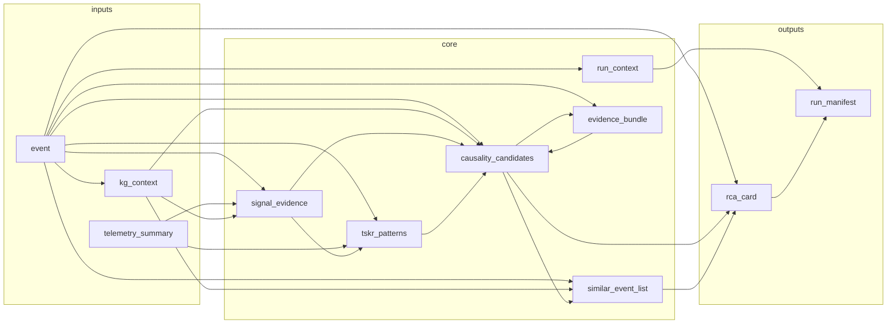

# Automated RCA Workflow — Reference Guide

**Date:** 2026-05-06  
**Audience:** Managers, system engineers, plant data analysts  
**Source materials:** `rca_metamodel.md` (causal categories A–L; **Pattern Recognition** questions), `orchestrators/rca_reasoning_orchestrator.py` (orchestrated run), `orchestrators/causality_engine_v32.py` (scoring and gates)  
**Show-and-tell tests:** `src/dackar/RCA/tests/show_and_tell_test_plan.md`, `test_case_1` … `test_case_7`

**SE-focused summary:** [§1.1 — What the pipeline is designed to answer](#11-what-the-pipeline-is-designed-to-answer). **Appendices:** **A** — [Pattern recognition](#appendix-a--pattern-recognition-limitations-and-improvement-directions-wip); **B** — [LLMs in the pipeline](#appendix-b--large-language-models-roles-today-and-possible-futures); **C** — [Similar event search](#appendix-c--similar-event-search-in-the-rca-workflow); **D** — [Show-and-tell test index](#appendix-d--show-and-tell-test-case-index).

This document is **descriptive** (what the pipeline is and what it does). It does not argue for or against particular licensing or deployment choices.

---

## 0. Document Conventions and Code-Documentation Sync

<!-- @doc: rca_workflow_reference_guide | section:0 | @reviewed: 2026-05-06 t -->

To keep this guide aligned with implementation over time, major sections are annotated with **HTML comments** (invisible in rendered Markdown) that a small script can parse:

- `<!-- @code: <path> | <class_or_fn> -->` — primary code anchor for the section
- `<!-- @schema: <path> -->` — JSON schema, when applicable
- `<!-- @status: implemented|partial|planned -->` — implementation state at last review
- `<!-- @reviewed: YYYY-MM-DD -->` — last time the section was verified against the repo

**Example** (as it appears in the source file, not the rendered view):

```html
<!-- @code: orchestrators/rca_reasoning_orchestrator.py | RCAReasoningOrchestrator.run -->
```

<!-- @code: diagrams/april_25/check_doc_code_sync.py | main -->

`check_doc_code_sync.py` in this folder (`diagrams/april_25/`) validates `@code` / `@schema` anchors against files under `src/dackar/RCA/`, checks that Python **symbols** exist in the target module (class, method, or `def`), and is safe to use on CI. **Run (from DACKAR repo root):** `python src/dackar/RCA/diagrams/april_25/check_doc_code_sync.py`, or from this directory: `python check_doc_code_sync.py` (optional: `--stale`, `--strict-warnings`). Bullets in the list above that use *placeholder* paths (not real `orchestrators/...` files) are **skipped** (not errors). Avoid putting additional `@code` HTML comments in the middle of a paragraph, or the checker will count them.

**AP-913** completeness and regulatory mapping are **out of scope** for this revision; they will be added when the product owner locks the surface area.

---

## 1. Problem, Purpose, and What the Pipeline Produces

<!-- @code: orchestrators/rca_reasoning_orchestrator.py | RCAReasoningOrchestrator -->

### 1.0 The problem

Large nuclear facilities generate an enormous volume of evidence during and after an equipment event: telemetry from the plant historian, sequence-of-events (SOE) records, alarm logs, condition reports, work orders, and maintenance history. Under schedule pressure, manual root-cause analysis is vulnerable to three well-documented failure modes:

- **Fixation** — early focus on the most salient signal, even when it is a consequence rather than a cause.
- **Incomplete coverage** — programmatic, common-cause, and human-performance contributors are under-weighted or missed entirely when time is short.
- **Inconsistent use of plant history** — relevant past events and operating experience exist in the plant record but are not systematically consulted.

The DACKAR RCA pipeline addresses these failure modes by constraining the hypothesis space to what plant data and the equipment model can support, scoring candidates in a deterministic and repeatable way, and surfacing data gaps and near-tie situations in structured artifacts the analyst and organization can review, challenge, and act on.

**The analyst remains accountable for the final safety determination.** The pipeline is an investigative and documentation engine, not a regulatory sign-off.

---

### 1.1 What the pipeline is designed to answer

A complete nuclear RCA must work through five investigation phases in order. The table below lists the key questions each phase must resolve and how the pipeline addresses them. Unanswered questions are surfaced as explicit gaps in the output — not silently dropped.

| Investigation phase | Questions the pipeline must answer | How the pipeline addresses them |
|---|---|---|
| **Scoping** | What failed, on which equipment, under what operating conditions? Which safety functions were challenged or lost? What is the investigation boundary — systems, trains, time window? | The pipeline builds an initial scope from event data and available logs, tracks it as a versioned record, and flags out-of-boundary signals for analyst review (§5.1, §7). |
| **Data and relations** | What signals were anomalous before the event, and in what order? What maintenance, tests, or configuration changes occurred in the precursor window? Which anomalies are causes versus consequences? Are any relevant data sources missing, degraded, or of insufficient resolution? | Signal ordering is established by placing telemetry anomalies, alarms, and SOE events on a shared timeline. Every data source — present, missing, or degraded — is recorded in the run manifest with a sensitivity flag indicating whether its absence could change the ranking (§5.3, §5.4, §6). |
| **Pattern recognition** | Is there a degradation trend preceding the event, and over what timescale? Is this a first occurrence or a recurrence — and if recurrence, did prior corrective actions work? Is there evidence of common-cause failure across multiple trains or components? Does the anomaly signature match a known failure mode? | Temporal patterns are scored against plant history and known failure-mode signatures. Past events from the equipment model are matched to active candidates. Common-cause failure is a scored dimension when vendor and lot records are available (§2.4, Appendix A). |
| **Hypothesis generation and ranking** | What are the plausible root causes, ranked by evidence strength? Which causal categories have been ruled out, and why? Are there near-tie hypotheses the evidence cannot discriminate between? Is the top-ranked hypothesis physically consistent with the operating conditions at the time? | Candidates are generated from the equipment model (not free text), scored on five weighted dimensions, filtered through three hard gates (physical plausibility, timeline consistency, barrier logic), and then checked against a dual composite/evidence-floor threshold. Ruled-out candidates carry documented reasons. Past-event profile matches are returned as a separate event analogs pool. Near-ties and sensitivity to missing data are flagged explicitly (§5.6, §5.8). |
| **Conclusion** | What corrective actions address the proximate, contributing, and root cause levels? What barriers failed, and why? Was human performance a cause or contributor? What gaps remain unresolved? What should be monitored to verify corrective action effectiveness? | The RCA card organizes findings at three causal depths (proximate → contributing → root), includes a barrier assessment and human performance block when evidence supports them, and lists unresolved gaps with the evidence that would close them (§5.12, §6). |

**Coverage enforcement:** For each event, the pipeline must either generate and score at least one candidate in each of the 12 causal categories (A–L, §1.5) or explicitly document in the RCA card why a category was ruled out. Coverage gaps are never silently dropped: a category with no candidates is always recorded in `category_coverage` with `reason_code = "no_supporting_data"`. An attention flag is raised only when the pipeline could not determine whether a category *applies* (status `"unknown"`); high-impact categories B, F, I, and L receive a dedicated flag in that case.

---

### 1.2 What the pipeline produces

Every run produces a **result bundle** under a unique run identifier. The two artifacts most relevant to managers and system engineers are:

**`rca_card`** — the primary analyst-facing document. Contains: ranked hypotheses with evidence citations; corrective action recommendations organized by causal depth (proximate, contributing, root); barrier assessment; human performance findings when applicable; and unresolved gaps with the specific evidence that would close each one.

**`run_manifest`** — the audit and review record. Contains: which data sources were present, missing, or degraded; how sensitive the current ranking is to each missing source (sensitivity table); what scope decisions were made and when; and what review actions the analyst must complete before the record can be closed.

Supporting artifacts (`causality_candidates`, `evidence_bundle`, `tskr_patterns`, `barrier_analysis`, `ishikawa_matrix`, and others) provide the evidence trail behind the card. They are described by audience in **§6**; the complete input and output list is in **§2**.

---

### 1.3 What the pipeline does not replace

- Physical inspection, laboratory analysis, or on-site equipment examination
- NRC event reporting determinations or AP-913 regulatory sign-off
- The analyst's final safety and quality determination — the pipeline provides structured inputs to that determination, not a substitute for it
- Fleet or industry operating-experience databases — these require a site-configured adapter (see **Appendix C**)
- A trained neural model — all candidate scoring is rule-based and deterministic; weights and thresholds are transparent and configurable (§5.6)

---

### 1.4 How the pipeline is built: main components

The pipeline is assembled from a set of purpose-built components. Each one is responsible for a distinct part of the investigation, so any finding in the RCA card can be traced back to the component — and from there to the data — that produced it. The table maps each component to the §1.1 investigation phases it serves.

| Component | What it does | Investigation phase served |
|---|---|---|
| **Equipment and failure mode model** | Holds a structured representation of plant equipment, component connections, failure modes, and safety function definitions. Every hypothesis is anchored to a specific component and failure mode already in this model — not invented from raw signals alone. | Scoping; Hypothesis generation and ranking |
| **Data coverage assessor** | Checks which data sources were supplied, records each as present, missing, or degraded, and flags whether any missing source could change the ranking. | Data and relations |
| **Temporal sequencer** | Places telemetry anomalies, alarms, and SOE events on a shared timeline to separate precursors (potential causes) from responses (potential consequences), and scores degradation trends per failure mode. | Data and relations; Pattern recognition |
| **Hypothesis ranking engine** | Generates candidates from the equipment model, scores each on five dimensions (structural fit, temporal support, telemetry match, documentary evidence, maintenance program posture), and applies three binary elimination gates. Eliminated candidates are retained in a documented ruled-out list. | Pattern recognition; Hypothesis generation and ranking |
| **Document evidence retriever** | Searches condition reports, work orders, procedures, FMEAs, and operating experience documents for text relevant to each active candidate. Retrieved passages adjust candidate scores and are cited in the RCA card. | Hypothesis generation and ranking; Conclusion |
| **Operating experience matcher** | Scores plant history for past events on the same or similar equipment, and optionally queries fleet or industry databases when a site adapter is configured. | Pattern recognition; Conclusion |
| **RCA card synthesizer** | Assembles the final structured report from ranked candidates, evidence passages, and barrier status, organized at three causal depths: proximate, contributing, and root cause. | Conclusion |

Every intermediate result is saved to the run record, and the **run manifest** (§1.2) tracks which components ran, what data each had access to, and what analyst review actions remain open.

---

### 1.5 Causal categories (A–L)

Every hypothesis the pipeline generates is assigned to one of twelve causal categories. Together they define the coverage requirement for a complete nuclear RCA: for each event the pipeline must either produce at least one scored candidate in each applicable category, or explicitly document in the RCA card why that category does not apply. Authoritative sub-item definitions are in `diagrams/april_25/rca_metamodel.md`.

| Cat | Name | What it captures | Causal depth | Primary driver data |
|-----|------|-----------------|--------------|---------------------|
| **A** | Equipment-internal | Intrinsic material, mechanical, electrical, or instrumentation degradation of the component itself | Proximate cause | Telemetry anomalies, FMEA failure mode nodes in KG |
| **B** | Required support unavailable or degraded | Failure of an ancillary system — power, cooling, lubrication, instrument air, control signal — that the primary component depends on | Proximate cause | Ancillary system tags, KG support-system edges |
| **C** | Upstream influence / common cause | Inlet conditions outside design basis; shared upstream process topology enabling common-mode failures across trains. Lot and batch defects belong to Category K. | Proximate cause | Process topology, KG CCF delta (topology-based CCF; `vendor_supply_chain_records` feeds Category K) |
| **D** | Downstream influence | Backpressure, blocked discharge, or unstable demand imposed on the component outlet by downstream systems | Proximate cause | Process topology, telemetry downstream tags |
| **E** | Operating context / mission demand | Equipment operated outside its design envelope: overload, off-design transients, prolonged standby, or excessive cycling | Proximate cause | `operational_context` (mode, train configuration, demand history) |
| **F** | External hazards | Conditions from outside the plant process boundary: thermal environment, flooding, seismic, fire, EMI | Proximate cause | `environmental_monitoring`, OE documents, evidence bundle |
| **G** | Human and organizational contributors | Operator or maintenance action that deviated from a correct procedure or configuration baseline | Contributing cause | Work order text in Chroma, procedure documents in Chroma, `operational_context` (operator actions and shift narrative) |
| **H** | Design deficiency | Equipment performs as designed, but the design itself is inadequate for actual service conditions | Contributing cause | Design documents and engineering evaluations (ECA, ECR) in Chroma |
| **I** | Configuration and change control | Work was executed correctly against a wrong, outdated, or unrevised configuration baseline | Contributing cause | `configuration_change_records`, procedure documents in Chroma |
| **J** | Inspection / testing program gap | Surveillance program not designed to detect this failure mode at its actual progression rate | Contributing cause | PM compliance records, `pm_compliance` artifact |
| **K** | Vendor and supply chain | Specification was correct but the delivered item did not meet it; includes lot-level and batch defects | Contributing cause | `vendor_supply_chain_records`, BULLETIN / MANUAL documents in Chroma |
| **L** | Systemic / organizational weakness | Programmatic or cultural root cause that allowed contributing causes to persist across events | Root cause | OE documents, prior CR effectiveness reviews, `similar_event_list` recurrence data, `training_records` (training program gaps) |

The causal depth column maps to the AP-913 framework. Corrective actions that address only the proximate cause without also addressing contributing and root cause levels will not satisfy regulatory expectations.

---

### 1.6 Candidates vs. causal categories

**Causal categories (A–L)** are classes of causal mechanisms — they define the *type* of cause and ensure investigation coverage. Coverage enforcement operates at the category level: did the pipeline generate at least one candidate in each applicable category, or explicitly rule it out?

**A candidate** is a specific, instance-level hypothesis: a particular failure mode on a particular component, at a particular point in the event causal chain, attributed to a primary causal category. Ranking and evidence assessment operate at the candidate level.

Internally, each candidate is represented as a **4-tuple**:

| Dimension | Values | What it means |
|-----------|--------|---------------|
| **Component** | Component ID from the equipment model | Which physical item failed or contributed |
| **Failure mode** | Failure mode ID registered in the KG — sourced from FMEA ingestion, or from confirmed findings in prior ECAs/RCAs entered into the KG as `CONFIRMED_CAUSE` or `MAY_CAUSE` links on past-event nodes | The specific mechanism by which that component failed |
| **Causal category** | A–L (§1.5) | The class of cause — determines which data sources and gates apply |
| **Chain position** | `initiating` / `contributing` / `consequence` | Where in the causal chain this candidate sits |

`chain_position` distinguishes a candidate that directly caused the event (`initiating`) from one that enabled or worsened it (`contributing`) or that is a downstream effect of it (`consequence`). The timeline consistency gate eliminates consequence candidates — a signal that follows the event cannot be its cause.

Each candidate additionally carries a **composite score** (weighted sum of five sub-scores using causal-category-specific weights — see §5.6), the results of the three hard gates, a score rationale, and, after the evidence refinement step, citations into the document corpus. The composite score is what drives ranking; the 4-tuple is what makes a candidate traceable to a specific physical item in the plant. Additional diagnostic fields on every candidate: `score_profile_applied` (which weight profile was used), `scoring_profile_weights` (the full weight dict), `temporal_score_quality` (`"full_allen"` when a direct Allen causal match was found, `"proxy"` otherwise), and `score_confidence_interval` (lower/upper bounds derived from data completeness).

One category can generate multiple candidates (e.g. several different failure modes on the same pump, or the same failure mode on different pumps across trains). One candidate belongs to exactly one primary category.

---

## 2. Workflow at a Glance

<!-- @code: orchestrators/rca_reasoning_orchestrator.py | RCAReasoningOrchestrator.run -->

### 2.1 Input data inventory

Two inputs are always required: **`event`** (event identity, asset ID, time window, symptom text) and **`telemetry_summary`** (pre-processed anomaly records per signal — pattern type, severity, time window). Every other input is optional; when absent it is recorded in the run manifest as `not_assessed` and the causal categories it would have informed are flagged as data-limited. The pipeline always completes; it never silently drops a coverage gap.

> **Note on telemetry:** the pipeline reasons over anomaly records — it does not perform signal processing on raw time-series. Anomaly detection quality upstream directly limits what the pipeline can conclude.

> **Note on telemetry unavailability:** `telemetry_summary` is a hard required input; the pipeline cannot accept `None` in its place. If pre-processed anomaly records are not available, the alarm log provides a partial substitute for **interval ordering only** — alarm activations are placed on the Allen relation map (§2.3) and can contribute to timeline classification. However, alarm records carry no anomaly `pattern_type` or `severity`, so **TSKR scoring is entirely absent** when `telemetry_summary` is missing. All candidates will have a zero temporal sub-score, pattern recognition (§2.4 Questions 1 and 4) will not run, and the RCA card will reflect heavily degraded rankings. The run manifest will flag all TSKR-dependent causal categories as `data-limited`.

> **Note on SOE and protection logic:** these two sources are tightly coupled. If SOE is present but protection logic is absent, the timeline and barrier gates operate in degraded mode and the run manifest escalates an `analyst_decisions_required` flag.

Inputs are grouped below by data family, following the same structure as the causal taxonomy (§1.5).

---

#### Event identity (required)

| Data element | What it provides to the pipeline | Causal categories | Schema |
|---|---|---|---|
| **Event** | The investigation anchor. Carries: `event_id`, `asset_id`, `timestamp_start`, `timestamp_end`, `event_type`, `actuation_type`, and symptom description. Every other input is cross-validated against the `event_id` and `asset_id` fields here — a mismatch aborts the run. **Required.** | A–L | `event.json` |

---

#### Pre-built pipeline artifacts (optional, checkpoint-resume)

These optional inputs allow the pipeline to skip re-computing one or more steps by injecting outputs from a prior run. When supplied they bypass the corresponding computation stage; when absent the stage runs normally. They are not plant data sources — they are previously computed pipeline state.

| Artifact | Bypasses | Schema |
|---|---|---|
| `signal_evidence` | Step 2a — signal propagation chain build | `signal_evidence.json` |
| `tskr_patterns` | Steps 2b + 3 — TSKR temporal scoring and documentary pattern recognition | `tskr_patterns.json` |
| `causality_candidates` | Step 4 only — candidate generation (`causality_engine.generate()`); Step 3 is bypassed by supplying `tskr_patterns` | `causality_candidates.json` |
| `evidence_bundle` | Step 5 — Chroma evidence retrieval | `evidence_bundle.json` |

---

#### Structured and model data

| Data element | What it provides to the pipeline | Causal categories | Schema |
|---|---|---|---|
| **Equipment model** | Components, topology, failure modes, safety function definitions, and plant past events — the typed hypothesis space. Every candidate is anchored to a node in this model. Built from Neo4j at run time or supplied as a pre-built snapshot. | A–L | `kg_context.json` |
| **Protection logic** | Trip setpoints, permissive logic diagrams, and barrier / safety function states at event time. Required for the barrier elimination gate and for interpreting SOE records. | A, B, F | `protection_logic_context.json` |
| **Configuration change records** | Engineering change notices, setpoint change packages, and work order history — change control traceability in the precursor window. | H, I | `configuration_change_records.json` |

---

#### Time-series and event data

| Data element | What it provides to the pipeline | Causal categories | Schema |
|---|---|---|---|
| **Telemetry summary** | Pre-processed anomaly records per sensor: pattern type (e.g. gradual drift, step rise), severity, and anomaly time window. **Required.** | A–F | `telemetry_summary.json` |
| **Sequence of events (SOE) log** | Millisecond-resolution discrete event records from the SOE recorder. Feeds the timeline consistency gate and the temporal sequencer. Pair with protection logic for full barrier analysis. | A, B, F | `soe_log.json` |
| **Alarm log** | Alarm activations with timestamps and priorities. Extends temporal coverage when SOE is absent or sparse. | A–F | `alarm_log.json` |
| **Environmental monitoring** | Ambient temperature, humidity, seismic indicators, and grid disturbances at event time. | F | `environmental_monitoring.json` |

---

#### Maintenance and operations data

| Data element | What it provides to the pipeline | Causal categories | Schema |
|---|---|---|---|
| **Operational context** | Operating mode, power level, recent operator actions, and shift narrative at event time. Feeds the operating-point scoring dimension (Category E modifier). **Operator shift logs should be included here** — shift turnover notes, operator observations, and equipment status entries from the shift log are expected as part of `shift_narrative` and `recent_alarms`. There is no separate `operator_shift_log` input; if shift logs become a first-class data source they will require a dedicated schema. | E, G | `operational_context.json` |
| **PM compliance** | PM schedule adherence, overdue intervals, and as-found / as-left inspection results. Auto-built from CMMS export rows when not supplied directly. | A, J | `pm_compliance.json` |
| **Condition reports and work orders (CR / WO)** | Event-scoped corrective maintenance records from the plant CMMS (e.g. Maximo). **Not a direct `run()` input** — fetched internally when a CMMS adapter is configured on the orchestrator. CR/WO records contribute to: (1) the initial scope `component_ids` at Step 0; (2) the plant past-event pool (up to 12 records merged into `kg_context.past_events` at Step 1); (3) the KG document neighborhood. When no CMMS adapter is configured this data is absent and flagged in `run_manifest.artifacts.cmms_context`. | A, G, J, L | `cmms_context.json` (internal artifact) |

---

#### Document and institutional knowledge

| Data element | What it provides to the pipeline | Causal categories | Schema |
|---|---|---|---|
| **Document corpus** | Pre-indexed condition reports, work orders, procedures, FMEAs, ECAs, and industry OE documents held in the vector store. Retrieved per candidate to raise or lower evidence scores and populate RCA card citations. Supplied as a pre-built bundle or queried live from Chroma. | All | `evidence_bundle.json` (pre-built) or live Chroma retrieval (§3.2) |

---

#### Supply chain and vendor data

| Data element | What it provides to the pipeline | Causal categories | Schema |
|---|---|---|---|
| **Vendor and supply chain records** | Lot numbers, vendor certifications, and receipt inspection records. Feeds the Category C common-cause structural score when a batch or lot defect is suspected. | C, K | `vendor_supply_chain_records.json` |
| **Training records** | Personnel qualification status and training recency. Provides evidence for human performance and programmatic findings; does not by itself establish root cause. | G, L | `training_records.json` |

### 2.2 Workflow steps (system engineer map)

The pipeline executes as a fixed, deterministic sequence of seven steps aligned with the investigation phase structure of the causal taxonomy (§1.5). Each step has a defined scope, consumes specific inputs, runs a deterministic mechanism, and produces artifacts that downstream steps build on. The table below is the SE reference map; **§5** provides full per-step detail.



*Simplified logical data flow. `event` is a universal input: its `asset_id` scopes the KG neighborhood, its `timestamp_start/end` is the reference interval for all Allen and TSKR scoring, and its `event_type` and `actuation_type` are query terms for the similar event search. Optional inputs (SOE, alarms, PM, vendor records, protection logic, etc.) are not shown.*

---

| Step | Scope | Key inputs | Core mechanism | Key outputs | §5 detail |
|------|-------|------------|----------------|-------------|-----------|
| **0 — Initialize** | Prove inputs are structurally valid and freeze run identity before any analysis begins. | `event` *(required)*, `telemetry_summary` *(required)*, `operational_context`, `alarm_log`, `soe_log`, `protection_logic_context`, `configuration_change_records` | JSON schema validation of all supplied inputs; cross-checks (asset ID consistency, telemetry coverage); initial investigation scope assembled from event data and logs (scope version 0, no boundary filter active); `pm_compliance` auto-built from CMMS export rows if not supplied. | `run_context` (scope v0, input guard flags), `input_validation`, `pm_compliance` | §5.1 |
| **1 — Equipment model and data context** | Materialize the typed hypothesis space and enrich it with CMMS records, past event history, and per-signal anomaly chains. | `event`, `telemetry_summary`, `run_context`, `operational_context`, `pm_compliance` | KG queried (or snapshot loaded): components, topology, failure modes, safety functions, past events. KG governance assessed; red state can abort per policy. CMMS adapter (if configured) augments with live CR/WO records. Past events enriched with temporal metadata. Signal-to-component tag mapping builds scored anomaly propagation chains. | `kg_context`, `kg_governance`, `signal_evidence`, `cmms_context` *(if adapter configured)* | §5.2–5.3 |
| **2 — Temporal analysis and OE search** | Establish the full temporal picture and operating-experience context before hypothesis ranking: search equipment history, score per-failure-mode temporal support, build the event-wide signal ordering map, and identify similar events. Four sub-steps (2a–2d): | `event`, `telemetry_summary`, `kg_context` (with past events from KG and CMMS), `signal_evidence`, `alarm_log`, `soe_log`, `operational_context` | **2a — Equipment history temporal search:** For each component/asset in the KG scope, past CRs, WOs, surveillance records, and operator logs (loaded into `kg_context.past_events` at Step 1) are filtered to those within the precursor window and tagged by window tier. This builds the recurrence pool used by TSKR in 2b. **2b — TSKR per-failure-mode scoring:** For each failure mode, computes onset lag, duration profile, recurrence count, and novelty flag from anomaly windows and the precursor-window record pool. Novelty flag set when `recurrence_count == 0` and no prior signal match exists. **2c — Allen relation map:** All anomaly intervals, alarm activations, and SOE point events are classified relative to the triggering event using Allen's interval algebra (OVERLAPS, CONTAINS, PRECEDES, DURING, FOLLOWS) — separating causal precursors from consequence followers for the whole event. **2d — Similar event identification:** Plant past events scored on five dimensions (component match, failure mode, event type, actuation type, precursor window overlap); top matches returned. Fleet and industry databases queried via `SimilarEventAdapter` when configured (§2.6). | `tskr_patterns` (per-FM temporal support, recurrence profiles, novelty flags), `allen_relation_map` (event-wide signal ordering), `similar_event_list` (plant / fleet / industry matches) | §5.4, §5.8, §2.6 |
| **3 / 3.5 — Pattern recognition** | Identify recurrence and novelty across two evidence registers: the documentary record (past CRs, WOs, and confirmed RCA findings) and the signal record (anomaly shapes, alarm sequences, SOE transitions). Two sub-steps: | `tskr_patterns`, `kg_context` (past events enriched with CRs/WOs/RCA findings from Step 1), `signal_evidence`, `alarm_log`, `soe_log` | **Step 3 — Documentary pattern recognition:** Examines `kg_context.past_events` records — structured prior events carrying `root_cause_label`, `finding_status`, and `causal_explanation` extracted from CRs, WOs, and confirmed RCA reports (injected via CMMS at Step 1 and KG historical data). For each prior event, checks component match, failure mode match, and resolution status. `_build_historical_support_channels` produces counts: same-component, same-failure-mode, unresolved, CMMS-injected. TSKR uses this pool to compute `recurrence_count` and `recurrence_trend` per failure mode. *Note: raw-text retrieval from CRs, WOs, RCAs, and ECAs in Chroma is Step 5 — Step 3 operates on structured metadata only.* **Step 3.5 — Signal pattern recognition:** `_build_signal_lessons_learned` classifies each TSKR pattern as **matched** (historical support found: `recurrence_count > 0` or `history_score ≥ threshold`) or **novel** (`novel_pattern = True`, no prior signal match). Input sources: telemetry anomaly windows, alarm log activations, SOE point events. | Recurrence and novelty flags on `tskr_patterns`; `signal_lessons_learned` (matched vs novel pattern classification, assembled into run manifest at Step 6) | §5.4, §5.12 |
| **4 — Candidate generation and initial ranking** | Generate all plausible failure-mode hypotheses, apply initial scoring and hard elimination gates, enforce approved scope boundary. **Directly depends on Steps 2b and 3** via `tskr_patterns`: `causality_engine.generate()` immediately indexes `tskr_patterns` on entry and uses it to compute the temporal sub-score for every candidate. Because `tskr_patterns` carries the Step 3 recurrence outputs (`recurrence_count`, `recurrence_trend`, `novel_pattern`, `unresolved_recurrence_count`), Step 4 implicitly consumes both the TSKR temporal scoring (Step 2b) and the documentary recurrence analysis (Step 3) through a single artifact. `signal_evidence` (Step 2a propagation chains) is **not** passed to `generate()` — it enters at Step 5 refinement only. | `event`, `kg_context`, `tskr_patterns` *(carries Steps 2b + 3 outputs)*, `operational_context`, `pm_compliance`, `run_context` | Candidates generated per failure mode from the equipment model — never from free text. Five-dimension weighted scoring: structural (KG topology, CCF delta), temporal (TSKR recurrence + Allen blend from `tskr_index`), telemetry (anomaly fit), evidence (document availability), governance (PM posture). Three binary hard gates applied in order: physical plausibility, timeline consistency, barrier logic. A dual-threshold check then retains only candidates that meet both the composite score minimum and the pre-evidence floor. Eliminated candidates retained in a documented ruled-out list with reason codes. Past-event profile matches returned as a separate event analogs pool. Scope boundary filter applied if an approved scope revision is active. | `causality_candidates` (v1, pre-refine; contains FM candidates, event analogs, and ruled-out list) | §5.6 |
| **5 — Evidence retrieval and refinement** | Retrieve documentary evidence per candidate, re-score the ranked list, and optionally expand context if coverage gaps are detected. | `causality_candidates` (v1), `event`, `kg_context`, `allen_relation_map`, `protection_logic_context`, `vendor_supply_chain_records`, `training_records`, `environmental_monitoring` | Chroma vector store queried per active candidate → scored passages (supporting, contradicting, contextual). Second scoring pass (`refine_with_evidence`) blends evidence scores, Allen relation signals, and protection logic into composite scores and re-runs hard gates. Optional auto-reentry re-runs Steps 1–5 with expanded context when coverage gaps are detected and `enable_auto_reentry` is set. | `evidence_bundle`, `causality_candidates` (v2, post-refine), `causality_candidates_pre_refine` *(for diff and reentry)* | §5.8 |
| **6 — Conclusion and finalization** | Assemble the final RCA card and barrier assessment; validate outputs; produce the run manifest. | All prior artifacts (including `similar_event_list` from Step 2d); `protection_logic_context`, `vendor_supply_chain_records`, `training_records`, `environmental_monitoring` | Optional Ishikawa 6M bucketing of evidence themes. Barrier analysis aggregates safety-function status from protection logic and hard gate results. RCA card assembled from ranked candidates, evidence citations, similar event findings, and barrier results at three causal depths (proximate → contributing → root). Attention flags applied (rank inversions, governance state, data quality). Output schema validation. Scope expansion signals detected from Allen map and TSKR state and injected into `run_context` for the next run. Run manifest assembled with data coverage, sensitivity table, scope state, and review hooks. | `rca_card`, `barrier_analysis`, `ishikawa_matrix`, `output_validation`, `run_manifest`, `reentry_execution` | §5.12 |

**Scope revision:** Scope is a versioned record initialized at Step 0 (version 0, open — no candidates filtered). If the analyst accepts an expansion suggestion from a prior run, scope version ≥ 1 is active on re-run and Step 4 applies the approved boundary filter before evidence retrieval. See **§2.5.3** for the scope revision workflow.

**Optional pipeline extensions:** The seven-step sequence above describes the default execution path. Several additional capabilities are implemented and activated by config flags (all default to disabled). They do not alter the step order but insert additional processing within existing steps:

| Extension | Config flag / injection | Where it runs | What it adds |
|-----------|------------------------|---------------|--------------|
| **Semantic FM recurrence** | `enable_semantic_recurrence = True` | Step 1, after KG build | `DocExtractionStore.resolve_fm_candidates()` resolves failure mode ID candidates in extraction records using KG FM embeddings, improving cross-pattern FM alignment for Questions 2 and 6 (§2.4) |
| **Evidence supersession (Phase C)** | `epistemics_policy_version` set | Step 5, after Chroma retrieval | `_apply_supersession()` applies an epistemic classification policy to re-rank evidence bundle items before refinement; only items with `epistemic_class = "analyzes_past_degradation"` contribute to the support score |
| **Signal episode search** | `enable_signal_episode_search = True` | Step 6, before synthesis | `PatternSearcher` queries `IncidentIndex` for historical signal episodes matching the current anomaly fingerprint (Jaccard / NLCS / EMD); produces `historical_signal_episodes` artifact (Question 5, §2.4) |
| **Cross-pattern documentary linkage** | `enable_cross_pattern_linkage = True` | Step 6, after episode search | `CrossPatternLinker` joins signal episodes with `DocExtractionStore` extraction records; produces `cross_pattern_evidence` with link confidence and support posture per candidate; feeds attention flags (Question 6, §2.4). CRs/WOs already counted in `past_events` are excluded from the `DocExtractionStore` query via the `exact_doc_ids` guard (Risk 2 fix — prevents double-counting in evidence scores). |
| **Epistemics digests (Phase D)** | `epistemics_classifier` injected | Step 6, just before synthesis | Attaches per-candidate `epistemics_digest` summarizing the epistemic class distribution of retrieved evidence; embedded in run manifest under `epistemics_summary` |

Analysts who encounter `historical_signal_episodes`, `cross_pattern_evidence`, or `epistemics_summary` in a run manifest can use §2.4 Questions 5–6 and §2.7.2 for interpretation.

---

### 2.3 Allen temporal relations

<!-- @code: orchestrators/temporal_relations.py | allen_relation -->
<!-- @code: orchestrators/rca_reasoning_orchestrator.py | RCAReasoningOrchestrator._build_allen_relation_map -->

The Allen relation map (pipeline Step 2, §2.2) classifies every observed signal, alarm, and discrete event relative to the triggering event using a subset of Allen's interval algebra. The result — `allen_relation_map` — is a single shared artifact built once **after** Step 4 candidate generation completes, and is reused by the evidence refinement pass (Step 5), the scope expansion signal detector (Step 6), and the run manifest. It is not available to the Step 4 candidate generation; Step 4 uses Allen-classified timing embedded in `tskr_patterns` by the TSKR scorer.

#### Relations and causal interpretation

The pipeline implements five of the thirteen Allen relations, selected for their RCA relevance. Each relation carries a base score that serves as a prior in temporal scoring; these scores are further refined downstream by latency alignment and severity weighting.

| Relation | A relative to triggering event B | Base score | Causal candidate |
|----------|----------------------------------|:----------:|:----------------:|
| **OVERLAPS** | A started before B and was still active at B onset — degradation present at the moment of failure | 0.90 | Yes |
| **CONTAINS** | A started before B and ended after B — a long-running latent condition that encompasses the event | 0.85 | Yes |
| **PRECEDES** | A ended before B started — classic causal lead-time; the anomaly was already resolved when the event occurred | 0.75 | Yes |
| **DURING** | A started at or after B onset — anomaly appeared inside or after the event; likely a consequence, not a cause | 0.30 | No |
| **FOLLOWS** | A starts after B ends — temporal contradiction; cannot be a cause | 0.10 | No |

Relations are evaluated in the order FOLLOWS → PRECEDES → CONTAINS → OVERLAPS → DURING. An `epsilon_hours` tolerance (default **0.5 h**) absorbs timestamp noise and near-simultaneous boundary cases — boundaries within epsilon are treated as touching. An `interval_type` parameter controls endpoint interpretation (closed / open / half-open) for edge cases.

`PRECEDES`, `OVERLAPS`, and `CONTAINS` set `causal_candidate = True` on the output node. `DURING` and `FOLLOWS` do not.

#### Input sources and interval representation

Both intervals and instantaneous events (time points) are supported. Point events are modeled as a degenerate closed interval with `start = end`. The table below describes the three input sources and how each is mapped to an interval.

| Source | Input fields consumed | Interval representation | Always a point event? | Clock sync guard |
|--------|-----------------------|-------------------------|-----------------------|-----------------|
| **Telemetry anomalies** | `telemetry_summary.signals[].anomaly_window.start` / `.end` (or `anomaly_start` / `anomaly_end`) | `[anomaly_start, anomaly_end]`; if no end field, treated as point (`end = start`) | No — duration present when historian provides a window | None; anomaly timestamps assumed reliable |
| **Alarm log entries** | `alarm_log.alarms[].activated_at` (start); `acknowledged_at` or `cleared_at` (end, checked in that order) | `[activated_at, cleared_at]`; if not yet cleared, treated as point (`end = start`) | No — most alarms have a clear time | Yes — if `alarm_log.quality.clock_sync_ok` is `False`, relation forced to `"unknown"` with score 0.0 |
| **SOE records** | `soe_log.records[].timestamp` | Always a point event (`start = end = timestamp`): SOE records represent instantaneous state transitions | Always | Yes — if `soe_log.quality.clock_sync_ok` is `False`, relation forced to `"unknown"` with score 0.0; large logs capped at `max_soe_nodes` (default **200**) |

#### Output per node

Each processed event produces one node in `allen_relation_map.nodes[]` carrying:

| Field | Description |
|-------|-------------|
| `node_id` | Unique node key: `"anomaly::{sensor_id}"`, `"alarm::{alarm_id}"`, or `"soe_record::{rec_id}"` |
| `node_type` | `anomaly`, `alarm`, or `soe_record` |
| `component_id` | Component linked to the signal or record (when available) |
| `interval_start` / `interval_end` | ISO timestamps; `interval_end` is `null` for point events |
| `is_point_event` | `true` for SOE records and for anomalies/alarms with no duration |
| `allen_relation_to_event` | One of the five relations above, or `"unknown"` on clock failure |
| `allen_base_score` | Base relevance score (0.10–0.90), 0.0 when unknown |
| `causal_candidate` | `true` when relation is PRECEDES, OVERLAPS, or CONTAINS |

The map-level summary includes `timeline_consistent` (true when no FOLLOWS nodes exist), counts of `causal_nodes`, `contradiction_nodes`, and `unknown_relation_nodes` (nodes forced to `"unknown"` by clock-sync failure), `dominant_causal_type` (the node type — `anomaly`/`alarm`/`soe_record` — with the most causal nodes), and `earliest_causal_onset`. A `quality_flags` block records `soe_nodes_capped: true` when the SOE log was truncated to `max_soe_nodes`. These feed attention flags on the RCA card and the run manifest.

#### How Allen scores enter the scoring pipeline

During Step 5 (`refine_with_evidence`), `allen_base_score` is blended into each candidate's temporal sub-score:

```
temporal_refined = 0.75 × TSKR_score + 0.25 × allen_base_score
```

The blend is one-directional — it can only raise, not lower, a candidate's temporal score. A `FOLLOWS` relation on a component matched to an active candidate sets `temporal_contradiction = True`, which the timeline consistency gate uses to eliminate that candidate from the ranked list.

Every candidate receives a `temporal_score_quality` field set during this blend: `"full_allen"` when the Allen component index returned a non-empty entry for the candidate's component (i.e. the temporal score incorporates a real Allen causal classification), `"proxy"` in all other cases (TSKR-embedded estimate only, no direct Allen node). This field is present on both retained and filtered-out candidates and is visible to the analyst in the `causality_candidates` artifact. It also feeds the `score_confidence_interval` temporal degradation signal (§5.6).

---

### 2.4 Pattern recognition

Pattern recognition in this pipeline is not a single component or stage — it is a cross-cutting capability distributed across Steps 2 through 6. The four questions below, drawn from the causal taxonomy metamodel, are each answered by a different combination of input data, pipeline steps, and output fields. The SE's role is to verify that the right input data is present for each question and to interpret the corresponding output artifacts correctly.

---

#### Question 1 — Is there a degradation trend, and over what timescale?

**What the pipeline looks for:** whether a signal anomaly was building up gradually before the event, how long it persisted, and how it was positioned relative to the event onset.

| | Detail |
|---|---|
| **Input data** | `telemetry_summary.signals[].anomaly_window` (start/end timestamps, anomaly type); `alarm_log`; `soe_log` |
| **How it works** | Each anomaly type in `telemetry_summary` — e.g. `gradual_drift`, `sustained_exceedance`, `step_rise`, `oscillation` — characterizes the shape of the degradation. The TSKR scorer (Step 2) computes onset lag hours and a duration profile per failure mode. The Allen relation (§2.3) classifies whether the anomaly was active at event onset (`OVERLAPS`), long-running and encompassing the event (`CONTAINS`), or already resolved before the event (`PRECEDES`). |
| **What it produces** | `tskr_patterns.patterns[].onset_lag_hours` — how far before the event the anomaly began; `tskr_patterns.patterns[].duration_profile` — characterization of how long the pattern persisted; `allen_relation_map.nodes[].allen_relation_to_event` — the temporal position of each signal. `OVERLAPS` and `CONTAINS` nodes are the strongest indicators of a pre-existing degradation trend. |
| **Pipeline steps** | Step 2 (TSKR, Allen map); Step 4 (temporal sub-score); Step 5 (Allen blend into refined score) |

---

#### Question 2 — Is this a first occurrence or a recurrence? Did prior corrective actions work?

**What the pipeline looks for:** whether the current event matches past events on the same or similar equipment, and whether the pattern is genuinely novel (no prior signal match) or a recurrence of a known failure sequence.

| | Detail |
|---|---|
| **Input data** | `kg_context.past_events` (enriched with temporal metadata at Step 1); `vendor_supply_chain_records` (for lot-level recurrence); optionally fleet/industry OE via a configured adapter (§2.6) |
| **How it works** | At Step 1, past events in the equipment model are tagged with `in_precursor_window` and window tier. At Step 3 / 3.5, each TSKR pattern is checked for historical matches: if `recurrence_count == 0` and no prior signal match exists, the pattern is flagged `novel_pattern = True`. At Step 6, the similar event list scores each plant past event on five dimensions (component match, failure mode match, event type, actuation type, precursor window overlap) and ranks the top matches. |
| **What it produces** | Two orthogonal novelty flags on every `tskr_patterns.patterns[]` entry: `documentary_novel` (True when `recurrence_count == 0` and `history_score < 0.20` — no CR/WO/RCA history regardless of signal matching) and `signal_novel` (True when no signal IDs resolved to this failure mode — no prior signal pattern match). The legacy `novel_pattern` flag (AND of both) is retained for backward compat. `tskr_patterns.summary.has_novel_patterns`; `signal_lessons_learned` in `run_manifest.artifacts` — separates matched patterns (prior causal explanation known) from novel ones; `similar_event_list` with confidence-weighted plant past events and `any_plant_match` summary flag. Analyst note: the most safety-critical case is `documentary_novel=True` and `signal_novel=False` (signal-matched first occurrence) — prior occurrences may exist but not have been documented. |
| **Pipeline steps** | Step 1 (past event temporal enrichment); Step 3/3.5 (novelty flags); Step 6 (similar event list, signal lessons learned) |

---

#### Question 3 — Is there evidence of common-cause failure across trains or components?

**What the pipeline looks for:** whether the same failure mode is appearing on multiple components simultaneously, pointing to a shared upstream cause (Category C) or a vendor batch defect (Category K) rather than an independent per-component failure.

| | Detail |
|---|---|
| **Input data** | `kg_context` (topology showing which components share support paths or are from the same lot/vendor); `vendor_supply_chain_records` (lot numbers, batch certifications, receipt inspection records) |
| **How it works** | The equipment model captures which failure modes carry a common-cause indicator. When a candidate belongs to Category C (upstream influence shared across trains), the hypothesis ranking engine adds a CCF structural delta to the structural sub-score, proportional to the `common_cause_score` computed from the KG topology. When vendor records are supplied, lot overlap across affected components raises this score further. |
| **What it produces** | `causality_candidates[].primary_causal_category == "C"` candidates in the ranked list; `causality_candidates[].scores.ccf_score` and `.ccf_note` on every candidate (0.0 for non-CCF candidates); `causality_candidates[].common_cause` block with structural CCF reasoning. A Category C candidate ranked highly is the pipeline's signal that CCF warrants investigation. |
| **Pipeline steps** | Step 1 (KG topology, vendor records loaded); Step 4 (CCF structural delta in initial scoring); Step 5 (CCF re-evaluated in refinement pass) |

---

#### Question 4 — Does the anomaly signature match a known failure mode?

**What the pipeline looks for:** whether the combination of anomaly type, severity, affected component, and temporal position is consistent with a specific failure mode already in the equipment's FMEA.

| | Detail |
|---|---|
| **Input data** | `telemetry_summary` (anomaly type, severity); `kg_context` (failure mode definitions, component–FM bindings from FMEA); `tskr_patterns` (per-FM temporal support and confidence) |
| **How it works** | The hypothesis ranking engine generates candidates by binding each FMEA failure mode to its parent component — only failure modes already in the equipment model are considered. The structural sub-score measures how well the component topology and failure mode type fit the observed event. The telemetry sub-score measures how well the anomaly severity and type match the failure mode signature. The temporal sub-score from TSKR measures how well the observed anomaly timing matches the expected onset lag and duration profile for that failure mode. The three sub-scores combine into a composite that ranks signature strength. |
| **What it produces** | `causality_candidates` ranked list — the top candidates represent the strongest signature matches to known failure modes; `causality_candidates[].scores.structural_score`, `.telemetry_score`, `.temporal_score` and their `score_rationale` entries explain which dimensions drove the ranking. A high composite score with high temporal and telemetry sub-scores indicates a strong signature match. |
| **Pipeline steps** | Step 2 (TSKR per-FM confidence and support); Step 4 (structural + telemetry + temporal sub-scores in initial ranking); Step 5 (evidence sub-score adds documentary support to the signature match) |

---

#### Question 5 — Does the current signal episode pattern match a known historical episode?

**What the pipeline looks for:** whether the sequence of anomaly and alarm event types observed before the current event has occurred before — in the same order, with the same event mix, and with comparable repetition frequencies — in indexed historical incidents on this or similar equipment.

| | Detail |
|---|---|
| **Input data** | `IncidentFingerprint` (derived from current `signal_evidence`: `event_set`, `event_seq`, `freq_vec`); `IncidentIndex` — pre-built index of historical signal episodes, each carrying an event set, event sequence, and per-type frequency vector |
| **How it works** | `PatternSearcher` runs a three-step coarse-to-fine retrieval: (1) inverted-index lookup retrieves candidates sharing at least one event type with the query; (2) Jaccard pre-filter discards candidates below `min_jaccard`; (3) surviving candidates receive NLCS and EMD scores; a weighted `combined_score = α·J + β·NLCS + γ·EMD` ranks them and returns the top-k. The three metrics answer complementary questions: **Jaccard** (`\|A∩B\| / \|A∪B\|`) — did the same event types occur? (set overlap, order-agnostic); **NLCS** (`\|LCS\| / max(\|A\|, \|B\|)`, on deduplicated sequences) — did they occur in a similar order?; **EMD similarity** (`1 − TV distance`, where `TV = 0.5 · Σ \|P(t) − Q(t)\|`) — did the same event types repeat with similar intensity? |
| **What it produces** | `historical_signal_episodes` — ordered list of `HistoricalSignalEpisode` objects; every result carries individual scores (`jaccard_score`, `nlcs_score`, `emd_score`, `similarity_to_current`), event-set decomposition (`matched_events`, `query_only_events`, `episode_only_events`), `episode_density`, `known_rca` (causal explanation from prior investigation if available), and `index_status` (`"indexed"` / `"stale"` / `"no_episodes_indexed"`) |
| **Pipeline steps** | Step 6 block, gated by `enable_signal_episode_search`; output feeds Question 6 cross-pattern linkage |

---

#### Question 6 — Does documentary evidence corroborate the matched signal episode?

**What the pipeline looks for:** whether documents associated with a matching historical signal episode — CRs, WOs, ECAs, or RCAs — contain causal chain records consistent with the current candidate failure modes, and whether the temporal, FM alignment, and semantic signals across those documents collectively support or conflict with the current hypothesis ranking.

| | Detail |
|---|---|
| **Input data** | `historical_signal_episodes` from Question 5; `DocExtractionStore` — a Chroma-backed store of causal chain records extracted from plant documents and indexed with dense embeddings; KG failure mode embeddings used at run initialization to resolve `fm_id_candidate` per extraction record (when `enable_semantic_recurrence = True`) |
| **How it works** | `CrossPatternLinker` joins each `HistoricalSignalEpisode` with document extraction records from `DocExtractionStore`. For each (episode, doc) pair a link confidence is computed from up to four terms, renormalized over the terms that are present: signal similarity 0.30 (always), temporal overlap 0.20, FM alignment 0.20, document semantic similarity 0.30. Linkage precedence levels rank the quality of the join: level 1 — doc referenced directly in episode source refs; level 2 — temporal and asset data available; level 3 — FM/semantic fallback only. When `index_status = "stale"` the link confidence is capped. `classify_support_posture()` summarizes the net posture across all links for a candidate as `"reinforcing"` (single or multiple-consistent FM IDs), `"weakly_supporting"` (mixed FM IDs), `"conflicting"` (at least one conflicting link), or `"unresolved"` (no links). `classify_linkage_outcome()` returns a per-candidate verdict: `"linked"`, `"below_threshold"`, `"no_match"`, or `"no_data"`. Each matched document record carries an epistemic classification: `affects_performance`, `monitors_performance`, `analyzes_past_degradation`, or `characterizes_system`. |
| **What it produces** | `cross_pattern_evidence` — per-candidate `CrossPatternLink` records with `link_confidence`, `support_posture`, `linkage_outcome`, `time_overlap_hours`, `fm_alignment_score`, `component_overlap`, and a full `provenance` dict recording all contributing terms and weights. Per matched document: `epistemic_class`, `finding_status`, `confidence_weight` (HIGH 1.0 / MEDIUM 0.7 / LOW 0.3), `cause_is_symptom_factor` (0.5 when assessed cause is itself a symptom, else 1.0), and `semantic_contribution = similarity_score × confidence_weight × cause_is_symptom_factor`. Results feed `_apply_cross_pattern_attention_flags()` on the RCA card. |
| **Pipeline steps** | Step 6 block, gated by `enable_cross_pattern_linkage`; runs after signal episode search (Question 5); results embedded in run manifest and surface as attention flags when linkage outcome is `"no_match"` or `"no_data"` |

---

#### Where pattern recognition results surface for the analyst

Pattern recognition outputs are not consolidated into a single artifact. The analyst sees them across:

- **`tskr_patterns`** — degradation trend and signature match (Questions 1 and 4)
- **`allen_relation_map`** in `run_manifest` — signal ordering and timeline consistency (Question 1)
- **`signal_lessons_learned`** in `run_manifest.artifacts` — novelty vs. recurrence summary (Question 2)
- **`similar_event_list`** — past event matches ranked by similarity (Question 2)
- **`causality_candidates`** — CCF scores and Category C candidates (Question 3); composite scores and score rationale for all four questions
- **`historical_signal_episodes`** — ranked historical signal pattern matches with individual Jaccard, NLCS, and EMD scores; event-set decomposition; `known_rca` from prior investigation; `index_status` (Question 5)
- **`cross_pattern_evidence`** — per-candidate link confidence, support posture, linkage outcome, and full provenance; epistemic class and `semantic_contribution` for each matched documentary chain (Question 6)
- **`rca_card.attention_flags`** — novel pattern flag, near-tie flag, sensitivity flags, signal episode index flags, and cross-pattern linkage flags surface pattern recognition gaps that require analyst attention

Appendix A covers limitations and improvement directions for the pattern recognition mechanisms described in §2.4.

### 2.5 Analyst interaction points

The pipeline is designed to run to completion without pausing mid-execution. Analyst interaction happens at two well-defined points: **after each run** (reading the outputs and deciding what to do next) and **between runs** (updating `run_context` with decisions that take effect on the next execution). There is no interactive mid-run prompt.

The four interaction patterns are described below.

---

#### 2.5.1 Reading attention flags

After every run the `rca_card.executive_summary.analyst_attention_flags` list collects all conditions the pipeline could not resolve on its own. The analyst reads these flags as part of reviewing the card. The pipeline populates them from fifteen independent checks (the last three of the original eleven are raised only when the corresponding optional extension is enabled; the flags marked "always" below fire on every run regardless of configuration):

| Flag trigger | What it means for the analyst |
|---|---|
| **Rank inversion** — pre-evidence top candidate differs from post-evidence leader | Evidence quality or KG coverage may be distorting the ranking; verify both before accepting the card |
| **KG governance warning** — equipment graph health is yellow or red | Hypothesis space may be incomplete or stale; check KG update status before writeback |
| **No prior KG events** — `past_event_count == 0` in KG-native past-event pool *(always)* | The KG contains no historical `abnormal_event` records for this asset — recurrence and novelty analysis cannot be performed. This may be expected for new equipment; for established assets it indicates missing data entry. |
| **FM link gap** — `fm_link_gap = True` in `kg_governance` (KG events exist but fewer than 50 % carry a failure mode link) *(always)* | Prior events are recorded but their failure mode links are missing — the FM-match branch of recurrence detection will undercount or miss genuine recurrences. Run CMMS FM enrichment (Phase 1) or manually populate `MAY_CAUSE` / `CONFIRMED_CAUSE` edges on the affected `abnormal_event` nodes. Threshold configurable via `kg_governance_fm_link_coverage_threshold` (default 0.5). |
| **High CR match-failure rate** — recurrence pool has many unmatched condition records | Recurrence ranking is likely understated; check whether relevant past events are missing from the KG |
| **Signal propagation cascade truncated** — feedback loop detected in Stage B.5 | Causal chain topology has concurrent-cause loops; review the chain manually before signing off |
| **Out-of-boundary anomaly signals** — anomalies exist outside the current investigation boundary | Signals were excluded by scope; consider whether they represent upstream causes (see §2.5.3) |
| **Metamodel category coverage unknown** — one or more A-L categories could not be assessed | Pipeline cannot confirm coverage for those categories; analyst must determine applicability (high-impact: B, F, I, L) |
| **Ishikawa not performed** — `ishikawa_matrix` was absent | Human performance and organizational factor branches were not evaluated; assess manually if the event warrants it |
| **Near-match documentary pattern** — a TSKR pattern has `near_match_pattern = True` | Historical documents exist below the primary semantic similarity threshold but above the near-match window; the event may not be as novel as `novel_pattern = True` suggests — review the near-match records before concluding novelty |
| **FM resolution ambiguity** — `fm_resolution_ambiguous = True` on a pattern record | Semantic similarity score fell in the [0.80, 0.88) ambiguity band; the FM ID assignment is uncertain — verify against KG failure mode definitions |
| **Signal episode index stale or missing** — `index_status = "stale"` or `"no_episodes_indexed"` on `historical_signal_episodes` | The `IncidentIndex` either has no indexed episodes for this asset or contains episodes that predate the last re-indexing run; link confidence for Question 5 matches may be capped or absent — schedule index refresh before treating episode results as authoritative |
| **Cross-pattern linkage gap** — `linkage_outcome = "no_match"` or `"no_data"` for top candidates in `cross_pattern_evidence` | Documentary extraction records could not be linked to the matched signal episodes; either no `DocExtractionStore` records exist for those episodes or confidence was below threshold — historical documentary support is unavailable for this event pattern |
| **Fast-transient Allen epsilon** — `allen_epsilon_unreliable = True` in attention flags | Event type is a fast transient (reactor trip, ECCS actuation, turbine trip, loss of feedwater) where the full causal sequence unfolds in seconds; the 0.5-hour Allen epsilon is too coarse to distinguish initiating vs consequence signals — all Allen-derived temporal orderings should be treated as unresolved until fine-grained SOE data is applied |
| **Category L organizational floor** — `category_l_floor_not_established` in attention flags | Run produced no Category L candidate with composite score above the site-configured floor threshold AND the event has prior recurrences or unresolved past events — organizational root cause was not established despite a recurrence pattern; analyst must actively evaluate and document why L does not apply |

---

#### 2.5.2 Reading review hooks and deciding the next step

After every run the `run_manifest.review_hooks` block tells the analyst what the pipeline thinks should happen next. The key fields:

| Field | Values | Meaning |
|---|---|---|
| `next_step` | `”writeback”` | All gates passed; run is ready to write to plant records |
| `next_step` | `”analyst_review”` | Outputs are valid but human sign-off is required before writeback |
| `next_step` | `”validation_remediation”` | A hard gate or governance check failed; remediation required before proceeding |
| `requires_human_review` | `true` | At least one condition (uncited claim, evidence gate failure, decision pending, severity floor missed) requires human review |
| `writeback_ready` | `true` | All schema, citation, evidence, severity, and decision checks passed and no degraded-run conditions exist |
| `analyst_decisions_required` | List of strings | Specific items the analyst must resolve (e.g. pending scope expansions, SOE/PLC pairing violation) before the run can progress |
| `coverage_acknowledgement_required` | `true` | Data coverage is partial or missing; analyst must set `analyst_review.coverage_degraded_acknowledged = true` in the card before writeback is allowed |
| `hard_abort_required` | `true` | Strict red-state governance is active and the KG is in a red state; the run must not proceed until governance remediation is complete |

If `writeback_ready` is `false` the analyst reads `degraded_reasons` (a plain-text list) to understand exactly which conditions are blocking writeback.

**KG writeback via `orchestrator.commit(run_id)` (Phase 2, opt-in).**
When `next_step = “writeback”` and `writeback_ready = True`, the analyst may call `orchestrator.commit(run_id)` to write the confirmed root-cause findings back to the Neo4j KG. This is a separate, explicit post-run call — it never executes automatically at the end of `run()`. Two independent gates must both pass before any Neo4j write occurs: (1) the **site gate** (`enable_kg_writeback = True` in orchestrator config, default `False` — opt-in because sites must validate their KG schema before enabling); and (2) the **run gate** (`writeback_ready = True` in the current run manifest). `commit()` is idempotent: re-running after a correction replaces existing edge properties rather than duplicating them. See §3.1 for what `commit()` writes to the KG.

---

#### 2.5.3 Scope revision — accepting, deferring, or rejecting expansion suggestions

When Step 6h detects signals that fall outside the current investigation boundary it writes **expansion suggestions** into `run_context.scope_management.expansion_suggestions`. Each suggestion carries a `signal_id`, a list of `suggested_component_ids`, an initial `analyst_decision` of `”pending”`, and a `suggestion_confidence` score derived from the originating run's data quality flags. A suggestion generated from a run with degraded TSKR, missing SOE, or a KG governance warning carries lower confidence than one from a complete run — the analyst should weight suggestions accordingly.

The analyst resolves each suggestion before the next run using `resolve_expansion_suggestion`:

```python
updated_context = orchestrator.resolve_expansion_suggestion(
    run_id=run_id,
    run_context=run_context,
    signal_id=”<signal_id from suggestion>”,
    decision=”accepted”,          # or “deferred” or “rejected”
    rationale=”Pump upstream of failed valve — in scope”,
)
```

Decisions and their effects:

| Decision | Scope version | Effect on next run |
|---|---|---|
| `”accepted”` | Incremented by 1 | `apply_scope_revision` is called immediately; added component IDs are merged into the approved boundary; Step 4 (§5.6) will apply the boundary filter on re-run |
| `”deferred”` | Unchanged | Suggestion stays pending; pipeline re-runs with the same boundary |
| `”rejected”` | Unchanged | Suggestion is marked rejected; pipeline re-runs with the same boundary |

The versioned scope history is preserved in `scope_management.scope_revisions[]`. Version 0 is always the initial open boundary (no filter). Version ≥ 1 means at least one accepted revision is active.

> **Multi-run pattern (TC-7):** Run 1 → analyst reviews expansion suggestions → `resolve_expansion_suggestion` → Run 2 with narrowed or expanded boundary → analyst compares ranked candidates before and after scope change.

---

#### 2.5.4 Data backfill — supplying missing inputs and re-running

When the sensitivity table in `run_manifest.artifacts.data_coverage_summary` flags a source as `”partial”` or `”missing”`, it means that source, if supplied, could materially change the candidate ranking or gate outcomes. The analyst's options:

| Situation | Action |
|---|---|
| Missing source is available | Supply the JSON input on the next run; the pipeline will re-score with the additional data |
| SOE present but `protection_logic_context` absent | This triggers a paired-data `”violated”` flag and adds an item to `analyst_decisions_required`; supply `protection_logic_context` or explicitly accept degraded barrier-gate operation in `analyst_review` |
| Missing source is genuinely unavailable | Note it in `analyst_review`; the `unresolved_gaps` field in the card is populated for exactly this purpose |

Coverage acknowledgement: if data coverage is degraded and the analyst has confirmed the run should proceed anyway, set `analyst_review.coverage_degraded_acknowledged = true` in the card JSON before the next run. This clears `coverage_acknowledgement_required` from the review hooks.

### 2.6 Fleet, plant, and industry OE (similar events)

The pipeline searches for similar past events across three tiers — plant, fleet, and industry — during Step 2d (`_build_similar_event_list`), before the RCA card is synthesized. Results feed into `rca_card.unresolved_gaps` and the card narrative to contextualize whether the current event is a known recurrence or a novel occurrence.

The **plant tier always runs** (in-memory, no external call). The **fleet and industry tiers run only when a `SimilarEventAdapter` is injected** via `orchestrator.set_similar_event_adapter(adapter)`. Without an adapter, `similar_event_list.status` is reported as `"partial"`.

---

#### 2.6.1 Query construction

Before querying any tier the orchestrator builds a shared set of query terms from the top-3 causality candidates (configurable via `step2d_query_top_n_candidates`):

| Query term | Source |
|---|---|
| `asset_id` | Event input |
| `component_ids` | `component_id` fields of top-N candidates |
| `failure_mode_ids` | `failure_mode_id` or `canonical_tuple.failure_mode` of top-N candidates |
| `event_type` | Event input |
| `actuation_type` | Event input |

These terms are stored verbatim in `similar_event_list.query_terms` for audit traceability.

---

#### 2.6.2 Plant tier

The plant tier is always active and requires no external connection. It scores the `past_events` array from `kg_context` (the equipment model) against the current event. Four plant data sources contribute, each at a different stage:

| Plant data source | Contents | Role in the plant tier |
|---|---|---|
| **Equipment KG** (`kg_context.past_events`) | Structured equipment-level event history loaded from the Neo4j graph neighborhood | Primary pool scored directly by `_query_plant_past_events`; always present when the KG was built with historical data |
| **CMMS** (`cmms_context.cr_records`, `cmms_context.wo_records`) | Condition reports and work orders from the plant Computerized Maintenance Management System | Up to 12 records merged into `kg_context.past_events` before scoring (configurable via `cmms_past_event_injection_max`); also contributes component IDs to the initial scope boundary |
| **Alarm log** (`alarm_log.alarms`) | Timestamped alarm transitions with `system` field | Does not enter `past_events` directly; at Step 0 each alarm's `system` field populates `scope_snapshot.system_boundary`, shaping which KG neighborhood — and therefore which past events — are loaded for the run |
| **SOE log** (`soe_log.records`) | Sequence-of-events records with `component_id` field | Does not enter `past_events` directly; at Step 0 each record's `component_id` is added to `scope_snapshot.component_ids`, which together with alarm-derived system boundaries defines the initial KG query scope |

The net effect is that alarm and SOE records shape the investigation boundary at Step 0, which determines the KG neighborhood, which determines what is in `kg_context.past_events` for plant-tier matching. Alarm and SOE records also appear in `signal_lessons_learned.summary.input_sources` as provenance for the pattern scoring step.

Scoring is deterministic and multi-dimensional. The active weight profile depends on whether semantic recurrence is enabled (`enable_semantic_recurrence = True` and `DocExtractionStore` injected):

| Dimension | Base weight | Semantic-enabled weight | Match condition |
|---|---|---|---|
| Component match | 0.40 | 0.36 | `matched_component_ids` overlap with current candidates |
| Failure mode match | 0.25 | 0.225 | `matched_failure_mode_ids` overlap with top-5 candidate FMs |
| Event type match | 0.15 | 0.135 | `event_type` equals current event |
| Actuation type match | 0.10 | 0.09 | `actuation_type` equals current event |
| Precursor window boost | 0.10 | 0.09 | `in_precursor_window = true` on the past event |
| Semantic similarity | — | 0.10 | Continuous `[0, 0.10]`; only CMMS-sourced events (event_id starting with `CMMS::CR::` or `CMMS::WO::`) carry a `source_doc_id` eligible for this dimension; KG-native events receive 0.0 |

When semantic recurrence is enabled, `_build_doc_id_semantic_scores()` queries `DocExtractionStore` using FM name and expected symptoms for the top-N candidates before plant-tier scoring runs, producing a `doc_id → max_similarity` map. The five base weights are renormalized × 0.90 to preserve a unit total. Each plant event record then carries `semantic_similarity_score` and `source_doc_id`; the `provenance` block gains `semantic_scoring_applied` and `semantic_doc_count`.

The confidence weight is `min(1.0, raw_score × 1.00)` (plant tier multiplier = 1.0). The top-5 results by confidence weight are returned (configurable via `step2d_plant_top_n`). Each returned record carries `source_db = "plant_kg"`.

---

#### 2.6.3 Fleet and industry tiers

Fleet and industry queries run via the `SimilarEventAdapter` protocol. The concrete production implementation is `LLMOEAdapter` (`adapters/llm_oe_adapter.py`), which calls a fine-tuned LLM REST API.

| Tier | What is queried | Data sources backing the LLM | Confidence multiplier | `source_db` label |
|---|---|---|---|---|
| **Fleet** | Utility fleet operating experience records | Utility-peer event databases (owner-group operating experience) | 0.80 | `"fleet_oe"` |
| **Industry** | Broad industry OE database | INPO SOER, EPRI technical reports, NRC LERs | 0.60 | `"inpo_epri_nrc"` |

The orchestrator calls `adapter.query(level="fleet", ...)` and `adapter.query(level="industry", ...)` separately, each capped at 5 results and 10-second timeout. If either call fails, that tier is added to `similar_event_list.summary.degraded_tiers` and the status is set to `"partial"`.

**Configuring the adapter:**

```python
from adapters.llm_oe_adapter import LLMOEAdapter

adapter = LLMOEAdapter(
    fleet_url="https://oe-api.example.com/fleet",
    industry_url="https://oe-api.example.com/industry",
    api_key=os.environ["OE_API_KEY"],
    model_name="oe-finetuned-v1",   # fine-tuned on INPO/EPRI/NRC corpus
)
orchestrator.set_similar_event_adapter(adapter)
```

The confidence multiplier discounts apply to fleet (default 0.80) and industry (default 0.60) records *after* the adapter returns its raw scores, reflecting increasing distance from plant-specific context. Plant records are not discounted (multiplier 1.0). These multipliers are now site-configurable via `OrchestratorConfig.tier_confidence_multipliers` and are recorded in `run_manifest.pipeline_config` so reviewers can see exactly what discount was applied.

---

#### 2.6.4 Output artifact

All three tiers are merged into `similar_event_list`:

```
similar_event_list
├── status              "complete" | "partial"
├── query_terms         audit record of what was searched
├── summary
│   ├── plant_count
│   ├── fleet_count
│   ├── industry_count
│   ├── total_count
│   ├── any_plant_match
│   └── degraded_tiers  list of tiers that failed or had no adapter
├── events[]            merged list, each with source_level, confidence_weight,
│                       source_db, failure_signature, root_cause_label,
│                       resolution, lessons_learned_ref, contributing_categories
└── provenance          adapter class name, generator
```

`status = "complete"` only when an adapter was present **and** both fleet and industry tiers completed without errors. `any_plant_match = true` indicates at least one plant-tier event was found matching the current event dimensions — the strongest signal for recurrence assessment.

---

### 2.7 Pipeline outputs

Every run produces a result bundle keyed by a unique `run_id`. Outputs fall into three categories: the **primary analyst-facing document** (`rca_card`), the **audit and review record** (`run_manifest`), and a set of **intermediate artifacts** that form the evidence trail behind the card.

All artifacts are persisted to the artifact store (default: `FileArtifactStore`) as JSON files under `<run_id>/<artifact_name>.json`. The two primary outputs (`rca_card`, `run_manifest`) are always written; intermediate artifacts are written as each pipeline step completes.

---

#### 2.7.1 `rca_card` — primary analyst-facing document

The `rca_card` is produced by `RuleValidatedRCASynthesizerV31` (Step 6d / §5.12) and is the document the analyst reads, challenges, and signs off on before writeback. Its top-level structure:

```
rca_card
├── executive_summary
│   ├── decision_status         "candidate_ready" | "review_required" | "insufficient_evidence"
│   ├── primary_conclusion      plain-text summary sentence
│   ├── confidence_label        "high" | "medium" | "low" | "speculative"
│   └── analyst_attention_flags[]   conditions requiring analyst review (see §2.5.1)
│
├── primary_hypothesis
│   ├── candidate_id, cause_label, fm_id, hypothesis_type
│   ├── narrative               explanation of why this is the primary cause
│   ├── why_primary[]           reasons this ranks above alternatives
│   ├── uncertainties[]         what remains unconfirmed
│   ├── composite_score (float)
│   ├── confidence_label
│   └── citations[]             evidence IDs supporting this hypothesis
│
├── alternatives[]              ranked list; each has candidate_id, cause_label,
│                               composite_score, reason_not_primary, citations[]
│
├── contributing_causes[]       each with contribution_type
│                               ("contributing" | "enabling" | "escalating"),
│                               rationale, citations[]
│
├── evidence[]                  all evidence items used; each has evidence_id,
│                               source_type, support_role
│                               ("supporting" | "contextual" | "contradicting" | "missing"),
│                               summary, excerpt
│
├── recommended_actions[]       each with action_type
│                               ("immediate_corrective" | "long_term_corrective" |
│                                "preventive" | "monitoring" | "procedure_update" |
│                                "engineering_evaluation"),
│                               priority ("critical" | "high" | "medium" | "low"),
│                               target_component_id, rationale
│
├── barrier_analysis            summary of which barriers held, degraded, or failed
├── ccf_summary                 common-cause failure assessment (injected post-synthesis)
├── human_performance_assessment  optional; injected when Ishikawa ran and HP factors found
├── unresolved_gaps[]           specific evidence items that, if obtained, would close open questions
│
├── analyst_review
│   ├── decision_required (bool)
│   ├── questions_to_resolve[]  open questions the analyst must address before writeback
│   ├── writeback_recommendation  "hold_until_review" | "ready_if_accepted"
│   ├── barrier_gate_degraded_acknowledged (bool)  set to true after verifying barrier
│   │                                              status by alternate means (walkdown,
│   │                                              PLC historian, operator statement);
│   │                                              clears barrier-gate degradation from
│   │                                              writeback_ready conditions (§5, Issue 3)
│   └── coverage_degraded_acknowledged (bool)  set to true to clear coverage_acknowledgement_required
│
└── validation_status
    ├── schema_valid (bool)
    ├── all_claims_cited (bool)
    ├── passed_minimum_evidence_gate (bool)
    ├── fallback_used (bool)     true when LLM synthesis failed and rule-based fallback was used
    └── synthesis_quality        "full_llm" | "partial_llm" | "deterministic"
```

If `fallback_used = true` the card was generated by the deterministic fallback template rather than the LLM synthesizer. `synthesis_quality` records which synthesis path was used: `"full_llm"` — LLM card accepted with no repairs; `"partial_llm"` — LLM card accepted but ≥1 hallucinated secondary ID was removed (see §6d); `"deterministic"` — fallback template used. Under `"partial_llm"`, the LLM narrative may reference contributing causes that were silently removed — review before writeback. The safety post-processing (barrier injection, CCF summary, human performance) always runs regardless of which path was taken.

---

#### 2.7.2 `run_manifest` — audit and review record

The `run_manifest` is produced at Step 6i (§5.12). It is the artifact the reviewer uses to assess run quality, data completeness, and readiness for writeback. Key sections:

| Section | Contents |
|---|---|
| `run_id`, `completed_at`, `input_refs` | Run identity and input data inventory |
| `pipeline_config` | Engine version, metamodel compliance level, top-k parameters, Ishikawa enabled flag, scoring evolution summary (pre- vs post-refine leader), scope revision state |
| `artifacts{}` | Per-artifact presence and health summary: counts (evidence items, pattern count, candidate count, barrier count, etc.) for every intermediate artifact |
| `coverage_summary` | Per-source data coverage status (`complete` / `partial` / `missing`); includes paired-data checks (SOE + protection logic) |
| `sensitivity_table` | For each missing or degraded source: whether supplying it could change the top-ranked candidate |
| `analyst_attention_flags[]` | All flags from §2.5.1, plus a sensitivity flag if any ranking change is possible |
| `review_hooks` | `next_step`, `writeback_ready`, `requires_human_review`, `analyst_decisions_required[]` (see §2.5.2) |
| `scope_revision_summary` | Active scope version, number of accepted revisions, latest analyst decision |
| `scope_expansion_summary` | Total expansion signals, pending analyst decisions |
| `pipeline_health` | Aggregate health status (`green` / `yellow` / `red`) and issues list |
| `stage_health` | Per-stage (A–G) health status |
| `similar_event_list` | Plant / fleet / industry match counts and degraded tier list (summary only; full list in intermediate artifact) |
| `signal_lessons_learned` | Matched pattern count, novel pattern flag, input sources used (manifest-embedded; not a standalone artifact file) |
| `epistemics_summary` | Per-candidate epistemics digest summary: epistemic class distribution, policy version, calibration profile applied (Phase D; present when epistemics classifier is injected) |
| `decision_trail` | Per-candidate scoring lineage for traceability |
| `analyst_checkpoints` | Ordered list of review checkpoints with status |
| `ap913_completeness` | AP-913 framework coverage assessment |
| `validation` | Input validation result, output validation result, optional artifact failures |

---

#### 2.7.3 Intermediate artifacts

These are persisted at each pipeline step and form the evidence trail behind the card. The analyst and data analyst use them to investigate specific sub-scores or trace a surprising ranking.

| Artifact | Saved by step | Key contents |
|---|---|---|
| `kg_context.json` | Step 1 | Equipment model neighborhood, past events, governance status, out-of-boundary anomalies |
| `signal_evidence.json` | Step 2a | Augmented anomaly list, propagation chains, chain warnings |
| `tskr_patterns.json` | Step 2b | Per-FM temporal patterns with Allen relations, onset lags, recurrence profiles, novel flags |
| `allen_relation_map` | Step 5b (§5.8) | Event-wide signal timeline; in-memory only — not persisted as a standalone file; embedded in manifest finalization |
| `causality_candidates_pre_refine.json` | Step 5 / §5.8 | Pre-evidence-refinement candidate list; enables scoring evolution comparison |
| `causality_candidates.json` | Step 5 / §5.8 | Final ranked candidates with composite scores, sub-scores, hard gate outcomes, causal categories |
| `evidence_bundle.json` | Step 5a / §5.8 | Chroma-retrieved document chunks linked to candidates |
| `ishikawa_matrix.json` | Step 6a / §5.12 (optional) | Cause-and-effect structure; human performance and organizational factor branches |
| `barrier_analysis.json` | Step 6b / §5.12 | Barrier states and degradation assessment |
| `similar_event_list.json` | Step 6c / §5.12 | Full plant / fleet / industry match list with confidence weights |
| `historical_signal_episodes.json` | Step 6 block (optional) | Ranked list of historical signal episodes matching the current anomaly fingerprint; per-episode Jaccard, NLCS, EMD scores; `index_status`; `known_rca` if available. Present only when `enable_signal_episode_search = True`. |
| `cross_pattern_evidence.json` | Step 6 block (optional) | Per-candidate cross-pattern links joining signal episodes to documentary causal chains; link confidence, support posture, linkage outcome, provenance. Present only when `enable_cross_pattern_linkage = True` and signal episodes were found. |
| `run_context.json` | Steps 0, 4, 6h (§5.12) | Versioned scope, pipeline runtime flags, input availability map |
| `workflow_dispatch.json` | Step 6i / §5.12 (when enabled) | External review queue dispatch record with transport status |
| `scoring_evolution.json` | Step 6i / §5.12 | Compact pre/post-refine rank comparison |

`cmms_context.json` is persisted as an optional artifact when CMMS data was supplied and is flagged in `run_manifest.artifacts.cmms_context`.

`signal_lessons_learned` is not a standalone artifact file. It is built during Step 6i finalization and embedded directly at `run_manifest["signal_lessons_learned"]`; the per-step summary is available at `run_manifest.artifacts.signal_lessons_learned`.

---

#### 2.7.4 What `decision_status` means

The `rca_card.executive_summary.decision_status` field is the most direct readout of the pipeline's confidence in the result:

| Value | Meaning | Typical next step |
|---|---|---|
| `"candidate_ready"` | A primary hypothesis exists, all claims are cited, and evidence and severity gates passed | Read `analyst_attention_flags`; if none are blocking, proceed to writeback review |
| `"review_required"` | A primary hypothesis exists but at least one condition is unresolved (uncited claim, open question, evidence gate not passed) | Resolve `analyst_review.questions_to_resolve`; consider data backfill (§2.5.4) |
| `"insufficient_evidence"` | No candidate reached the minimum evidence threshold | Investigate data gaps in `coverage_summary`; consider scope expansion (§2.5.3) |

---

## 3. Data Structures: Knowledge Graph (Neo4j) and Chroma (Vector Store)

The pipeline relies on two fundamentally different persistence stores. The **Knowledge Graph** holds the structured equipment model — every component, failure mode, and safety function the pipeline is allowed to reason about. The **Chroma vector store** holds the documentary record — condition reports, work orders, procedures, and OE documents the pipeline retrieves as evidence. They answer different questions and are populated and maintained by different people.

Neither is modified by the pipeline itself during a run. Both are read-only inputs to any given RCA execution.

---

### 3.1 Knowledge Graph (Neo4j)

#### What it contains

The KG is the typed hypothesis space for the pipeline. It is a property graph stored in Neo4j and queried at run time by `Neo4jKGContextBuilder` to produce the `kg_context.json` snapshot that the orchestrator uses. The graph covers:

| Node type | What it represents | Key properties |
|---|---|---|
| `element_usage` / `element_definition` | Physical components and their design definitions | `component_id`, `component_label`, `component_type`, `maximo_floc`, `sap_equipment_id` |
| `failure_mode` | Named failure modes applicable to a component | `fm_id`, `name`, `superclass`, `expected_latency_min/max_hours`, `expected_symptoms`, `failure_mechanism`, `rpn`; also `causal_category` / `causal_category_source` when populated by `assign_causal_category()` (§Phase4c-Steps4). **Note: `expected_anomaly_pattern` is in the `kg_context.json` schema but is not yet populated in any KG nodes** — it is the prerequisite for Issue 2 full symptom coverage (currently blocked). |
| `safety_function` | Plant safety functions a component performs or supports | `sf_id`, `sf_name`, `sf_category` |
| `monitored_variable` | Process tags and sensor signals attached to a component | `variable_id`, monitored tag list |
| `abnormal_event` / `oe_document` | Past plant events and operating experience documents stored in the graph | `event_id`, `severity`, `fm_id`, `resolved`, `priority_score` |
| `document` | References to procedures, engineering documents, and bulletins | `doc_id`, `doc_type`, `title`, `created_at` |

Edges encode relationships: `APPLIES_TO` (failure mode → component), `MONITORS` / `MEASURES` (signal → component), `has_part_usage` (containment hierarchy), `owns_port_usage` / `connects_port` (physical connectivity — element_usage owns a port, connectors join ports across elements), `PERFORMS` / `SUPPORTS` / `ENABLES` and their reverses (safety function links), `MAY_CAUSE` / `CONFIRMED_CAUSE` / `RELATED_TO` (past event causal links), `APPLICABLE_TO` (OE document → failure mode), `DOCUMENTS` (document → element_usage).

#### How data is structured at the pipeline boundary

The orchestrator does not query Neo4j directly during a run. `Neo4jKGContextBuilder.build()` issues a set of Cypher queries scoped to the event’s `asset_id` and a configurable neighborhood (default: `max_hops = 2`) and serializes the result into a `kg_context.json` snapshot. This snapshot is the only KG input to the orchestrator. Its top-level fields:

| Field | Contents |
|---|---|
| `components[]` | Components in the event neighborhood with their type, FLOC/SAP IDs, and monitored variable list |
| `failure_modes[]` | Failure modes applicable to those components with latency bounds, expected symptoms, and RPN |
| `safety_functions[]` | Safety functions associated with the neighborhood |
| `past_events[]` | Historical events from the graph, tagged with precursor window tier after `_enrich_past_events_temporal_metadata` |
| `upstream_paths[]` | Graph paths from the seed component to upstream components with path strength scores |
| `documents[]` | Document references from KG nodes (not the full text — that lives in Chroma) |
| `out_of_boundary_anomalies[]` | Signals detected outside the approved scope boundary (populated at Step 4) |
| `seed_context` | Asset IDs, monitored variables, and per-component past-event index used internally |
| `kg_snapshot_version` | Version string tied to KG software version and `last_modified` timestamp — used for replayability |

The query scope is controlled by `KGContextBuilderConfig`: `max_hops` (default 2), `max_past_events` (default 10), `max_documents` (default 20), `doc_window_days_before/after` (default 90/7 days), `past_event_window_days` (default 3650 days ≈ 10 years — how far back the builder searches for historical `abnormal_event` nodes), `max_oe_documents` (default 10).

#### Who populates and maintains the KG

| Role | Responsibility |
|---|---|
| **Plant configuration engineers** | Create and maintain component hierarchy, FLOC/SAP IDs, monitored variable assignments, and connectivity edges in Neo4j. This is the authoritative source of equipment topology. |
| **Reliability / RCM engineers** | Define and maintain failure modes: applicability to components, latency bounds, expected symptoms, RPN values. Gaps here directly limit the pipeline’s hypothesis space. |
| **Plant event records staff** | Enter past events (`abnormal_event` nodes) and their causal links (`MAY_CAUSE`, `CONFIRMED_CAUSE`) after each RCA or CR closure. These feed the recurrence and pattern-recognition analyses. *This manual step is the only current path to confirmed FM links on past events; automated writeback via `orchestrator.commit()` (Phase 2, opt-in) will supplement it once enabled at a site.* |
| **Document control** | Maintain document reference nodes pointing to procedures, engineering evaluations, and bulletins. Full text lives in Chroma; the KG holds metadata and link pointers only. |
| **KG governance process** | Periodically validates graph health (minimum failure mode count, FMEA staleness, FM link coverage on past events). The pipeline reports governance status in `run_manifest.kg_governance`; a `”red”` state can trigger a hard-abort (see §2.5.2). The governance check now also reports `past_event_count`, `past_events_with_fm`, `fm_link_coverage`, and `fm_link_gap` so that “no prior events” and “events with missing FM links” can be distinguished. |

**The pipeline does not write to the KG during a run.** Scope revision decisions (§2.5.3) update `run_context` only; they do not alter the graph. The post-run `orchestrator.commit(run_id)` call (§2.5.2) is the one mechanism that writes to Neo4j, and only when both the site gate and the run gate are satisfied.

---

### 3.2 Chroma (vector store)

#### What it contains

Chroma holds pre-indexed document chunks from the plant’s documentary record. Documents are split into chunks, embedded, and stored with structured metadata so the pipeline can retrieve the most relevant passages for each candidate during evidence retrieval (Step 5a / §5.8).

Document types indexed:

| Type | Source | Priority weight |
|---|---|---|
| `CR` — Condition Report | Plant CMMS (e.g. Maximo) | 1.00 |
| `WO` — Work Order | Plant CMMS | 0.95 |
| `ECA` — Engineering Condition Assessment | Plant engineering | 0.92 |
| `RCA` — Root Cause Analysis report | Plant RCA program | 0.90 |
| `ECR` — Engineering Change Request | Plant engineering | 0.85 |
| `FMEA` — Failure mode and effects analysis | Plant engineering | 0.80 |
| `SOP` — Standard operating procedure | Plant operations | 0.75 |
| `OE` — Operating Experience | INPO, NRC, EPRI, owner-group | 0.70 |
| `MANUAL` — Vendor/maintenance manual | Vendor documentation | 0.60 |
| `BULLETIN` — Vendor or regulatory bulletin | Vendor / NRC | 0.55 |

Each stored chunk carries metadata the retriever uses to filter and score:

| Metadata field | Purpose |
|---|---|
| `record_id`, `doc_id`, `doc_type`, `chunk_index` | Identity and provenance |
| `authority_level` | `mandatory` / `guidance` / `informational` — maps to authority_weight (1.00 / 0.90 / 0.75) applied to all sub-scores |
| `primary_component_id`, `component_ids[]` | Enables component-scoped filtering during retrieval |
| `failure_mode_refs[]`, `causal_statements_text`, `failure_mode_refs_text` | Pre-extracted causal content; used in structural contradiction scoring |
| `eca_causal_factors_text` | ECA-specific structured causal factors; contributes to structural alignment check |
| `finding_status` | `confirmed` / `preliminary` / `fleet_experience` — drives epistemic_weight (confirmed ECA → up to 1.25×; preliminary CR → 0.80×; OE → 0.70×) |
| `eca_confidence` | Float 0–1 on ECA records; scales the ECA epistemic_weight bonus |
| `extraction_quality` | Float 0–1; global multiplier applied to all sub-scores alongside authority and epistemic weights |
| `epistemic_class` | One of `affects_performance`, `monitors_performance`, `analyzes_past_degradation`, `characterizes_system` — Phase C gate: only `analyzes_past_degradation` hits contribute to support_score |
| `dominant_temporal_relation` | Pre-extracted temporal signal (e.g. “precedes”, “during”) |
| `issuing_body`, `oe_number`, `plant_scope` | OE-specific provenance fields |
| `ca_as_found_condition`, `ca_as_left_condition` | Structured WO/ECA inspection result; `degraded`/`failed` adds ±0.35 to support or contradiction score independent of text scoring |

#### How retrieval works

`ChromaEvidenceRetriever` (Step 5.7) issues multiple typed queries against the store, one set per candidate plus event-level and component-level queries. Each query carries a `query_type`, a fixed `weight`, and a `query_intent`:

| Query type | Weight | Doc types targeted | Intent |
|---|---|---|---|
| `candidate` | 1.00 | CR, WO, ECA, RCA, FMEA | Find passages that support this candidate’s failure mode |
| `candidate_contradiction` | 0.70 | CR, WO, RCA, ECA | Find passages that contradict this candidate |
| `failure_mode` | 0.95 | CR, WO, FMEA, ECA, SOP | Broaden to the FM description (top-3 FM names) |
| `component` | 0.85 | CR, WO, SOP, FMEA, MANUAL | Broaden to the component’s documented history |
| `out_of_boundary` | 0.75 | CR, WO, ECA, RCA, SOP, FMEA, MANUAL | Retrieve evidence for signals outside the scope boundary |
| `oe` | 0.80 | OE only | Fleet-wide plausibility; scoped to KG-retrieved OE doc IDs |
| `operational_context` | 0.80 | CR, WO, SOP, ECA | Checks operating mode and parameter context from `operational_context` input |
| `fallback` | 0.50 | CR, WO, ECA, SOP | Fires only when no candidates exist; broad asset-level retrieval |

Retrieval is **hybrid**: dense vector similarity (Ollama embeddings) combined with BM25 keyword matching. Scoring for each hit is a multi-stage pipeline: (1) semantic relevance from Chroma vector score, with encoder-based cosine fallback and lexical overlap as last resort; (2) support, contradiction, and context sub-scores built from semantic relevance + cue word matching (`support_cues`, `contradiction_cues`, `contextual_cues`) + causal attribution phrases (“caused by”, “root cause is”, etc.) + query-type priors; (3) all sub-scores scaled by `authority_weight × extraction_quality × epistemic_weight`; (4) `ca_as_found`/`ca_as_left` structured inspection adjustments (±0.35 independent of text); (5) optional spaCy conjecture discount (up to 35% when hedging language detected). `support_role` is then assigned by threshold: `contradicting` if contradiction score ≥ 0.35 and dominates; `supporting` if support score ≥ 0.30 and dominates; else `contextual`. Prescriptive doc types (SOP, FMEA, MANUAL, BULLETIN) are capped at `contextual` regardless of score.

When the collection was loaded from disk rather than ingested in-process, BM25 is unavailable and retrieval degrades to dense-only; this is flagged in `evidence_bundle.provenance.retrieval_quality_warning`.

Retrieved chunks are deduplicated, re-ranked, and the final `evidence_bundle.json` carries all results plus a `candidate_evidence_summary` that aggregates hit counts and best scores per candidate.

#### Who populates and maintains Chroma

| Role | Responsibility |
|---|---|
| **Document processing pipeline** | Parses source documents (CR, WO, ECA, RCA, OE, manuals) into chunks, extracts metadata fields (causal statements, temporal references, finding status), and ingests them via `ChromaRecordStore.upsert_records()`. New documents are added incrementally; existing records are updated by re-upserting with the same `record_id`. |
| **Plant CMMS administrators** | Keep condition reports and work orders current. Closed CRs with confirmed root causes are the highest-value documents for the pipeline — they directly inform `causal_statements_text` and `finding_status = “confirmed”`. |
| **Document control / OE program** | Ingest NRC LERs, INPO SOERs, and EPRI reports as `OE` type documents. These feed the industry-tier evidence retrieval and the fleet OE similar event search (§2.6). |
| **Pipeline engineers** | Control `EvidenceRetrieverConfig`: `top_k_total` (default 10, global result cap), `top_k_per_query` (default 5, per-query cap before deduplication), `score_threshold`, `doc_type_priority` weights, `contradiction_cues`, `support_cues`, `contextual_cues`. Changes to these parameters directly affect what evidence reaches the RCA card. |

**The pipeline does not write to Chroma during a run.** Pre-supplied `evidence_bundle.json` files (test/fixture mode) bypass retrieval entirely; the retriever’s live query path is skipped when `evidence_bundle` is passed directly to `run()`.

---

### 3.3 How KG and Chroma work together

The pipeline relies on three distinct persistence stores: **Neo4j KG** (structured equipment model and history), the **main Chroma evidence store** (unstructured document chunks for retrieval), and the **DocExtractionStore** (a second Chroma store holding causal chains extracted from historical documents, used by `CrossPatternLinker`). KG and the main Chroma store serve complementary roles in producing the composite candidate score:

| Question | Answered by | Pipeline artifact |
|---|---|---|
| Which failure modes are applicable to this component? | KG (`failure_modes[]`) | `causality_candidates` — structural sub-score |
| What is the expected degradation timescale for this FM? | KG (`expected_latency_min/max_hours`) | Temporal alignment in `tskr_patterns` |
| Has this component failed this way before at this plant? | KG (`past_events[]`) + CMMS | `similar_event_list`, recurrence sub-score |
| What did prior CRs and RCA reports say about this failure mode? (initial scoring — Step 4) | KG (`kg_context.documents[]` — doc_type + recency metadata) | Initial evidence sub-score in candidate generation (`_evidence_score_for_fm`) |
| What did prior CRs and RCA reports say about this failure mode? (refinement — Step 5) | Main Chroma store (CR, WO, RCA, ECA chunks) | `evidence_bundle` — evidence sub-score updated by `refine_with_evidence()` |
| Do vendor manuals or OE bulletins describe this failure mechanism? | Main Chroma store (MANUAL, BULLETIN, OE chunks) | `evidence_bundle` — contextual citations in `rca_card` |
| Are there regulatory or procedure-level constraints relevant to this candidate? | Main Chroma store (SOP, mandatory-authority chunks) | Evidence gate in `causality_candidates` post-refine |
| What causal chains have been extracted from historical documents matching this event pattern? | DocExtractionStore (second Chroma store, `HistoricalDocExtraction` objects) | `cross_pattern_evidence` — documentary linkage via `CrossPatternLinker`; feeds `link_confidence` and `support_posture` |

A failure mode that has no KG node is invisible to the pipeline regardless of how much evidence exists in Chroma. Conversely, a well-defined KG failure mode with no supporting Chroma documents will score low on the evidence dimension but will not be eliminated by a hard gate unless it also fails the timeline or barrier gates. **Maintaining both stores is necessary for the pipeline to produce well-supported results.**

---

## 5. Workflow Steps in Detail (System Engineer View)

<!-- @code: orchestrators/rca_reasoning_orchestrator.py | RCAReasoningOrchestrator.run -->

This section provides step-by-step detail for each of the seven workflow stages introduced in §2.2. The audience is system engineers and data analysts who need to understand what the pipeline does at each stage, which data it depends on, and what artifacts it produces or transforms. Internal implementation details (function names, pseudocode, class hierarchies) are confined to code-anchor comments and appendices.

**Note on execution order:** §5 subsection numbering aligns with the §2.2 step numbering (Steps 0–6). A small number of operations execute at a different position than their conceptual step suggests — most notably, the Allen relation map (Step 2c conceptually) runs after Chroma evidence retrieval in the actual pipeline sequence. The cross-walk table below is the authoritative reference for these cases.

**§2.2 step → §5 subsection cross-walk**

| §2.2 Step | §5 subsections | Notes |
|-----------|----------------|-------|
| **Step 0** — Initialize | §5.1 | Run ID, input validation, run context, input guards, optional PM auto-build |
| **Step 1** — Equipment model and data context | §5.2, §5.3 | KG context build, governance, CMMS adapter, past-event enrichment (§5.2); signal evidence assembly (§5.3) |
| **Step 2** — Temporal analysis and OE search (overview) | §5.4 | Intro to all four sub-steps; execution order notes |
| **Step 2a** — Equipment history temporal search | §5.4 / Step 2a | Past-event pool grouped by component and FM; feeds recurrence pool for Step 2b |
| **Step 2b** — TSKR per-FM temporal scoring | §5.4 / Step 2b | Onset lag, anomaly, chain, and history scores blended into per-FM `confidence`; `tskr_patterns` output |
| **Step 2c** — Allen relation map | §5.4 / Step 2c | Signal-interval classification; executes after Chroma retrieval in run order |
| **Step 2d** — Similar event identification | §5.4 / Step 2d | Plant-tier scoring + fleet/industry adapter query; executes before RCA card synthesis |
| **Step 3** — Documentary pattern recognition | §5.5 / Step 3 | Recurrence profiling (count, trend, unresolved) from `kg_context.past_events`; embedded in TSKR run |
| **Step 3.5** — Signal pattern recognition | §5.5 / Step 3.5 | Matched vs novel classification (`signal_lessons_learned`); runs at manifest finalization |
| **Step 4** — Candidate generation and initial ranking | §5.6 | Five-dimension scoring, hard gates, chain position, scope boundary filter — all in one section |
| **Step 5** — Evidence retrieval and refinement | §5.8 | Chroma retrieval (5a); Allen map build (5b); evidence-informed re-scoring (5c); auto-reentry (5d) — all in one section |
| **Step 6** — Conclusion and finalization | §5.12 | Ishikawa (6a); barrier (6b); similar event list (6c); RCA card synthesis (6d); attention flags (6e); output validation (6f); Chroma archive (6g); scope expansion signals (6h); run manifest + return (6i) — all in one section |

**Appendix cross-reference:** **A** — pattern-recognition mechanisms; **B** — LLM vs deterministic paths; **C** — similar-event query and tiers.

Each subsection uses the following format: **Purpose** — what the step does and why it matters; **Inputs** — artifacts and parameters consumed; **How it works** — plain-language description of the mechanism; **Outputs** — artifacts produced; **Parameters and defaults** — key configuration values; **What can go wrong** — failure modes and how they surface.

---

### 5.1 — Step 0: Initialize

<!-- @code: orchestrators/rca_reasoning_orchestrator.py | RCAReasoningOrchestrator.run -->

**For managers:** Step 0 validates that you've supplied all required data, assigns a unique run ID to track the analysis, and freezes the initial investigation scope. This is the data guardrail check before analysis begins — if something is fundamentally wrong (missing event timestamp, bad schema, asset ID mismatch), the run stops here instead of failing downstream.

**For system engineers:**

**Purpose** Assign a unique identity to the run, verify that all supplied inputs meet the expected schema, and freeze the initial investigation scope — so that every downstream step operates on a consistent, validated dataset from a known starting point.

**Inputs**

| Artifact | Required? | Description |
|----------|-----------|-------------|
| `event` | Required | Equipment event being investigated (asset ID, timestamps, event type) |
| `telemetry_summary` | Required | Pre-processed anomaly records from the plant historian |
| `operational_context` | Optional | Shift narrative, recent alarms, and operational state at time of event |
| `alarm_log` | Optional | Alarm activations during and around the event window |
| `soe_log` | Optional | Sequence-of-events point records |
| `protection_logic_context` | Optional | Actuation logic and safety function state |
| `configuration_change_records` | Optional | Recent plant configuration changes |
| `pm_compliance` | Optional | Pre-built preventive maintenance compliance record; auto-built from CMMS export rows if not supplied |
| `environmental_monitoring` | Optional | Ambient conditions at event time; influences data coverage summary and Category F scoring |
| `vendor_supply_chain_records` | Optional | Lot/batch records; influences data coverage summary and Category C/K scoring |
| `training_records` | Optional | Personnel qualification records; influences data coverage summary and Category G scoring |

**How it works**

The pipeline executes five actions in sequence:

1. **Assign run identity.** A unique `run_id` is generated and a `run_status` record is immediately written to the artifact store with `run_complete: False`. This record is updated to `True` only at the end of Step 6 — if it remains `False`, the run did not complete.

2. **Build PM compliance (if not supplied).** If no `pm_compliance` artifact was passed in, the pipeline attempts to construct one automatically from CMMS export rows in `operational_context`. Three modes are available: `auto` (default — build if absent), `off` (skip always), and `force` (re-run the build step even if no CMMS rows were found, but note: if `pm_compliance` was already supplied as an input, `force` has no effect — the guard is `if pm_compliance is None`). The look-back window defaults to **730 days**. PM compliance is treated as optional: if the build fails or the data are unavailable, the failure is recorded in `run_context.pipeline_runtime.pm_compliance` and the run continues.

3. **Validate all inputs.** The four core artifacts (`event`, `telemetry_summary`, `operational_context`, `pm_compliance`) are checked against their JSON schemas. Required artifacts (`event`, `telemetry_summary`) must pass or the run stops. Optional artifacts that fail validation are logged in `optional_artifact_failures` and the run continues without them. The bundle validator also runs semantic cross-checks: `asset_id` is compared across all supplied artifacts (including `telemetry_summary`) and `event_id` is compared across artifact pairs — mismatches are flagged as `asset_id_mismatch` / `event_id_mismatch` validation errors in `input_validation`. Under the default `stop_on_validation_error=True`, any error stops the run immediately.

4. **Build run context and initial scope.** The `run_context` record is assembled. It contains the run identity, a copy of the validated input metadata, and — critically — the initial investigation scope (scope version 0). The scope is seeded from three sources: systems in scope from `operational_context.recent_alarms[].system_affected` and `alarm_log.alarms[].system`; component IDs from `soe_log.records[].component_id`; change-control systems from `configuration_change_records.records[].system_ids`. CMMS records are not yet available at this stage (CMMS fetch happens in Step 1). This initial scope is **open** — it does not filter any candidates at this stage. Scope filtering only activates at Step 4 if an analyst has approved a scope revision from a prior run (see §5.6 and §2.5.3).

5. **Enforce input guard policy.** After `run_context` is assembled, input guard flags are evaluated. Under strict configuration (`strict_input_guard_enforcement=True` or `input_guard_hard_stop_on_any_flag=True`), any flagged condition — including `asset_id` mismatch, missing required cross-checks, or output directory not writable — causes the orchestrator to raise immediately with `run_status.aborted=True`. This abort happens **before the KG build begins**. Under permissive configuration (the default), flags are recorded in `run_context` and the run continues.

**Outputs**

| Artifact | Description |
|----------|-------------|
| `run_context` | Run identity, scope version 0 (open), input guard flags, PM build metadata |
| `input_validation` | Per-artifact pass/fail results; `optional_artifact_failures` list |

**Parameters and defaults**

| Parameter | Default | Effect |
|-----------|---------|--------|
| `pm_compliance_build_mode` | `auto` | Controls whether PM compliance is auto-built (`auto`), skipped (`off`), or always rebuilt (`force`) |
| `pm_compliance_look_back_window_days` | 730 | How far back the PM auto-build searches for maintenance records |
| `stop_on_validation_error` | `True` | If `True`, a required-artifact validation failure aborts the run immediately |

**What can go wrong**

- **`asset_id` mismatch** between `event` and `telemetry_summary` (or other artifacts): flagged as an `asset_id_mismatch` validation error in `input_validation` by the bundle validator. Under the default `stop_on_validation_error=True`, this aborts the run immediately. This is a validation mechanism, not an input guard flag.
- **PM auto-build fails** (no CMMS export rows, adapter unavailable): failure is recorded in `run_context.pipeline_runtime.pm_compliance` with `build_succeeded: False`; run continues but the PM compliance dimension in Step 4 scoring will be unavailable.
- **Input guard policy fires**: if strict enforcement is active and any input guard flag is set, the run aborts at Step 0 action 5 before the KG build begins. Check `run_status.aborted` and `run_context.pipeline_runtime.input_guard_policy` for the specific flag that triggered the stop.
- **Required artifact fails validation**: run stops immediately; the `input_validation` artifact records which field or schema rule was violated.
- **Scope seeds missing** (no alarm log, no SOE log, no operational context): scope version 0 is initialized with empty system and component lists; the pipeline still runs but Step 4 scope filtering (if active) will have nothing to filter against.

---

### 5.2 — Step 1 (part 1): Equipment model and data context

<!-- @code: orchestrators/rca_reasoning_orchestrator.py | RCAReasoningOrchestrator.run -->
<!-- @code: orchestrators/kg_context_builder.py | KGContextBuilderConfig -->

**For managers:** Step 1 pulls the plant's equipment blueprint (components, failure modes, past events, safety functions) and merges it with live maintenance records. Think of this as building the 'what could have failed?' checklist — every potential cause the pipeline will consider comes from this step. If the equipment model is incomplete or stale, the RCA will be limited to what's in the KG.

**For system engineers:**

**Purpose** Materialize the typed hypothesis space — the set of components, failure modes, topology relationships, safety functions, and past events — that every downstream scoring and pattern-recognition step will reference. This step also enriches the hypothesis space with live CMMS records when available and normalizes all past-event timestamps relative to the triggering event.

**Inputs**

| Artifact | Required? | Description |
|----------|-----------|-------------|
| `event` | Required | Scopes the KG query: asset ID, timestamps, event type |
| `telemetry_summary` | Required | Used by the KG builder to link signal tags to graph entities |
| `run_context` | Required | Run identity and scope version produced by Step 0 |
| `operational_context` | Optional | Shift and alarm data; used by the KG builder if available |
| `pm_compliance` | Optional | PM record from Step 0; used by the KG builder to assess maintenance posture |
| `kg_context` | Optional | Pre-built KG snapshot; if supplied, the live Neo4j query is skipped entirely (checkpoint-resume) |

**How it works**

The pipeline executes four actions in sequence:

1. **Build the KG context.** If a pre-built `kg_context` is not supplied, the pipeline queries the Neo4j knowledge graph to retrieve: the asset's component tree (up to `max_hops` hops from the seed component), associated failure modes, topology and dependency edges, safety function assignments, and the document and past-event neighborhoods (CRs, WOs, ECAs, RCAs within the look-back window). The result is the typed hypothesis space for the run — all candidate failure modes and components that the causality engine will consider come from this artifact. If a pre-built snapshot is supplied, this query is skipped and the snapshot is used as-is.

2. **Assess KG governance.** The KG artifact is evaluated for data quality and coverage: are required node types populated, are relationships well-formed, are key attributes present? The result is a `kg_governance` record with a status of `green`, `yellow`, or `red`. A **red** status means the KG is missing data critical to reliable scoring. A red-state abort requires both `strict_red_state_governance=True` (default) **and** `hard_abort_on_kg_red_state=True` (default) — either set to `False` disables the abort. When both are True, a red status aborts the run immediately and records the specific issues in the manifest. A yellow status allows the run to continue with flags that appear in the final RCA card (`rca_card.executive_summary.analyst_attention_flags`).

   The governance check is computed at this point — **before** CMMS augmentation — so it measures KG-native event quality only. This is intentional: CMMS-enriched events improve the recurrence pool at runtime but do not fix the underlying KG data gap that governance is meant to diagnose.

   In addition to the existing checks (failure mode count, FMEA staleness, snapshot version), the governance record now includes:

   | Field | Type | Meaning |
   |-------|------|---------|
   | `past_event_count` | int | Total KG-native `abnormal_event` records in the asset neighborhood |
   | `past_events_with_fm` | int | Count of those events where `fm_id` is not None |
   | `fm_link_coverage` | float `[0, 1]` | `past_events_with_fm / past_event_count`; 0.0 when no events |
   | `fm_link_gap` | bool | True when `past_event_count > 0` and `fm_link_coverage < threshold` (default 0.5, configurable via `kg_governance_fm_link_coverage_threshold`) |

   Two new attention flags are always evaluated and surfaced in `rca_card.executive_summary.analyst_attention_flags` (see §2.5.1): one when `past_event_count == 0` (no history at all), one when `fm_link_gap` is true (history exists but FM links are missing).

3. **Augment with CMMS records (if configured).** If a CMMS adapter is configured, the pipeline fetches the event-scoped CR and WO records from the CMMS system and merges them into `kg_context` in two ways: (a) as documents added to the document neighborhood (alongside KG-sourced CRs and WOs), and (b) as past events added to the past-event pool (up to `cmms_past_event_injection_max` records). The merged `kg_context` is re-validated before proceeding. If the CMMS fetch fails for any reason, the failure is logged and the run continues with the KG-only context.

   **CMMS injection deduplication (Risk 1 Tier 1 guard).** Before injecting a CR or WO record, the pipeline extracts its underlying document id via `_source_doc_id_from_event_id()` and checks whether that id is already present in any CMMS event already in `past_events`. If a match is found the record is suppressed — the same physical document cannot be counted twice via separate CMMS code paths. This guard prevents CMMS-vs-CMMS duplication. Detecting that a CMMS record is the same physical event as a KG-native `abnormal_event` node requires `source_doc_refs` on the KG node, which is populated by `orchestrator.commit()` (Phase 2).

4. **Enrich past-event temporal metadata.** The KG query already supplies `days_before_current_event` for each past event. This enrichment step uses that field to add two new tags to each event: `in_precursor_window` (bool — whether the event falls within `precursor_window_days`, default 180) and `window_tier` (`"primary"` ≤ 180 d, `"extended"` ≤ 360 d, `"historical"` beyond, `"unknown"` when date is missing). It also builds a `per_component_past_events` index (top-N events per component by priority score) on `kg_context`. Step 2a uses `in_precursor_window` and `window_tier` to filter the past-event pool.

**Outputs**

| Artifact | Description |
|----------|-------------|
| `kg_context` | Components, failure modes, topology, safety functions, document neighborhood, past-event pool — enriched with CMMS records and temporal metadata |
| `kg_governance` | Data quality assessment (`green` / `amber` / `red`) with issue list; used by attention flags in Step 6 |
| `cmms_context` | Raw CMMS CR/WO fetch result (only present if CMMS adapter is configured and fetch succeeds) |

**Parameters and defaults**

| Parameter | Default | Effect |
|-----------|---------|--------|
| `max_hops` | 2 | How many relationship hops from the seed component the KG query traverses |
| `max_past_events` | 10 | Maximum past events returned from the KG (before CMMS augmentation) |
| `max_documents` | 20 | Maximum documents (CRs, WOs, ECAs, etc.) in the document neighborhood |
| `doc_window_days_before` | 90 | Document look-back window before the event timestamp |
| `doc_window_days_after` | 7 | Document look-forward window after the event timestamp |
| `cmms_past_event_injection_max` | 12 | Maximum CMMS past events merged into `kg_context.past_events` |
| `precursor_window_days` | 180 | Days threshold for `window_tier = "primary"`; events at 1–2× are `"extended"`, beyond 2× are `"historical"` |
| `per_component_past_event_top_n` | 5 | Max past events per component in the `per_component_past_events` index |
| `hard_abort_on_kg_red_state` | `True` | If `True` (and `strict_red_state_governance=True`), a red KG governance status aborts the run |
| `strict_red_state_governance` | `True` | Second guard for red-state abort; both this and `hard_abort_on_kg_red_state` must be `True` for abort to trigger |

**What can go wrong**

- **Red KG governance state**: run aborts (by default, when both `strict_red_state_governance=True` and `hard_abort_on_kg_red_state=True`); the `kg_governance` record lists the specific missing nodes or broken relationships. Fix the KG data and re-run, or set either `hard_abort_on_kg_red_state: False` or `strict_red_state_governance: False` to allow the run with reduced reliability.
- **CMMS fetch fails**: logged and skipped; run continues with KG-only past events and documents. The `run_manifest` will flag that CMMS augmentation was unavailable.
- **KG context is empty or minimal**: if the asset has few or no components, failure modes, or past events in the KG, downstream scoring will produce very low-confidence candidates. The `kg_governance` amber/red status is the primary signal for this condition.

---

### 5.3 — Step 1 (part 2): Signal evidence assembly

<!-- @code: orchestrators/rca_reasoning_orchestrator.py | RCAReasoningOrchestrator.run -->

**For managers:** Step 1b takes your plant's sensor readings and connects them to equipment components. It tracks which signals anomalized in what order and maps that sequence to the failure-mode logic. This is where "pump bearing temperature spiked, then pressure dropped" gets linked to the bearing-wear failure mode.

**For system engineers:**

**Purpose** Build a unified, run-scoped record that maps each telemetry signal to its associated KG component, anomaly window, and propagation chain. This gives Steps 2–5 a structured view of which signals anomalized, in which order, and how they relate to components — rather than treating the raw telemetry summary as an unstructured list of readings.

**Inputs**

| Artifact | Required? | Description |
|----------|-----------|-------------|
| `event` | Required | Event identity and timestamps; anchors the signal time window |
| `telemetry_summary` | Required | Pre-processed anomaly records from the plant historian |
| `kg_context` | Required | Component and tag mapping from Step 1 (part 1); used to link signal tags to graph entities |
| `signal_evidence` | Optional | Pre-built signal evidence; if supplied, the build step is skipped (checkpoint-resume) |

**How it works**

Each anomaly record in `telemetry_summary` carries a signal tag (e.g., a historian point ID). The builder resolves each tag to its corresponding component node in the KG and constructs a scored propagation chain — an ordered sequence of signal anomalizations that describes how the disturbance spread across components. When a plant historian adapter is configured, the builder can enrich the anomaly records with additional context (trend direction, rate of change, exceedance duration) directly from the historian. Without a historian adapter, the builder uses the pre-processed records in `telemetry_summary` as-is.

The output is the `signal_evidence` artifact, which contains: `augmented_anomaly_set[]` (per-signal records with component ID, anomaly window start/end, peak value, pattern, and source); `propagation_chains[]` (scored paths through the signal DAG with `path_score`, `topology_alignment_factor`, `lag_consistency_factor`, `mean_allen_score`); `per_candidate_chain_score{}` (per-FM chain alignment scores used directly by TSKR in Step 2b); and `dag_topology_summary` (node type counts: divergence, convergence, hub, linear, isolated). If a signal tag cannot be resolved to a KG component, it is retained in `augmented_anomaly_set` with a null component link; the gap is logged in `fetch_gaps` and surfaces in the out-of-boundary attention check in Step 6.

**Outputs**

| Artifact | Description |
|----------|-------------|
| `signal_evidence` | Per-signal anomaly records with component links, propagation chains, and historian enrichment where available |

**Parameters and defaults**

| Parameter | Default | Effect |
|-----------|---------|--------|
| `signal_evidence_historian_mode` | `"null"` | Historian adapter selection: `"null"` (no live historian — use `telemetry_summary` only), `"infile"` (load from a local file path), `"osisoft"` (placeholder — falls back to null in this phase) |
| `signal_evidence_historian_infile_path` | — | Required when mode is `"infile"`; path to the historian data file |

All internal build parameters (`fetch_lookback_hours=72`, `fetch_lookahead_hours=4`, `max_paths=20`, `max_chains=10`) are not exposed through orchestrator config and use hardcoded defaults.

**What can go wrong**

- **Telemetry signals not resolvable to KG components**: signals are retained with null component links; downstream TSKR scoring will not be able to associate those signals with failure modes. The out-of-boundary attention flag in Step 6 will surface these gaps.
- **No historian adapter configured**: `signal_evidence` is built from `telemetry_summary` alone; historian enrichment fields will be absent. This is the normal operating mode in fixture/test environments.
- **Signal evidence build fails entirely**: The pipeline retries with a NullHistorianAdapter fallback. If the retry also fails, an empty minimal artifact is emitted (empty `propagation_chains`, empty `augmented_anomaly_set`) and `signal_evidence.runtime.fallback_used=True`. The run continues but all chain-based scoring in Step 2b will produce zero signal support.
- **`telemetry_summary` is empty or missing**: `signal_evidence` will be a minimal empty structure; TSKR scoring (Step 2b) will produce zero temporal support for all failure modes, and all TSKR-dependent causal categories will be flagged as data-limited in the manifest.

---

### 5.4 — Step 2: Temporal analysis and OE search

<!-- @code: orchestrators/tskr_temporal_scorer.py | TSKRTemporalScorerV1 -->
<!-- @code: orchestrators/temporal_relations.py | allen_relation -->
<!-- @code: orchestrators/rca_reasoning_orchestrator.py | RCAReasoningOrchestrator._build_similar_event_list -->

**For managers:** Step 2 answers the critical question: "Have we seen this before?" It compares your signals and failure patterns against plant history, looks for recurrence trends, and checks fleet operating experience. It also locks down the exact timing and sequence of what happened, which helps distinguish root causes from their downstream effects.

**For system engineers:**

Step 2 establishes the full temporal and operating-experience picture before any hypothesis ranking. It has four sub-steps: (2a) filter the past-event pool by precursor window; (2b) score each failure mode on observed signal timing and recurrence history; (2c) classify every signal interval relative to the triggering event using Allen’s interval algebra; and (2d) identify similar past events at plant, fleet, and industry level. Sub-steps 2b and 2c share the same `tskr_patterns` and `allen_relation_map` artifacts that Step 4 and Step 5 consume directly.

> **Execution note:** Sub-steps 2a and 2b execute in pipeline order here (after Step 1, before Step 4). Sub-step 2c (Allen map) executes after Chroma retrieval in the actual run sequence because it is used by evidence refinement, not by candidate generation. Sub-step 2d (similar events) executes just before RCA card synthesis. Both are described here for conceptual coherence; their execution positions are noted in each sub-section.

---

#### Step 2a — Equipment history temporal search

**Purpose** Filter the past-event pool that was loaded into `kg_context` at Step 1 down to records relevant to the current investigation, grouped by component and failure mode. This filtered pool is the input to the recurrence analysis in Step 2b. The sole purpose of this step is to **build an indexed recurrence pool** for Step 2b (TSKR scoring): by grouping past events by `(component_id, fm_id)`, TSKR can instantly retrieve the relevant history for any failure mode without scanning the full `past_events` list each time. This step produces no persisted artifact — it is purely a pre-indexing step that makes Step 2b efficient and structured.

**Inputs** `kg_context.past_events` (enriched with temporal metadata at Step 1), `event` (timestamp as reference point).

**How it works** Each past event in `kg_context.past_events` carries normalized temporal metadata added at Step 1: how many days before the triggering event it occurred and whether it falls within the active look-back window. Step 2a groups these records by `component_id` and `fm_id` so that Step 2b can immediately retrieve the relevant subset for any given failure mode without scanning the full pool.

```
for each (component_id, fm_id) pair in kg_context.failure_modes:

    recurrence_pool = [
        e for e in kg_context.past_events
        if e.component_id == component_id
        OR e.fm_id == fm_id
    ]

    # each event already carries:
    #   days_before_event    — days before event.timestamp_start
    #   within_window        — True if days_before_event ≤ look_back_days
    #   resolved             — True / False from CR/WO finding_status
    #   root_cause_label     — from prior RCA or CR if available

recurrence_pool_index[component_id][fm_id] = recurrence_pool
```

**Outputs** In-memory recurrence pool index, used immediately by Step 2b. No separate artifact is persisted; the pool is embedded in the `tskr_patterns` scoring context.

**What can go wrong** If `kg_context.past_events` is empty (no historical records in KG and no CMMS adapter configured), every failure mode will have an empty recurrence pool. All `recurrence_count` values in Step 2b will be 0 and all `novel_pattern` flags will fire regardless of signal evidence.

---

#### Step 2b — TSKR per-FM temporal scoring

**Purpose** For every failure mode in the equipment model, compute a `confidence` score that captures both how well the observed signal timing supports that failure mode and how often it has recurred in the plant’s documentary history. The result — `tskr_patterns` — is the primary temporal input to Step 4 candidate ranking.

**Inputs**

| Artifact | Required? |
|----------|-----------|
| `event` | Required |
| `telemetry_summary` | Required |
| `kg_context` | Required |
| `signal_evidence` | Optional (improves tag-to-FM mapping) |
| `alarm_log` | Optional (onset timing) |
| `soe_log` | Optional (sequence ordering) |
| `tskr_patterns` | Optional (pre-built; skips this step if supplied) |

**How it works** For each failure mode, four sub-scores are computed and blended:

*Anomaly score (weight 0.45):* counts and peak magnitudes of anomaly hits on signal tags associated with the failure mode. More hits and higher exceedances raise this score.

*Onset lag score (weight 0.30):* measures whether signals began anomalizing before the triggering event and whether the lead time matches the expected degradation profile. Signals within `simultaneous_epsilon_hours` (0.5 h) of the event are treated as simultaneous rather than strictly preceding.

*Propagation chain score (weight 0.10):* checks whether the sequence of signal anomalizations across components matches the failure mode’s expected propagation path.

*History score (weight 0.10):* derived from the recurrence pool built in Step 2a (see Step 3 details in §5.5). Base score by count: 0 events → 0.0; 1 → 0.35; 2–3 → 0.55; 4–6 → 0.70; >6 → 0.80. Bonuses: +0.15 if trend is increasing; +0.10 if any events are unresolved; +0.05 if most recent event was within 90 days.

```
for each failure_mode in kg_context.failure_modes:

    anomaly_score         = score_anomaly_hits(telemetry_summary, alarm_log, failure_mode)
    onset_score           = score_onset_lag(signal_evidence, failure_mode, event,
                                            epsilon_hours=0.5)
    chain_score           = score_propagation_chain(signal_evidence, failure_mode)
    history_score         = score_history(recurrence_pool_index[failure_mode])  # from 2a
    anomaly_count_score   = score_anomaly_count(telemetry_summary, failure_mode)
    lag_consistency_score = score_lag_consistency(signal_evidence, failure_mode)

    # Six-term normalized weighted sum (denominator = sum of weights)
    # anomaly term uses max(anomaly_score, telemetry_support) as a floor
    confidence_base = normalized_weighted_sum([
        (max(anomaly_score, telemetry_support), 0.45),
        (onset_score,           0.30),
        (chain_score,           0.10),
        (history_score,         0.10),
        (anomaly_count_score,   0.15),
        (lag_consistency_score, 0.10),
    ])

    # temporal_contradiction = True when:
    #   Allen relation == FOLLOWS  OR  latency_violation_type in {"too_fast", "too_slow"}
    confidence = clamp01(confidence_base - (0.20 if temporal_contradiction else 0.0))

    # novel_pattern requires all three conditions:
    #   (1) effective_recurrence_count == 0  (exact + semantic combined count)
    #   (2) history score below the novelty floor (< 0.20)
    #   (3) no signal IDs resolved to this failure mode
    novel_pattern = (effective_recurrence_count == 0
                     AND history_score < 0.20
                     AND NOT bool(matched_signal_ids))

    tskr_patterns[failure_mode] = {confidence, onset_lag_hours,
                                    recurrence_count, recurrence_trend,
                                    unresolved_recurrence_count, novel_pattern,
                                    history_score}
```

> **Note on `novel_pattern`:** a failure mode that has matching signal IDs (even if first-occurrence in the documentary record) is **not** flagged as novel — the third condition ensures that a signal match alone is enough to suppress the flag. True novelty requires no documentary trace **and** no signal match.

If no TSKR scorer is configured, a synthetic empty `tskr_patterns` is returned with `summary.mode: "absent"` and confidence = 0 for all failure modes.

**Outputs**

| Artifact | Key fields |
|----------|-----------|
| `tskr_patterns` | Per-FM: `confidence`, `onset_lag_hours`, `recurrence_count`, `effective_recurrence_count`, `recurrence_trend`, `unresolved_recurrence_count`, `novel_pattern`, `history_score`, `temporal_contradiction`, `signal_support_score`, `recurrence_support_score` |
| `tskr_patterns.summary` | `n_supported_patterns` (confidence ≥ 0.35), `n_novel_patterns`, `mode` (`"deterministic_v1"` when scored; `"absent"` when no scorer configured) |

**Parameters and defaults**

| Parameter | Default | Effect |
|-----------|---------|--------|
| `simultaneous_epsilon_hours` | 0.5 h | Tolerance for "simultaneous" signal onset |
| `min_confidence_for_support` | 0.35 | Threshold for counting a pattern as supported |
| `anomaly_weight` | 0.45 | Weight in confidence blend |
| `latency_weight` | 0.30 | Weight in confidence blend |
| `chain_weight` | 0.10 | Weight in confidence blend |
| `history_weight` | 0.10 | Weight in confidence blend |
| `anomaly_count_weight` | 0.15 | Weight for anomaly count score in confidence blend (not displayed in sub-score breakdown) |
| `lag_consistency_weight` | 0.10 | Weight for lag consistency score in confidence blend (not displayed in sub-score breakdown) |

**What can go wrong**
- **No TSKR scorer configured**: all confidence values are 0; temporal dimension is unavailable in Step 4 scoring.
- **Empty recurrence pool**: all `recurrence_count = 0`, all `novel_pattern = True`. Does not stop the run; reduces confidence in the history component.
- **Signal tags not resolved to failure modes**: anomaly and onset scores default to fallback (0.25 each). Verify tag-to-FM mappings in `kg_context`.

---

#### Step 2c — Allen relation map

> **Execution note:** The Allen map is built in pipeline execution order *after* Chroma evidence retrieval (Step 5) — not immediately after TSKR. It is described here because it is conceptually part of the Step 2 temporal picture. The artifact is used by evidence refinement (`refine_with_evidence`) and scope expansion signal detection, not by candidate generation.

**Purpose** Classify every signal interval in the event window — telemetry anomalies, alarm activations, SOE transitions — relative to the triggering event using Allen’s interval algebra. The result establishes which signals preceded the event (potential causes) versus which followed it (potential consequences), providing a shared temporal ordering map for evidence refinement and scope expansion.

**Inputs** `event`, `telemetry_summary`, `alarm_log` (optional), `soe_log` (optional).

**How it works** Each signal is represented as an interval `[start, end]`. The triggering event’s `[timestamp_start, timestamp_end]` is the reference interval. Every signal interval is classified into one of five Allen relations by testing membership conditions in order (FOLLOWS → PRECEDES → CONTAINS → OVERLAPS → DURING):

| Relation | Condition | Base score |
|----------|-----------|-----------|
| PRECEDES | Signal ends before event starts (within epsilon) | 0.75 |
| FOLLOWS | Signal starts after event ends (within epsilon) | 0.10 |
| CONTAINS | Event interval is fully inside signal interval | 0.85 |
| DURING | Signal interval is fully inside event interval | 0.30 |
| OVERLAPS | Intervals partially overlap | 0.90 |

The Allen base score for each matched signal is then blended into the matching candidate’s temporal sub-score using a raise-only rule: the existing temporal score can only increase, never decrease.

```
for each signal_interval in (telemetry anomalies + alarm activations + SOE events):

    relation = classify_allen(signal_interval, event_interval, epsilon_hours=0.5)
    base_score = RELATION_SCORES[relation]   # from table above

    for each candidate that maps to this signal:
        old_temporal = candidate.temporal_score
        blended     = 0.75 × old_temporal + 0.25 × base_score
        new_temporal = max(old_temporal, blended)   # raises only
        candidate.temporal_score = new_temporal
```

**Outputs** `allen_relation_map` — passed in-memory to `refine_with_evidence()` and `_detect_scope_expansion_signals()`; the full map is also embedded in `run_manifest.allen_relation_map` at Step 6. It is not a standalone persisted artifact.

**Parameters and defaults**

| Parameter | Default | Effect |
|-----------|---------|--------|
| `epsilon_hours` | 0.5 h | Tolerance for boundary conditions (e.g. signal ending exactly at event start) |
| `ALLEN_ALPHA` | 0.25 | Weight of the Allen base score in the temporal blend (1 − ALLEN_ALPHA = 0.75 for existing score) |

**What can go wrong**
- **No alarm log or SOE log supplied**: only telemetry anomaly intervals are classified; alarm and SOE ordering will be absent from the map. Scope expansion signals that rely on alarm ordering may not fire.
- **Timestamp inconsistencies** (signals with `start > end`, or NaT values): those intervals are skipped; a warning is logged. Ensure historian export and SOE timestamps are consistent before running.

---

#### Step 2d — Similar event identification

> **Execution note:** The similar event list is assembled in pipeline execution order just before RCA card synthesis (after evidence refinement). It is described here because it is conceptually part of the Step 2 operating-experience picture. See §2.6 for full detail on the query logic and adapter contract.

**Purpose** Identify past events at three levels — plant, fleet, and industry — that are similar to the current event based on component, failure mode, event type, and actuation type. The resulting `similar_event_list` is provided to the RCA card synthesizer and appears in the final report as the "have we seen this before?" section.

**Inputs** `event`, `kg_context` (plant past events), `causality_candidates` (top candidates drive the query), `SimilarEventAdapter` (optional; enables fleet and industry tiers).

**How it works**

*Plant tier:* Each past event in `kg_context.past_events` is scored against the current event on five dimensions. The top `step2d_plant_top_n` events by score are returned.

```
for each past_event in kg_context.past_events:

    plant_score = (0.40 × component_match       +
                   0.25 × failure_mode_match     +
                   0.15 × event_type_match       +
                   0.10 × actuation_type_match   +
                   0.10 × precursor_window_overlap)

similar_event_list (plant) = top step2d_plant_top_n events by plant_score
```

*Fleet and industry tiers* (if `SimilarEventAdapter` is configured):

```
fleet_matches    = adapter.query(level="fleet",
                                  component_ids    = top candidate component IDs,
                                  failure_mode_ids = top candidate FM IDs,
                                  event_type       = event.event_type,
                                  actuation_type   = event.actuation_type,
                                  max_results      = step2d_query_top_n_candidates)

industry_matches = adapter.query(level="industry", ...)

similar_event_list = plant_matches + fleet_matches + industry_matches
```

**Outputs** `similar_event_list` — list of similar event records, each carrying `event_id`, `source_level` (plant / fleet / industry), `confidence_weight`, `summary`, `root_cause_label`, `resolution`, `lessons_learned_ref`, `contributing_categories`.

**Parameters and defaults**

| Parameter | Default | Effect |
|-----------|---------|--------|
| `step2d_plant_top_n` | 5 | Maximum plant-tier matches returned |
| `step2d_query_top_n_candidates` | 3 | Number of top candidates whose component/FM IDs are used to query fleet and industry adapters |
| Plant-tier dimension weights | 0.40 / 0.25 / 0.15 / 0.10 / 0.10 | Component / FM / event_type / actuation_type / precursor_window |

**What can go wrong**
- **No fleet/industry adapter configured**: only plant-tier matches are returned. The `similar_event_list` will be populated from `kg_context.past_events` only.
- **Plant past-event pool is sparse**: few or no plant matches; `similar_event_list` may be empty. The RCA card will note the absence but will not fail.
- **Adapter timeout or failure**: the failed tier is skipped and logged; plant-tier results are still returned. See §2.6 for the adapter error contract.

---

---

### 5.5 — Step 3 / 3.5: Pattern recognition

<!-- @code: orchestrators/tskr_temporal_scorer.py | TSKRTemporalScorerV1._build_recurrence_profile -->
<!-- @code: orchestrators/rca_reasoning_orchestrator.py | RCAReasoningOrchestrator._build_signal_lessons_learned -->

**For managers:** Step 3 looks at whether this has happened before at your plant. It counts prior failures, notes if recurrence is accelerating, and flags whether this is a truly novel event or a repetition of a known pattern.

**For system engineers:**

Step 3 and Step 3.5 both produce pattern classification outputs that characterize what the pipeline "already knows" about the current failure mode from prior plant experience and from the observed signal record. Neither step is a separate code block: the Step 3 documentary analysis is embedded in the TSKR scoring run (§5.4 / Step 2b), and Step 3.5 signal classification runs at manifest finalization (§5.18 / Step 6). They are described here as a pair because they answer a single SE question: *is this a known pattern or a novel one?*

---

#### Step 3 — Documentary pattern recognition

> **Execution note:** This analysis runs inside TSKR scoring (Step 2b). Its outputs are already in `tskr_patterns` by the time Step 4 runs. This section describes the outputs and their interpretation.

**Purpose** For each failure mode, determine how well the plant's documentary record (past CRs, WOs, confirmed RCA findings) supports it as a known recurring issue. The recurrence profile answers: how many times has this failed before, is the rate increasing or decreasing, and are prior occurrences resolved?

**Inputs** `kg_context.past_events` (structured past events carrying `root_cause_label`, `finding_status`, `causal_explanation` from injected CRs/WOs/RCA reports), grouped into the recurrence pool by Step 2a.

**How it works**

```
for each (component_id, fm_id) pair:

    pool = recurrence_pool_index[component_id][fm_id]   # from Step 2a

    recurrence_count   = len(pool)
    intervals_days     = inter-event intervals sorted by date
    unresolved_count   = count where e.resolved == False
    most_recent_days   = days since most recent event in pool

    # trend: ratio = second_half_mean / first_half_mean
    # ratio < 1 means recent intervals are shorter → events accelerating → "increasing"
    # ratio > 1 means recent intervals are longer  → events slowing     → "decreasing"
    if len(intervals_days) < 3:
        trend = "insufficient_data"
    else:
        ratio = mean(second_half) / mean(first_half)
        trend = "increasing"  if ratio < 0.75   # events accelerating
              = "decreasing"  if ratio > 1.33   # events slowing
              = "stable"      otherwise

    # history score
    base = {0: 0.00, 1: 0.35, 2-3: 0.55, 4-6: 0.70, >6: 0.80}[recurrence_count]
    history_score = base
                  + 0.15 if trend == "increasing"
                  + 0.10 if unresolved_count > 0
                  + 0.05 if most_recent_days < 90
```

**Outputs** Recurrence fields on each `tskr_patterns` entry: `recurrence_count`, `recurrence_trend`, `unresolved_recurrence_count`, `most_recent_days_ago`, `history_score`, `novel_pattern`.

**What to look for as an analyst**
- A high `recurrence_count` with `trend = "increasing"` and `unresolved_count > 0` is a strong signal that the root cause has not been corrected. The attention flag `recurrence_match_quality` will fire if this combination is present in the top candidates.
- `novel_pattern = True` across all top candidates means the pipeline has no prior documentary trace for the failure modes it is most confident about. This warrants closer scrutiny of the evidence and a review of whether the plant's CR/WO history is fully loaded into the KG.

---

#### Step 3.5 — Signal pattern recognition

> **Execution note:** This classification runs at manifest finalization (Step 6i / §5.12), after all scoring and synthesis are complete. It is described here for conceptual continuity with Step 3.

**Purpose** Classify each TSKR pattern as *matched* (the signal shape has a prior documentary trace) or *novel* (the signal pattern has never been recorded for this failure mode at this plant). This classification is assembled into `signal_lessons_learned` and stored in the run manifest as a structured lessons-learned record.

**Inputs** Finalized `tskr_patterns` (all per-FM fields including `recurrence_count`, `history_score`, `novel_pattern`).

**How it works**

```
matched_patterns = []
novel_patterns   = []

for each pattern in tskr_patterns.patterns:

    entry = {
        target_id:          pattern.target_id,   # fm_id
        component_id:       pattern.component_id,
        confidence:         pattern.confidence,
        recurrence_count:   pattern.recurrence_count,
        recurrence_trend:   pattern.recurrence_trend,
        novel_pattern:      pattern.novel_pattern,
        relation:           pattern.relation,     # Allen relation tag
        causal_explanation: built from recurrence_count + trend if > 0,
        resolution_summary: built from unresolved_recurrence_count if > 0,
    }

    if pattern.novel_pattern == True:          # set by TSKR; not recomputed here
        novel_patterns.append(entry)
    elif pattern.recurrence_count > 0 OR pattern.support >= 0.20:
        matched_patterns.append(entry)
    # patterns that are neither novel nor matched are excluded from both lists
```

**Outputs** `signal_lessons_learned` — two lists (`matched_patterns[]` and `novel_patterns[]`) plus a `summary` block (`total_matched`, `novel_pattern_flag`, `n_novel_patterns`, `input_sources`). Each entry carries `causal_explanation` and `resolution_summary` text when recurrence data is available. Embedded in `run_manifest.signal_lessons_learned`. Not a standalone persisted artifact.

**What to look for as an analyst**
- Multiple `"novel"` entries across the top-ranked candidates suggest a genuinely new failure mode or a data gap (KG not populated for this asset). Cross-check against §3 (KG and Chroma coverage) before concluding novelty.
- A `"matched"` entry with high `recurrence_count` and unresolved prior events is the most actionable pattern: the pipeline has seen this before and it was not fixed.

---

### 5.6 — Step 4: Candidate generation and initial ranking

<!-- @code: orchestrators/causality_engine_v32.py | RuleBasedCausalityEngineV32.generate -->

**For managers:** Step 4 generates every plausible failure mode from your equipment model and scores each on five factors: equipment topology fit, timing patterns, signal match, documentary support, and maintenance posture. Physically impossible candidates are eliminated by three safety gates. This is the first-pass ranking — evidence from documents is added in Step 5.

**For system engineers:**

**Purpose** Generate all plausible failure-mode hypotheses from the equipment model, score each one on five evidence dimensions, eliminate physically or logically impossible candidates through hard gates, and produce a ranked shortlist for evidence retrieval. This is the first pass: scores are preliminary because Chroma evidence has not yet been retrieved. A scope boundary filter then removes any candidates outside the analyst-approved investigation boundary before evidence retrieval begins.

**Inputs**

| Artifact | Required? | Description |
|----------|-----------|-------------|
| `event` | Required | Event identity and reference interval |
| `telemetry_summary` | Required | Anomaly records for telemetry sub-score |
| `kg_context` | Required | Full equipment model: components, failure modes, topology, safety functions |
| `tskr_patterns` | Required | Per-FM temporal support and recurrence profiles from Steps 2b / 3 |
| `operational_context` | Optional | Shift context; contributes to operating-point scoring |
| `pm_compliance` | Optional | PM posture; contributes to governance sub-score |
| `run_context` | Required | Scope version; drives the scope boundary filter |
| `causality_candidates` | Optional | Pre-built; skips candidate generation entirely (checkpoint-resume) |

**How it works**

**Candidate generation.** Every failure mode in `kg_context` becomes a candidate. The engine does not generate hypotheses from free text — the hypothesis space is strictly bounded by the KG equipment model.

**Five-dimension scoring.** Each candidate receives a sub-score on five dimensions, blended into a single `composite_score` using a **causal-category-specific weight profile**. The profile is selected based on the candidate’s `primary_causal_category` and stored on the candidate as `score_profile_applied` and `scoring_profile_weights` — making every composite score fully auditable.

| Dimension | What it measures |
|-----------|-----------------|
| Structural | KG topology fit: is this FM reachable from the affected component? CCF and operating-point modifiers applied here |
| Temporal | TSKR confidence from `tskr_patterns` blended with Allen-based timing; recurrence contribution also enters here |
| Telemetry | How well the observed anomaly pattern matches the failure mode’s expected signal signature |
| Evidence | Initial estimate of documentary support; low at this stage (Chroma not yet queried) |
| Governance | PM compliance posture |

**Default weight profiles by causal category (all sum to 1.00):**

| Category | Profile name | structural | temporal | telemetry | evidence | governance | Rationale |
|---|---|---|---|---|---|---|---|
| A–F | `equipment_origin` | 0.30 | 0.20 | 0.20 | 0.20 | 0.10 | Baseline equipment-origin weights |
| G | `human_performance` | 0.05 | 0.10 | 0.05 | 0.65 | 0.15 | Procedure/WO record dominates; no topology signal |
| H | `design_deficiency` | 0.15 | 0.05 | 0.20 | 0.45 | 0.15 | Temporal guaranteed (latent flaw); telemetry captures margin exceedances |
| I | `change_control` | 0.05 | 0.25 | 0.10 | 0.45 | 0.15 | Change date vs. event date is primary causal test |
| J | `surveillance` | 0.05 | 0.05 | 0.05 | 0.55 | 0.30 | Regulatory/OE record and CAP fidelity dominate |
| K | `vendor_procurement` | 0.10 | 0.10 | 0.05 | 0.50 | 0.25 | Traceability + industry OE dominate |
| L | `organizational` | 0.05 | 0.05 | 0.05 | 0.60 | 0.25 | No topology/telemetry signal; documentary record is sole source |

Profiles are site-configurable via `CausalityEngineConfigV32(scoring_profiles={...})`. Two weights are particularly plant-dependent: H telemetry (historian coverage depth) and J governance (CAP/OE integration fidelity).

**Category dispatch.** The `primary_causal_category` is determined first from the FM KG node’s `causal_category` field (SE-reviewed, authoritative), and falls back to keyword inference on `name + superclass + failure_mechanism` when the field is absent. The `causal_category_source` field (`"curated"` or `"inferred"`) records how dispatch was resolved.

Two additional adjustments are applied within the structural sub-score: a CCF delta (up to +0.10 for Category C common-cause contributors) and an operating-point delta (up to +0.12 for Category E environmental / operating-point contributors).

**Hard elimination gates.** After scoring, three binary gates are applied in sequence. Any candidate that fails a gate is moved to a documented ruled-out list with the gate name as the reason — it is retained in the output for audit purposes but is not carried forward to evidence retrieval. A dual-threshold check then filters candidates that pass all gates.

```
for each candidate:

    # Gate 1 — Physical plausibility
    if failure_mode is physically impossible given component state:
        ruled_out(reason=”physically_impossible”)
        continue

    # Gate 2 — Timeline consistency
    if candidate’s causal timeline contradicts the observed signal sequence:
        ruled_out(reason=”timeline_inconsistent”)
        continue

    # Gate 3 — Barrier logic
    if a safety barrier confirmed as intact makes the failure mode impossible:
        ruled_out(reason=”barrier_held”)
        continue

    # Dual threshold check — BOTH conditions must be satisfied:
    #   (a) composite score meets the composite floor
    #   (b) evidence sub-score meets the evidence floor (meets_evidence_threshold flag)
    if composite_score < minimum_composite_threshold (0.30):
        filtered_out(reason=”below_threshold”)
        continue
    if NOT meets_evidence_threshold:   # evidence sub-score < minimum_evidence_threshold
        filtered_out(reason=”below_evidence_threshold”)
        continue

    active_candidates.append(candidate)
```

> **Note:** `minimum_evidence_threshold` (default 0.35) is the evidence sub-score floor for `meets_evidence_threshold`. `minimum_pre_evidence_threshold` (default 0.10) is a separate, lower pre-evidence floor — a candidate that scores below 0.10 on the evidence dimension at Step 4 is immediately ineligible; `minimum_evidence_threshold` is checked after the evidence refinement pass in Step 5.

**Chain position assignment.** Each passing candidate is assigned a `chain_position` indicating its role in the causal sequence: `initiating` (temporal precedence indicates it triggered the event), `consequence` (temporal data shows it followed the trigger), or `contributing` (concurrent contributor without clear precedence).

**Retention.** The active candidate list is sorted by `composite_score` descending. Only the top `top_k_candidates` (default 5) are retained for evidence retrieval; any beyond that are moved to filtered-out with reason `”below_top_k”`.

```
# Profile selected per candidate's primary_causal_category
profile = scoring_profiles[primary_causal_category]  # site-configurable; default profiles above

composite_score = (profile["structural"]  × structural  +
                   profile["temporal"]    × temporal    +
                   profile["telemetry"]   × telemetry   +
                   profile["evidence"]    × evidence    +
                   profile["governance"]  × governance)

# Diagnostic fields stored on every candidate (retained and filtered):
candidate["scores"]["score_profile_applied"]    = profile_name   # e.g. "human_performance"
candidate["scores"]["scoring_profile_weights"]  = dict(profile)
candidate["scores"]["temporal_score_quality"]   = "full_allen" | "proxy"
candidate["score_confidence_interval"]          = {lower, upper, width, degraded_dimension_count, degraded_dimensions}

sort candidates by composite_score descending
active_candidates = top top_k_candidates
```

**Event analogs.** Alongside the failure-mode (FM) candidate pool, `generate()` also produces an `event_analogs` pool — past plant events whose profile closely matches the current event. Event analogs are scored and threshold-filtered independently; they do not compete for FM candidate slots and are not subject to the `top_k_candidates` cap. Both pools are returned in `causality_candidates` and consumed by the synthesizer and manifest.

**Scope boundary filter.** After `generate()` returns, the orchestrator applies the scope boundary filter. This is an **orchestrator-level operation** — the causality engine has no knowledge of scope; it operates only on the KG equipment model. On the first run, the scope is open (version 0) and no candidates are filtered. If the analyst has approved a scope revision (version ≥ 1) from a prior run, the orchestrator moves any candidate whose `component_id` is outside the approved component set to the ruled-out list with reason `”scope_filtered”` before evidence retrieval begins.

```
# Applied by orchestrator after causality_engine.generate() returns
if run_context.active_scope_version >= 1:
    approved_components = run_context.scope_management.approved_component_set

    for each candidate in active_candidates:
        if candidate.component_id NOT in approved_components:
            ruled_out(reason=”scope_filtered”,
                      scope_version=active_scope_version)

    run_context.pipeline_runtime.scope_filter.applied = True
else:
    run_context.pipeline_runtime.scope_filter.applied = False
```

**Outputs**

| Artifact | Key fields |
|----------|-----------|
| `causality_candidates` | `candidates` list (active FM hypotheses, scored, chain-positioned); `event_analogs` list (past-event profile matches); `ruled_out` list with reason codes; `scoring_config` echo; `scope_filter` metadata |

Each FM candidate carries: `candidate_id`, `component_id`, `fm_id`, `composite_score`, `scores` (per-dimension plus `score_profile_applied`, `scoring_profile_weights`, `temporal_score_quality`, `governance_weight`), `hard_gates` (pass/fail per gate), `chain_position`, `chain_position_confidence`, `meets_evidence_threshold`, `score_confidence_interval` (lower/upper/width/degraded_dimension_count/degraded_dimensions). All fields are present on both retained and filtered-out candidates.

**Parameters and defaults**

| Parameter | Default | Effect |
|-----------|---------|--------|
| `scoring_profiles` | See weight table above | Full weight dict per causal category A–L; site-configurable via `CausalityEngineConfigV32(scoring_profiles={...})` |
| `minimum_composite_threshold` | 0.30 | Candidates below this composite score are filtered out |
| `minimum_pre_evidence_threshold` | 0.10 | Minimum evidence sub-score at Step 4 entry; candidates below this floor are immediately ineligible |
| `minimum_evidence_threshold` | 0.35 | Minimum evidence sub-score after Step 5 refinement; candidates below this threshold have `meets_evidence_threshold=False` and fail the dual-threshold check |
| `top_k_candidates` | 5 | Maximum FM candidates carried forward to evidence retrieval (`OrchestratorConfig` default; causality engine internal default is 10 but is overridden at runtime) |

**What can go wrong**

- **All candidates eliminated by hard gates**: typically indicates a data issue — either the KG’s safety function state is inconsistent, or the signal timestamps are unreliable. Check `kg_governance` (Step 1) and signal timestamps (Step 0 asset_id cross-check).
- **All candidates below composite threshold**: the equipment model may be incomplete (too few failure modes in KG) or all TSKR scores are zero (no scorer configured). Review `kg_context` coverage and TSKR scorer configuration.
- **Scope boundary filters too aggressively**: if a scope revision was approved with a narrow component set, legitimate candidates may be excluded. Re-run without the scope filter (scope version 0) to confirm, then revise the approved component set (see §2.5.3).
- **Chain position all “contributing”**: no temporal data strong enough to distinguish initiating vs consequence candidates. Supply `soe_log` and `alarm_log` to improve Allen and TSKR onset scoring.

---

### 5.8 — Step 5: Evidence retrieval and refinement

<!-- @code: orchestrators/evidence_retriever.py | ChromaEvidenceRetriever -->
<!-- @code: orchestrators/temporal_relations.py | allen_relation -->
<!-- @code: orchestrators/causality_engine_v32.py | RuleBasedCausalityEngineV32.refine_with_evidence -->

**For managers:** Step 5 searches your maintenance records and engineering documents for evidence on each candidate, then re-ranks them based on what's actually documented. It also verifies the timeline using detailed signal ordering. This is where preliminary scores get adjusted based on "what did we actually write down about this?"

**For system engineers:**

Step 5 takes the ranked candidate list from Step 4 and gives it a second, evidence-informed scoring pass. It runs in four sub-steps: (5a) retrieve relevant document passages from Chroma for each candidate; (5b) build the Allen relation map (this is where Step 2c conceptually executes); (5c) re-score every candidate using the retrieved evidence, Allen signals, and data coverage state; and (5d) optionally re-run the full Steps 1–5 sequence with a broader context if the first pass produced low-confidence results. The `causality_candidates` artifact produced by this step (v2, post-refine) is what the RCA card synthesis in Step 6 uses.

---

#### Step 5a — Chroma evidence retrieval

**Purpose** Query the Chroma vector store for document passages relevant to each active candidate, populating the evidence score dimension with real documentary support. Passages retrieved here are also cited directly in the final RCA card.

**Inputs**

| Artifact | Required? |
|----------|-----------|
| `event` | Required |
| `kg_context` | Required |
| `causality_candidates` (v1, from Step 4) | Required |
| `operational_context` | Optional |
| `evidence_bundle` | Optional (pre-built; skips retrieval if supplied) |

**How it works** For each active candidate, the retriever builds up to **8 query types** against the Chroma store: `candidate` (weight 1.00), `candidate_contradiction` (0.70), `failure_mode` (0.95), `component` (0.85), `out_of_boundary` (0.75), `oe` (0.80), `operational_context` (0.80), and `fallback` (0.50, only when no candidates exist). Per-query results are capped at `top_k_per_query` (default 5) before deduplication; the final set is capped at `top_k_total` (default 10).

Each retrieved passage is scored through a multi-stage pipeline — not a simple multiplicative formula. See §3.2 for the full 8-stage scoring pipeline (semantic relevance → cue matching + causal attribution → authority_weight × extraction_quality × epistemic_weight → ca_as_found/ca_as_left adjustments → spaCy conjecture discount → support_role threshold → prescriptive type cap → Phase C epistemic gate). BM25 keyword matching is applied alongside dense vector similarity when available.

Document type priority weights apply as factors in the scoring pipeline:

| Doc type | Weight | Doc type | Weight |
|----------|--------|----------|--------|
| CR | 1.00 | ECR | 0.85 |
| WO | 0.95 | FMEA | 0.80 |
| ECA | 0.92 | SOP | 0.75 |
| RCA | 0.90 | OE | 0.70 |
| — | — | MANUAL | 0.60 |
| — | — | BULLETIN | 0.55 |

**Outputs** `evidence_bundle` — per-candidate passage records with scores, doc type, source reference, and query type (support / contradiction / contextual).

**Parameters and defaults**

| Parameter | Default | Effect |
|-----------|---------|--------|
| `top_k_total` | 10 | Maximum passages retained across all candidates |
| `query_weight` (support) | 1.00 | Full weight for passages supporting a hypothesis |
| `query_weight` (contradiction) | 0.70 | Reduced weight for passages contradicting a hypothesis |

**What can go wrong**
- **Chroma store empty or unindexed**: `evidence_bundle` will have zero passages; the evidence sub-score for all candidates stays at the Step 4 initial estimate. The run continues but the RCA card will cite no documents.
- **Pre-built `evidence_bundle` supplied**: retrieval is skipped entirely (checkpoint-resume). Useful for iterative runs where the document set has not changed.

---

#### Step 5b — Allen relation map (execution)

> **Conceptual note:** This is where the Allen relation map described in Step 2c (§5.4) is actually built in the pipeline execution sequence — after Chroma retrieval, immediately before evidence-informed re-scoring. The map is passed directly to Step 5c and is also used by scope expansion signal detection in Step 6.

**Purpose** Classify every signal interval (telemetry anomalies, alarm activations, SOE transitions) relative to the triggering event using Allen’s interval algebra. The result tells Step 5c which signals preceded the event (potential causes) and which followed it (potential consequences), allowing the re-scoring pass to sharpen temporal sub-scores.

**Inputs** `event`, `telemetry_summary`, `alarm_log` (optional), `soe_log` (optional).

**How it works** Each signal interval `[start, end]` is compared to the event interval `[timestamp_start, timestamp_end]` using the five Allen relations (see Step 2c in §5.4 for the full relation table and base scores). The result is an in-memory `allen_relation_map` passed immediately to Step 5c.

```
allen_relation_map = {}

for each signal_interval in (telemetry + alarms + SOE):
    relation  = classify_allen(signal_interval, event_interval, epsilon_hours=0.5)
    base_score = {PRECEDES: 0.75, FOLLOWS: 0.10, CONTAINS: 0.85,
                  DURING: 0.30, OVERLAPS: 0.90}[relation]
    allen_relation_map[signal_id] = {relation, base_score}
```

**Outputs** In-memory `allen_relation_map` (not a standalone persisted artifact; passed to Step 5c and Step 6 manifest finalization).

---

#### Step 5c — Evidence-informed re-scoring

**Purpose** Re-score every active candidate using the retrieved evidence passages, Allen relation signals, protection logic, and data coverage state. This is the second and final scoring pass — the `composite_score` values produced here are the ones that appear in the RCA card.

**Inputs**

| Artifact | Required? |
|----------|-----------|
| `causality_candidates` (v1) | Required |
| `evidence_bundle` | Required |
| `signal_evidence` | Required |
| `allen_relation_map` | Required (from Step 5b) |
| `protection_logic_context` | Optional |
| `environmental_monitoring` | Optional |
| `vendor_supply_chain_records` | Optional |
| `training_records` | Optional |

**How it works**

Before re-scoring, the pre-refine state is snapshotted as `causality_candidates_pre_refine`. This snapshot is used by the rank-inversion attention flag (Step 6) and by auto-reentry (Step 5d) to detect whether re-scoring changed the ranking.

A data coverage summary is assembled from all available artifacts. This summary tells the engine which data dimensions were populated and which were absent, allowing it to weight sub-scores appropriately when data is sparse.

The re-scoring pass then updates each candidate:

```
# Snapshot before re-scoring
causality_candidates_pre_refine = copy of causality_candidates (v1)

# Coverage summary
coverage_summary = {
    kg_coverage:          kg_context completeness metrics,
    tskr_coverage:        tskr_patterns.summary,
    evidence_coverage:    evidence_bundle retrieval metrics,
    environmental:        "available" or "absent",
    vendor_supply_chain:  "available" or "absent",
    training_records:     "available" or "absent"
}

# Pass 1 — Evidence re-scoring loop (one candidate at a time)
for each candidate in causality_candidates (v1):

    support_score      = sum of passage scores where support_role == "supporting"
    contradiction_score = sum of passage scores where support_role == "contradicting"
    contextual_score   = sum of passage scores where support_role == "contextual"
    authority_weight   = doc_authority_multiplier(best_passage.authority_level)

    # Four-term evidence blend (clipped to [0, 1]):
    new_evidence = max(0, min(1,
        0.30 × prior_evidence_score
      + 0.55 × support_score × authority_weight
      + 0.15 × contextual_score
      - 0.45 × contradiction_score
    ))
    # If chain position evidence is available, blend doc-based and chain-based scores:
    # new_evidence = 0.70 × new_evidence_doc + 0.30 × new_evidence_chain

    # Refine temporal sub-score using Allen signals (raise-only)
    # temporal_score_quality set here: "full_allen" if Allen index has a node for this component,
    # "proxy" otherwise — stored on candidate regardless of whether the blend raises the score.
    allen_score  = allen_relation_map.get(candidate.component_signals)
    new_temporal = max(old_temporal, 0.75 × old_temporal + 0.25 × allen_score)
    candidate.scores["temporal_score_quality"] = "full_allen" if allen_index_has_component else "proxy"

    # Category minimum evidence gate (4th gate — applied inside evidence loop)
    if new_evidence < category_minimum_evidence_threshold[candidate.causal_category]:
        candidate.category_evidence_blocked = True

    # Composite uses the category-specific profile stored on the candidate (set in Step 4)
    profile = candidate.scores["scoring_profile_weights"]
    new_composite = (profile["structural"]  × structural  +
                     profile["temporal"]    × new_temporal +
                     profile["telemetry"]   × telemetry   +
                     profile["evidence"]    × new_evidence +
                     profile["governance"]  × governance)

# Pass 2 — Hard gate re-check loop (runs after all evidence scoring is complete)
for each candidate in causality_candidates (v1):
    apply_physical_plausibility_gate(candidate, kg_context)
    apply_timeline_consistency_gate(candidate, allen_relation_map)
    apply_barrier_logic_gate(candidate, protection_logic_context)
    # Candidates failing any gate are moved to ruled_out with the gate reason

# Near-tie and block flagging
for each adjacent pair (c_i, c_{i+1}) sorted by new_composite:
    if (c_i.composite - c_{i+1}.composite) <= review_alternative_gap:
        c_i.review_required = True
        c_{i+1}.review_required = True   # both flagged as near-tie

for each candidate:
    if evidence_posture == "contradicted" OR temporal_posture == "contradicted":
        candidate.review_required = True
        candidate.primary_eligibility = "blocked"
        candidate.primary_block_reasons = [...]

causality_candidates (v2) = re-ranked by new_composite
```

> **Near-tie and block flags** (`review_required`, `primary_eligibility=blocked`) directly affect synthesis in Step 6: the synthesizer includes `review_required` candidates beyond the normal top-N cutoff and will not select a `primary_eligibility=blocked` candidate as the primary hypothesis regardless of its composite score.

**Outputs**

| Artifact | Description |
|----------|-------------|
| `causality_candidates` (v2) | Re-ranked candidates with updated composite scores, evidence citations, near-tie flags, and block status |
| `causality_candidates_pre_refine` | Snapshot of v1 scores; used by rank-inversion attention flag and auto-reentry |

**What can go wrong**
- **No evidence passages retrieved** (Step 5a returned empty): the evidence sub-score remains at its Step 4 initial value; re-scoring still runs but does not meaningfully change the ranking. The `run_manifest` will flag evidence coverage as absent.
- **Rank inversion after refinement**: a candidate that ranked lower in v1 moves above a higher-ranked v1 candidate after evidence is applied. This is expected when evidence strongly favors a previously low-scoring failure mode. The attention flag in Step 6 will call this out explicitly.
- **All top candidates have `review_required=True`**: evidence is contradictory or no candidate has a clear score lead. The synthesizer will include them all; the analyst must resolve the near-tie manually before writeback.

---

#### Step 5d — Auto-reentry

**Purpose** If the first full pass (Steps 1–5) produced low-confidence results and the pipeline detects that a broader KG context could improve them, automatically re-run portions of the pipeline with expanded parameters. This avoids requiring the analyst to manually trigger a re-run for common coverage-gap scenarios.

**Inputs** `causality_candidates_pre_refine`, `causality_candidates` (v2), `evidence_bundle`, `kg_context`, `signal_evidence`, `tskr_patterns`, `run_context`, and all optional Step 5c inputs.

**How it works**

The pipeline compares v1 and v2 candidate scores and checks the coverage summary for gaps. If the top-ranked candidate’s composite score is below a confidence threshold and the coverage gap is fixable (e.g., the KG neighborhood can be expanded), a reentry is triggered.

```
if enable_auto_reentry AND confidence_gap_detected(pre_refine, post_refine):

    for attempt in 1 .. auto_reentry_max_attempts:

        # Expand KG neighborhood and re-run Steps 1–5
        kg_context (expanded) = re_query_kg(event, wider_hop_limit)
        signal_evidence, tskr_patterns = re_run_steps_1_to_3(kg_context_expanded)
        causality_candidates, evidence_bundle = re_run_steps_4_to_5(tskr_patterns)
        kg_governance = re_assess_governance(kg_context_expanded)

        if top_candidate_score improved sufficiently: break

    reentry_execution = {triggered: True, attempt_count: attempts,
                          kg_governance: refreshed}
else:
    reentry_execution = {triggered: False, attempt_count: 0}
```

The refreshed `kg_governance` from reentry is what Step 6 uses for KG governance attention flags — it reflects the post-reentry KG state, not the original Step 1 assessment.

**Outputs** `reentry_execution` (persisted); updated `kg_context`, `tskr_patterns`, `causality_candidates`, `evidence_bundle`, and `kg_governance` if reentry was triggered.

**Parameters and defaults**

| Parameter | Default | Effect |
|-----------|---------|--------|
| `enable_auto_reentry` | `True` | Enables the reentry loop; typically disabled in test/fixture runs for determinism |
| `auto_reentry_max_attempts` | 1 | Maximum number of reentry iterations |

**What can go wrong**
- **Reentry triggered but does not improve scores**: the expanded KG context did not add useful failure modes. The final candidates are from the last reentry iteration; the `reentry_execution` record documents what was attempted.
- **Reentry disabled**: `reentry_execution.attempt_count` is 0 and `triggered` is False. Coverage gaps detected in Step 5c will appear in the manifest as data-limited flags but will not trigger a second pass.

---

### 5.12 — Step 6: Conclusion and finalization

<!-- @code: orchestrators/rca_reasoning_orchestrator.py | RCAReasoningOrchestrator.run -->

**For managers:** Step 6 packages everything into two deliverables: the RCA card (what the analyst reads) and the run manifest (the audit trail showing what data was available and what it means for the ranking). It flags quality concerns—like organizational factors or barrier failures—that the analyst should review before signing off.

**For system engineers:**

Step 6 assembles the final deliverables. It runs eight sub-steps in sequence: (6a) optional Ishikawa 6M bucketing of evidence themes; (6b) barrier analysis aggregating safety function state across all candidates; (6c) final assembly of the similar event list for the synthesizer; (6d) RCA card synthesis from all prior artifacts; (6e) attention flags applied to the card; (6f) output schema validation; (6g) optional Chroma archive; (6h) scope expansion signal detection; and (6i) run manifest finalization, workflow dispatch, and return. The `rca_card` and `run_manifest` produced by this step are the two primary deliverables of the pipeline.

---

#### Step 6a — Ishikawa matrix (optional)

**Purpose** Provide a structured 6M cause-category view of the evidence and candidates, supplementing the failure-mode ranking with a causal-category perspective. This step is optional: if `enable_ishikawa` is False, no matrix is produced and an attention flag is set on the RCA card.

**Inputs** `event`, `telemetry_summary`, `kg_context`, `tskr_patterns`, `causality_candidates` (v2), `evidence_bundle`, `operational_context`, `pm_compliance`, `run_context`.

**How it works** The Ishikawa evaluator maps evidence passages and candidate metadata onto six cause categories: personnel / human factors, equipment / hardware, procedure / process, material / parts, measurement / instrumentation, and environment. It produces a matrix of which categories have supporting evidence and which are under-represented.

```
if enable_ishikawa:

    for each evidence_passage and candidate:
        bucket = classify_6M(passage.text, candidate.fm_category)
        ishikawa_matrix[bucket].append(passage_or_candidate)

    # flag under-represented categories
    for each 6M bucket with no entries:
        ishikawa_matrix.gaps.append(bucket)

else:
    ishikawa_matrix = None    # attention flag set at Step 6e
```

**Outputs** `ishikawa_matrix` (persisted if produced) or `None`.

**What can go wrong** If `enable_ishikawa` is True but no evaluator is configured, the pipeline raises immediately. If disabled, an Ishikawa-skip attention flag appears on the RCA card noting that the 6M view was not assessed.

---

#### Step 6b — Barrier analysis

**Purpose** Produce a run-level summary of safety function and barrier status — which barriers were intact, which were degraded or failed, and how that relates to the top candidates. This is a run-level aggregation, distinct from the per-candidate `barrier_held` hard gate applied in Step 4.

**Inputs** `event`, `kg_context`, `causality_candidates` (v2), `evidence_bundle`, `ishikawa_matrix` (optional).

**How it works**

```
for each safety_function in kg_context.safety_functions:

    # Determine barrier status from protection logic and candidate gate results
    if protection_logic_context has explicit actuation record:
        status = protection_logic_context[safety_function].status
    elif any candidate has hard_gate.barrier_held == True for this function:
        status = “intact”
    else:
        status = “unknown”

    barrier_analysis[safety_function] = {
        status:                status,              # intact | degraded | failed | unknown
        associated_candidates: candidates linked to this safety function,
        evidence_references:   relevant evidence passages
    }

barrier_analysis.degraded_barrier_count = count where status in (“degraded”, “failed”)
```

**Outputs** `barrier_analysis` (persisted). A compact summary is injected into the `rca_card` at Step 6d.

---

#### Step 6c — Similar event list assembly

**Purpose** Assemble the final `similar_event_list` and pass it to the RCA card synthesizer. The scoring and querying logic was described in Step 2d (§5.4); this sub-step is the execution point where that list is finalized in pipeline order, immediately before synthesis.

**Inputs** `event`, `kg_context`, `causality_candidates` (v2). `SimilarEventAdapter` if configured.

**How it works** The top active candidates drive the component and failure mode IDs used to filter the plant past-event pool and query fleet/industry adapters (same logic as Step 2d). The assembled list is passed directly to the synthesizer in Step 6d and embedded in the run manifest.

**Outputs** `similar_event_list` — passed to synthesizer; embedded in `run_manifest.artifacts`.

---

#### Step 6d — RCA card synthesis

**Purpose** Assemble the primary analyst-facing deliverable — the `rca_card` — from all artifacts produced in Steps 0–6c. The card presents the ranked failure mode hypotheses, evidence citations, similar event findings, barrier status, and data quality notes at three causal depths: proximate cause, contributing causes, and root cause.

**Inputs** `causality_candidates` (v2), `evidence_bundle`, `tskr_patterns`, `kg_context`, `telemetry_summary`, `ishikawa_matrix`, `similar_event_list`, `cmms_context`, `operational_context`, `pm_compliance`, `run_context`.

> **Note on `barrier_analysis`:** this is **not** a `synthesize()` input. The barrier summary is injected into the card by the orchestrator **after** synthesis via `rca_card[“barrier_analysis”] = _barrier_summary_for_card(barrier_analysis)`.

**How it works** The synthesizer operates in one of two modes:

- **LLM-assisted** (when an LLM client is configured): `generate_json()` is called with a large structured prompt containing candidates, evidence slices, TSKR patterns, and other inputs. The LLM returns a **full `rca_card` JSON** — including primary hypothesis, contributing causes, evidence citations, recommended actions, and narrative text. Deterministic postprocessing rules then run on top of the LLM output: safety significance, metamodel phase-2, recommended action depth mapping, CCF summary injection, and human performance assessment injection. If the LLM returns a `primary_hypothesis.candidate_id` that is not in the active candidate set, the output is discarded (hallucination guard) and the fallback path is used instead.
- **Deterministic fallback** (`DummyLLMClient` or after hallucination discard): `_fallback_card()` fills the card from the ranked candidate list using rule-based templates. This path is deterministic and is the recommended baseline for regression testing.

> **`similar_event_list` and the LLM prompt:** `similar_event_list` is accepted by `synthesize()` but is **not included in the LLM prompt** — it is used only by the deterministic fallback path. When the LLM path succeeds, the similar event data reaches the card via the orchestrator's post-synthesis injection steps, not through the LLM itself.

```
# LLM path (when LLM client configured)
prompt = build_prompt(candidates, evidence_slices, tskr_patterns,
                      operational_context, pm_compliance, ...)
# Note: similar_event_list is NOT in the prompt

llm_output = llm_client.generate_json(model, prompt, temperature=0.1)

if llm_output.primary_hypothesis.candidate_id NOT in active_candidate_ids:
    # hallucination guard — primary ID invalid: discard LLM output, use fallback
    rca_card = _fallback_card(candidates, evidence_bundle, similar_event_list, ...)
else:
    # Extended hallucination guard — secondary sections validated and repaired:
    # contributing_causes[], alternatives[] — entries with invalid candidate_id removed
    # recommended_actions[], evidence[] — invalid linked_candidate_id nullified
    # repair_count > 0 → synthesis_quality = “partial_llm”; 0 → “full_llm”
    _llm_repair_count = validate_and_repair_llm_sections(llm_output, active_candidate_ids)
    rca_card = llm_output

# synthesis_quality recorded in rca_card.validation_status:
#   “full_llm”      — LLM card accepted with no repairs
#   “partial_llm”   — LLM card accepted but ≥1 hallucinated secondary ID removed
#   “deterministic” — fallback path used (DummyLLMClient or after hallucination discard)
rca_card[“validation_status”][“synthesis_quality”] = synthesis_quality

# Deterministic postprocessing always runs (both LLM and fallback paths):
rca_card = apply_safety_significance_postprocessing(rca_card)
rca_card = apply_metamodel_phase2_postprocessing(rca_card)
rca_card = enforce_recommended_action_depth_mapping(rca_card)
rca_card[“ccf_summary”]                  = build_ccf_summary(causality_candidates)
rca_card[“human_performance_assessment”] = build_hp_assessment(ishikawa_matrix)

# Orchestrator injects barrier summary after synthesize() returns:
rca_card[“barrier_analysis”] = barrier_summary_for_card(barrier_analysis)
```

**Outputs** `rca_card` (persisted; primary return artifact).

**Parameters and defaults**

| Parameter | Default | Effect |
|-----------|---------|--------|
| LLM client | None (`DummyLLMClient` raises, fallback used) | When a real LLM client is configured, the full card JSON is LLM-generated then deterministically postprocessed |
| `allow_fallback_template_fill` | `True` | If `True`, LLM failure or hallucination guard triggers the deterministic fallback rather than aborting |

> **Note on `synthesis_quality`:** under `”partial_llm”`, the LLM narrative may reference contributing causes or alternatives that were silently removed by the secondary hallucination guard. The `synthesis_quality` field signals this to the analyst — any `”partial_llm”` card should be reviewed with this in mind before writeback.

---

#### Step 6e — Attention flags

**Purpose** Apply a set of rule-based checks to the synthesized `rca_card` and annotate it with flags that draw the analyst’s attention to specific quality or data concerns. Flags do not change the ranking; they add a structured alert to the card.

**How it works** Thirteen flag checks are applied in sequence after synthesis:

```
# 1. Rank inversion: post-refine ranking differs from pre-refine for top candidates
if top_candidate changed between causality_candidates_pre_refine and v2:
    add_flag(“rank_inversion”, {pre_rank, post_rank, candidate_id})

# 2. KG governance: KG was amber or red state
if kg_governance.status in (“amber”, “red”):
    add_flag(“kg_governance”, kg_governance.issues)

# 3. Recurrence match quality: top candidate has unresolved recurring failures
if top_candidate.recurrence_count > 0 AND top_candidate.unresolved_recurrence_count > 0:
    add_flag(“recurrence_match_quality”, {recurrence_count, trend, unresolved_count})

# 4. Near-match pattern: any tskr_patterns entry has near_match_pattern=True
#    (similar historical docs found below semantic similarity threshold)
if any pattern.near_match_pattern == True in tskr_patterns.patterns:
    add_flag(“near_match_pattern”, {affected_fm_ids})

# 5. FM resolution ambiguous: semantic similarity in [0.80, 0.88) range for any pattern
if any pattern.fm_resolution_ambiguous == True in tskr_patterns.patterns:
    add_flag(“fm_resolution_ambiguous”, {affected_fm_ids})

# 6. Signal episode index stale or absent: IncidentIndex not available or not current
if historical_signal_episodes.summary.any_no_data:
    add_flag(“no_signal_episodes_indexed”)
elif historical_signal_episodes.summary.any_stale:
    add_flag(“signal_episode_index_stale”, {index_built_at})

# 7. Cross-pattern attention: cross-pattern evidence signals conflicting or weak posture
if cross_pattern_evidence has attention-worthy posture for top candidates:
    add_flag(“cross_pattern_attention”, {candidate_id, support_posture})

# 8. Signal evidence gaps: signal tags with no KG component link
if signal_evidence has unresolved tags:
    add_flag(“signal_evidence_gap”, {unresolved_tag_count})

# 9. Out-of-boundary signals: anomaly signals outside current KG scope
if any signal.component_id NOT in kg_context.components:
    add_flag(“out_of_boundary”, {out_of_scope_signals})

# 10. Metamodel coverage: causal categories A-L under-represented in candidates
if coverage(categories_A_to_L) < threshold:
    add_flag(“metamodel_coverage”, {under_represented_categories})

# 11. Ishikawa skipped: matrix was not produced
if ishikawa_matrix is None:
    add_flag(“ishikawa_skipped”)

# 12. Fast-transient Allen epsilon: event type makes Allen 0.5-hour epsilon unreliable
if event.event_type in OrchestratorConfig.fast_transient_event_types:
    if any Allen-classified signal exists in allen_relation_map:
        add_flag(“allen_epsilon_unreliable”,
                 {event_type, fast_transient_types, epsilon_hours})

# 13. Category L organizational floor: no L candidate above floor despite recurrence
l_candidates_above_floor = [c for c in retained_candidates
                             if c.primary_causal_category == “L”
                             and c.composite_score >= OrchestratorConfig.category_l_floor_threshold]
if not l_candidates_above_floor:
    if recurrence_count > 0 or any unresolved past events:
        add_flag(“category_l_floor_not_established”,
                 {l_floor_threshold, recurrence_count, unresolved_count})
```

**Outputs** `rca_card` updated in-place with `attention_flags` list; persisted.

---

#### Step 6f — Output validation

**Purpose** Validate all output artifacts against their JSON schemas — the same schema check applied to inputs at Step 0, now applied to outputs. This catches schema drift when the pipeline emits fields the schema does not yet know about, which is the primary signal that a schema update is needed after a code change.

**Inputs** All output artifacts: `rca_card`, `causality_candidates`, `evidence_bundle`, `barrier_analysis`, `ishikawa_matrix`, `tskr_patterns`, `kg_context`, `signal_evidence`, `input_validation`.

**How it works**

```
output_validation = validate_all_outputs(
    rca_card, causality_candidates, evidence_bundle,
    barrier_analysis, ishikawa_matrix, ...
)

for each artifact:
    if schema_check fails AND artifact is required:
        if stop_on_validation_error: abort run
        else: record in output_validation.failures
    if schema_check fails AND artifact is optional:
        record in output_validation.optional_failures
```

**Outputs** `output_validation` (per-artifact pass/fail results).

---

#### Step 6g — Chroma archive

**Purpose** Write the run’s evidence passages and embeddings back to a long-lived Chroma collection so that future runs can retrieve them as operating experience. This step is deployment-specific and is typically disabled in test environments.

**How it works**

```
if enable_chroma_archive_stage:

    archive_result = write_to_chroma(run_id, evidence_bundle, rca_card)

    if archive_result.failed AND hard_fail_on_chroma_archive_error:
        mark run_status = “aborted”
        raise error   # run aborts AFTER rca_card is already persisted

else:
    archive_result = {enabled: False}   # no-op
```

**Outputs** `chroma_archive` result dict (status, written count, or error).

**Parameters and defaults**

| Parameter | Default | Effect |
|-----------|---------|--------|
| `enable_chroma_archive_stage` | `False` (test); `True` (production) | Enables the archive write |
| `hard_fail_on_chroma_archive_error` | `True` | If `True`, archive failure aborts the run after the RCA card is already saved |

**What can go wrong** An archive failure under strict policy aborts the run and marks `run_status = “aborted”` — but the `rca_card` is already persisted and accessible. Set `hard_fail_on_chroma_archive_error: False` to treat archive failures as non-fatal warnings.

---

#### Step 6h — Scope expansion signals

**Purpose** After the RCA card is finalized, scan the Allen relation map, signal evidence, and TSKR patterns for signals from components that are outside the current investigation scope but show precursor timing. Any such signals are recorded as *suggested scope expansions* that the analyst can accept before the next run. This step does not change the current run’s candidates — it only seeds the next run’s scope.

**Inputs** `run_context`, `allen_relation_map`, `signal_evidence`, `tskr_patterns`.

**How it works**

```
# Scope expansion fires only when an accepted scope revision exists
# (on first run scope version 0 is open; in_scope_components is empty and no signals fire)

expansion_signals = []

# Source 1: Allen relation map — causal nodes outside scope
for each node in allen_relation_map.nodes:
    if node.causal_candidate == True:   # PRECEDES, OVERLAPS, or CONTAINS
        if node.component_id NOT in in_scope_components:
            expansion_signals.append({
                signal_id:              “SEX::ALLEN::<node_id>”,
                source_stage:          “step_2c_allen_relation_map”,
                trigger_type:          “out_of_scope_causal_component”,
                allen_relation:        node.allen_relation_to_event,
                suggested_component_ids: [node.component_id],
                analyst_decision:      “pending”
            })

# Source 2: Signal evidence propagation chains — chain components outside scope
for each chain in signal_evidence.propagation_chains:
    for each node in chain.nodes:
        if node.component_id NOT in in_scope_components:
            expansion_signals.append({
                signal_id:              “SEX::CHAIN::<node_id>”,
                source_stage:          “step_1b_signal_evidence”,
                trigger_type:          “out_of_scope_chain_component”,
                suggested_component_ids: [node.component_id],
                analyst_decision:      “pending”
            })

if expansion_signals:
    run_context.scope_management.expansion_suggestions += expansion_signals
    # Analyst reviews suggestions and accepts/rejects via the scope revision API
    # Accepted suggestions create scope version N+1 for the next run (see §2.5.3)
```

**Outputs** Updated `run_context` (re-persisted if expansion signals were found). Expansion suggestions are visible in `run_context.scope_management.expansion_suggestions`.

---

#### Step 6i — Run manifest finalization and return

**Purpose** Assemble the complete audit record for the run (`run_manifest`), execute workflow dispatch if configured, mark the run complete, and return all artifacts to the caller.

**Inputs** All artifacts produced during the run; `allen_relation_map`; `similar_event_list`.

**How it works**

```
# Build signal_lessons_learned (Step 3.5 output — computed here at finalization)
signal_lessons_learned = classify_patterns(tskr_patterns)   # matched vs novel per FM

# Assemble run_manifest
run_manifest = {
    artifacts: {
        data_coverage_summary:  coverage of all input dimensions (kg, tskr, evidence, ...),
        sensitivity_table:      which inputs, if changed, would most affect the ranking,
        scope_state:            active_scope_version, expansion_suggestions, filter history,
        signal_lessons_learned: matched/novel classification per failure mode (Step 3.5),
        similar_event_summary:  summary of similar_event_list findings
    },
    review_hooks: {
        writeback_targets:      systems to notify (CMMS, DMS, workflow queue),
        human_review_required:  True if any attention flag is present,
        decision_status:        rca_card.decision_status,
        ...                     (28 fields total)
    },
    pipeline_config:    configuration snapshot for reproducibility
}

# Workflow dispatch (runs after manifest is assembled, merges results back)
if workflow_dispatch configured:
    dispatch_result = execute_workflow_dispatch(run_manifest)
    run_manifest.review_hooks += dispatch_result
    run_manifest.artifacts    += dispatch_result.artifacts

# Persist and mark complete
save(run_manifest)
save(run_status, run_complete=True)

return {
    run_context, pm_compliance, kg_context, signal_evidence, tskr_patterns,
    causality_candidates, causality_candidates_pre_refine, evidence_bundle,
    ishikawa_matrix, barrier_analysis, reentry_execution, cmms_context,
    rca_card, input_validation, output_validation, run_manifest
}
```

**Outputs** `run_manifest` (persisted); complete return dict with all artifacts listed above. `run_id` is the correlation key across all artifacts, logs, and the artifact store.

**What can go wrong**
- **Step 3.5 (`signal_lessons_learned`) empty**: no TSKR patterns or all patterns have `confidence = 0`. The manifest will note TSKR data as absent.
- **Workflow dispatch fails**: logged and skipped; `run_manifest` is saved without dispatch metadata. The run is still marked complete.
- **`run_status.run_complete` remains `False`**: the run did not reach this step — check logs for which earlier step failed.

---

## 6. Output Artifacts (Reader-Oriented)

| Artifact | Manager use | System engineer use | Data analyst use |
|----------|-------------|----------------------|------------------|
| `rca_card` | One-screen primary story, gaps, decision status | Trace candidate IDs, categories, attention flags | N/A (unless curating features) |
| `run_manifest` | Review hooks, run health, **scope** and **sensitivity** | Stage health, `artifacts` sub-objects, validation links | **Data coverage** and **missing source** list |
| `causality_candidates` / `_pre_refine` | N/A (detail) | **Scores, gates, chain_position** | Provenance to raw inputs |
| `evidence_bundle` | N/A (unless cited in exec summary) | Snippet / doc alignment | Chroma query tuning |
| `tskr_patterns` | “Something preceded something” in plain language | Pattern IDs, Allen support | TSKR data feed QA |
| `ishikawa_matrix` | Programmatic / procedure gaps | Category rows and keywords | N/A |
| `barrier_analysis` | “Which safety function failed” at a high level | PLC consult flags, `degraded_barrier_count` | N/A |
| `input_validation` / `output_validation` | “Safe to use for review” | Schema failures | **Schema drift** after upgrades |
| `reentry_execution` | N/A (ops / tuning) | Whether reentry ran, `kg` / candidate **mutations** and hook output | N/A |
| `pm_compliance` / `cmms_context` | PM and WO narrative when present | **Build provenance** (auto vs provided), CMMS-augmented KG | Source alignment for PM rows |

**Reading `data_coverage_summary` and `sensitivity_table`** (both under `run_manifest.artifacts`): these are the primary analyst view of "what we had" vs "what could have changed the answer."

| Status | Meaning |
|--------|---------|
| `not_assessed` | Input was not passed to `run()` at all — applies only to conditional sources (SOE, alarm, PLC, CCR, env, VSC, training) |
| `missing` | No usable data retrieved, or an expected source was absent (e.g. PLC absent when SOE is present) |
| `partial` | Present but incomplete or quality-flagged |
| `complete` | All required checks passed with no degradation |

If SOE is present and PLC is absent, SOE/PLC pairing may be violated — see the TSKR chain bonus (TC-2). Cross-reference: **TC-7** (degraded SOE/alarm path), **TC-2** (PLC pairing).

*Note: **`similar_event_list`**, `signal_lessons_learned`, and **`workflow_dispatch`** details live under **`run_manifest.artifacts` / `review_hooks`** as summaries — they are **not** top-level keys in the `run()` return dict. `run_id` is the correlation id in the artifact store; `run_status` is written directly to the artifact store (see §5.12).*

---

## 7. Human and Organizational Contributors (G / I / L)

Categories G, I, and L have dedicated **scoring profiles** (§5.6) that substantially up-weight the evidence dimension and down-weight structural topology and telemetry — correcting the systematic under-ranking these categories receive under the equipment-origin weight set:

| Category | Profile | Evidence weight | Structural weight | Rationale |
|---|---|---|---|---|
| G | `human_performance` | 0.65 | 0.05 | Procedure/WO record is the primary evidence source; KG topology is not informative |
| I | `change_control` | 0.45 | 0.05 | Change date vs. event date is the primary causal test; temporal raised to 0.25 |
| L | `organizational` | 0.60 | 0.05 | No topology or telemetry signal; documentary record and CAP are sole sources |

Profile dispatch requires the FM KG node to carry a `causal_category` field (SE-reviewed) or to match G/I/L keywords in `name + superclass + failure_mechanism`. The `causal_category_source` field (`"curated"` or `"inferred"`) records which path was used — a `"curated"` assignment is authoritative regardless of keyword inference.

- **G** (execution error) and **I** (procedure / config baseline wrong) are **distinguishable** in principle; the product surfaces both when evidence supports them (**TC-6**).  
- **Training records** establish **qualification and recency** — they can **rule in** a human-factors *investigation* but do not by themselves establish root cause.  
- **L** (organizational) requires documentary and often **OE** support — use `SimilarEventAdapter` and fleet data when available. A Category L floor attention flag fires when no L candidate clears the site-configured score threshold despite recurrence evidence — forcing the analyst to explicitly document why L does not apply.

**Show-and-tell cross-reference:** **TC-6** (G primary, I contributing).

---

## 8. Appropriate Use and Limitations

- The pipeline does **not** perform physical inspection, offline lab analysis, or NRC reporting determinations. It is a decision-support tool; final determinations remain with the responsible engineer or review board.
- **Scores and gates are model output.** Challenging a ranking or gate decision with new evidence is the normal and expected process — the manifest is explicitly designed to surface gaps so that reviewers can do this.
- **Reproducibility:** Given the same code version and the same inputs, all rule-based and retrieval stages produce identical outputs. LLM-synthesized narrative (the `rca_card` text and similar fields) may vary across runs when a live LLM is enabled; the Dummy LLM path produces stable text and is the recommended baseline for regression testing. See **Appendix B** for a precise boundary between LLM-generated and rule-generated content.
- **Known limitations** in pattern recognition and similar-event search are documented in **Appendix A** and **Appendix C** respectively — consult these before drawing conclusions from low-confidence or novel-pattern runs.

---

## Appendix A — Pattern recognition: limitations and improvement directions [WIP]

Section §2.4 describes what pattern recognition means in this pipeline, how each mechanism works, and what it produces. This appendix covers what §2.4 does not: where the pattern logic can misfire, and where the product can be deepened.

> **Debugging note:** FM-anchored patterns (TSKR), event-wide signal order (Allen), hypothesis ranking (causality engine), and organizational recurrence (similar events) are *different* objects backed by different artifacts. Do not conflate them when tracing a surprising candidate rank or card narrative — each has its own inputs–outputs path in §2.4 and §5.

### A.1 Where pattern logic can misfire (limitations)

- **Data boundedness:** TSKR and Allen are only as good as the **time windows and logs** you pass in. Missing SOE, sparse alarms, or a thin `telemetry_summary` yield **low temporal support** without labeling the run “invalid” — the manifest and attention flags are how gaps surface.
- **KG coverage:** If the hypothesis space omits a relevant FM or the graph’s **past_events** are incomplete, *recurrence* and *signature–FM* matches skew toward the **known** set, not the **true** set.
- **Scorer is engineered, not learned:** `CausalityEngineConfigV32` **weights and caps** (e.g. CCF/OP deltas) are hand-tuned for interpretability. They are **not** a trained neural end-to-end model; changing plant priorities may require **config and governance** review, not retraining a single model.
- **No substitute for physics or on-site work:** Distinguishing *instrumentation* vs *real* plant response, or a one-off from a systematic failure, still needs human judgment and often **work management / inspection** data outside this pipeline.
- **TSKR absent path:** If `tskr_temporal_scorer` is `None`, patterns are **synthetic / empty** — downstream still runs, but metamodel *temporal pattern* questions are under-supported.
- **Failure mode resolution in past records (Step 3):** Step 3 assumes that each past event in `kg_context.past_events` carries a resolved `fm_id` that maps cleanly to the FMEA taxonomy. In practice, CRs and WOs are written in free text with inconsistent terminology and are rarely closed against a formal failure mode ID. KG-native records may carry an `fm_id` only when a prior RCA formally resolved the CR; CMMS-injected records almost never do. This means `recurrence_count` and `novel_pattern` outputs are only as reliable as the upstream FM assignment process — an incorrect or missing assignment silently inflates or deflates recurrence scores for the wrong failure mode.

### A.2 Room for improvement (product and engineering, not promises)

- **Richer TSKR inputs:** Tighter integration with the plant historian and alarm **pairing** quality would raise confidence in relation labels without changing the *architecture* of §5.4.
- **Calibration and feedback:** Closed-loop use of analyst **accept / reject** on primary hypotheses could inform **weight** or **gate** policy over time, while keeping **deterministic replay** a requirement.
- **OE depth:** **Appendix C** — stronger fleet/industry retrieval and **schema** for `similar_event_list` (see `step2d_similar_event_plan_april_25.md`) would strengthen the “have we seen this before?” path.
- **Scope and governance:** Tighter **KG governance** and **scope** UX reduce false confidence when the graph is stale or the investigation boundary is still fluid (**TC-7** narrative).
- **LLM-assisted extraction for Step 3 and Step 2d (planned improvement):** To address the FM resolution limitation above, a pre-ingestion LLM extraction step could parse each CR/WO and extract structured fields — identified effect, assessed cause, and inferred failure mode — before records are loaded into the KG or Chroma. This would enable both Step 3 recurrence matching and Step 2d similar event search to operate on richer, semantically consistent content rather than relying on exact `fm_id` fields. Key design considerations:
  - **Scope:** extraction runs at document ingestion time, not during RCA execution — keeping the pipeline itself deterministic. Extracted fields are stored as structured metadata alongside the raw record.
  - **Matching:** cause/effect/FM similarity between records is best computed as embedding similarity (encode extracted fields, compare vectors via Chroma) rather than string matching, allowing records that describe the same failure in different terminology to correctly match.
  - **Effectiveness:** LLMs are well-suited to this bounded extraction task and can normalize inconsistent plant terminology to a canonical vocabulary. However, CRs often record symptoms rather than true FMEA-level causes (“pump vibrated excessively” vs. “bearing wear due to lubrication failure”) — the LLM extracts what is written, not what the underlying failure mode was. Short or sparse records further limit extraction quality.
  - **Reliability guardrails:** a confidence score must accompany each extraction; low-confidence records should route to human review before their `fm_id` assignment is used in recurrence counting. Without this, a misassigned cause silently corrupts `recurrence_count` and `novel_pattern` flags downstream.
  - **Consistency requirement:** extracted fields must be stable and versioned — the same record processed twice must yield the same assignment — otherwise recurrence counts drift between pipeline runs.

---

## Appendix B — Large language models: roles today and possible futures

### B.1 What uses an LLM *today* (in this repo)

- **RCA card structured synthesis** — `RuleValidatedRCASynthesizerV31` calls `llm_client.generate_json(...)` to turn a **large, tabular** prompt (candidates, evidence slices, TSKR, Ishikawa, etc.) into **`rca_card` JSON** (`synthesis/rca_synthesizer_v31.py`). If generation fails, validation fails, or the model **invents** a `primary_hypothesis.candidate_id` that is not in the input set, the synthesizer **discards** the LLM output and uses **`_fallback_card`** (deterministic template fill) when `allow_fallback_template_fill` is True.
- **Optional similar-event (fleet / industry) tier** — A deployment may inject `LLMOEAdapter` (`adapters/llm_oe_adapter.py`) as a `SimilarEventAdapter` implementation. That is an **HTTP API to an LLM- or RAG-style service**, not a call inside the causality engine. Plant-tier matching (Appendix C) is **in-memory, non-LLM**.

### B.2 What does *not* use the narrative LLM by default

- **Candidate ranking and hard gates** — `RuleBasedCausalityEngineV32` (rule + score, §5.6).
- **Vector retrieval (Chroma)** — Uses **embeddings** and retrieval config (§5.8); the embedding model is a **separate** concern from the **synthesis** LLM. Do not assume one vendor or one model for both.
- **TSKR temporal scoring** — External scorer or synthetic absence (§5.4).
- **Ishikawa, barrier aggregation, input validation, manifest math** — Deterministic in Python.

### B.3 Guardrails and determinism (SE-relevant)

- **DummyLLMClient** — `generate_json` **raises** on purpose so development runs use **fallback** synthesis (`orchestrators/llm_clients.py`).
- **Hallucination guard (two tiers)** — (1) If the LLM picks a **primary** `candidate_id` that was never an input candidate, the entire LLM card is dropped and the deterministic fallback is used. (2) If the primary ID is valid, a secondary validation pass removes any entries in `contributing_causes[]` and `alternatives[]` with invalid `candidate_id`, and nullifies invalid `linked_candidate_id` values in `evidence[]` and `recommended_actions[]`. The number of repairs is recorded; if any repairs occurred, `validation_status.synthesis_quality` is set to `"partial_llm"` rather than `"full_llm"` (see `RuleValidatedRCASynthesizerV31._validate_and_repair_llm_sections`).
- **Post-processing is deterministic** — After either LLM or fallback path, the synthesizer applies **safety / metamodel** postprocessing, **injects** `ccf_summary` and may inject **`human_performance_assessment`** in code, so the **safety story** is not fully delegated to the LLM.
- **Narrative variance** — With a real LLM (e.g. **Ollama** via `OllamaLLMClient`), **wording** and **ordering** in executive text may differ run-to-run at fixed inputs; **IDs and score plumbing** are still constrained as above.

### B.4 Possible futures (design space, not committed roadmap)

- **Assisted red-team / second pass** — A model could critique **gaps** or **contradictions** only after **deterministic** candidates exist, to avoid conflating “safety logic” with “chat.”
- **Stronger RAG** — Tighter coupling between **Chroma** chunks and **citations** in the card, with explicit *no-source* rules for sensitive claims.
- **Governed generation** — Fixed JSON schema, **field-level** allowlists, and temperature **0** for ID-bearing fields; multi-stage generate–validate.
- **Fleet OE** — LLM-backed or hybrid retrieval (Appendix C) for industry databases with **provenance and tier discount** as first-class fields.

---

## Appendix C — Similar event search in the RCA workflow

This is the place **SEs** will look to answer: *How do we “search” for similar events, and why might we miss a known industry case?*

### C.1 When it runs and what it produces

- **Stage:** **After** `barrier_analysis` and **before** `rca_synthesizer.synthesize` (§5.12, sub-steps 6b → 6c → synthesis). The list is passed as `similar_event_list` so the **card** and **narrative** can refer to recurrence and `unresolved_gaps`.
- **Artifact:** A single `similar_event_list` **dict** with `status`, `query_terms`, `summary` (counts, `degraded_tiers`, `any_plant_match`), `events[]`, and `provenance`. The **return dict** of `run()` does **not** top-level a separate key for it — the **manifest** and card consumption carry it; do not assume a parallel return field in strict JSON consumers.

### C.2 Query terms (audit trail)

- Built from the **top** `N` **causality** candidates (default `step2d_query_top_n_candidates` = **3** in `OrchestratorConfig.extra` — see `_build_similar_event_list`).
- **Extracts:** `component_id`, `failure_mode_id` (or `canonical_tuple.failure_mode` fallback), and event-level `event_type` and `actuation_type`, plus `asset_id` — captured under `query_terms` for **traceability** (not for hidden ML).

### C.3 Plant tier (always on)

- **Source:** `kg_context.past_events` (temporal metadata — `in_precursor_window` and related fields — is injected by `_enrich_past_events_temporal_metadata` at the end of Step 1, after CMMS augmentation).
- **Scoring** (`_query_plant_past_events`): for each past event, **partial credit** is summed from five structured dimensions. When CMMS-sourced past events are present and `_build_doc_id_semantic_scores` returns results (Phase 3b), a sixth **semantic** dimension is added at weight 0.10 and the other five are renormalized ×0.90 so the total maximum stays at 1.0:

| Dimension | Condition | Base weight | Weight w/ semantic |
|-----------|-----------|------------:|-------------------:|
| Component match | `matched_component_ids` non-empty | 0.40 | 0.36 |
| FM match | top-5 candidates’ FM IDs ∩ `matched_failure_mode_ids` non-empty | 0.25 | 0.225 |
| Event type | string equality of `event_type` to current | 0.15 | 0.135 |
| Actuation type | string equality of `actuation_type` to current (if current set) | 0.10 | 0.09 |
| Precursor window | `in_precursor_window` True | 0.10 | 0.09 |
| Semantic similarity | embedding similarity against source CR/WO doc *(CMMS-sourced events only)* | — | 0.10 *(continuous)* |

- The raw sum is multiplied by the **plant** tier factor **`1.0`** from `TIER_CONFIDENCE_MULTIPLIERS` (`adapters/similar_event_adapter.py`) and then **capped** at 1.0. Results are **sorted** by `confidence_weight` and trimmed to `step2d_plant_top_n` (default **5**). The five structured dimensions are deterministic for all past events; the semantic dimension applies only to CMMS-sourced events (`event_id` prefixed `CMMS::CR::` or `CMMS::WO::`) — KG-native events receive semantic score 0.0.

### C.4 Fleet and industry tiers (optional)

- **Precondition:** `orchestrator.set_similar_event_adapter(adapter)`; default is **no adapter** → fleet and industry are **skipped**, `status` = **`partial`**, and `provenance` notes *no adapter injected*.
- **Contract:** `SimilarEventAdapter.query(level="fleet"|"industry", ...)` returns a list of **dict** rows; the orchestrator must **not** get exceptions from well-behaved adapters (errors → empty list and `degraded_tiers` metadata). Scores are adjusted by **tier multipliers** — e.g. **fleet 0.80**, **industry 0.60** — to avoid over-crediting external digests.
- **Reference implementation:** `LLMOEAdapter` — HTTP-based, described in `adapters/llm_oe_adapter.py` and the Step 2d plan. Treat as **deployment-specific** wiring.

### C.5 Status, degradation, and SE interpretation

- **`complete`** only when an adapter was present and **neither** tier is marked degraded. Otherwise **`partial`**. Either way, **zero plant matches** with no fleet/industry results means **“no similar event surfaced” in product terms**, not “none exist in the world.”
- **SE action:** If recurrence is business-critical, validate **`past_events` quality** in the KG, **increase** `step2d_plant_top_n` / candidate query width only with awareness of **noise**, and invest in **adapter** + source registry — not a larger LLM in the main orchestrator by itself.

### C.6 Further reading in-repo

- `diagrams/april_25/step2d_similar_event_plan_april_25.md` — product and schema evolution for Step 2d.  
- **Show-and-tell:** **TC-7** (`any_plant_match`); **TC-3** where `past_events` is populated in the KG fixture.

---

## Appendix D — Show-and-tell test case index

| Case | File | Emphasis |
|------|------|----------|
| TC-1 | `tests/test_case_1/` | Minimal plumbing, `build_dev_orchestrator` path optional |
| TC-2 | `tests/test_case_2/` | SOE, alarms, **PLC** pairing, vacuum loss |
| TC-3 | `tests/test_case_3/` | Condenser / U2 scenario, **configuration + environmental** |
| TC-4 | `tests/test_case_4/` | **Reactor trip**, **timeline gate**, RPS / PLC |
| TC-5 | `tests/test_case_5/` | **ECCS CCF**, **vendor supply chain** |
| TC-6 | `tests/test_case_6/` | **Human performance**, **training** |
| TC-7 | `tests/test_case_7/` | **Scope expansion**, TSKR, degraded SOE/alarm (absent) |

---

## Document history

| Version | Date | Notes |
|---------|------|--------|
| 0.1 | 2026-04-25 | Initial full draft; AP-913 deferred; code anchors for Neo4j/Chroma/test paths. |
| 0.2 | 2026-04-25 | Section 5 expanded to 18 execution-ordered substeps (5.1–5.18); PM build order vs KG clarified. |
| 0.3 | 2026-04-25 | **§2.3 Pattern recognition** (metamodel table + `signal_lessons_learned`); backlog table row; cross-refs in §1, **§2.2**, **5.3–5.5**, **5.8**, **5.13**, **5.18**; former §2.3–2.4 renumbered to **2.4–2.5**. |
| 0.4 | 2026-04-25 | **§5** code-order verification blurb; **5.10** reentry / `kg_governance`; **5.18** workflow-dispatch *after* finalize; **Appendices A–D** (pattern recognition, LLMs, similar events, test index renumbered from former Appendix A). |
| 0.5 | 2026-04-25 | `check_doc_code_sync.py` first added under `scripts/`; §0 with run instructions; `@code` links verified. |
| 0.6 | 2026-04-25 | Final **code** alignment with `RCAReasoningOrchestrator.run` (**§1** return bundle, **§2.2** step order incl. Chroma / expansion / manifest / return, **§2.3** v32 **past event** hook, **§8** `reentry` / PM/CMMS / manifest note); new **§1.1** central **SE** element table. |
| 0.7 | 2026-04-25 | **`check_doc_code_sync.py`** moved to `diagrams/april_25/`; §0 `@code` and run command updated. |
| 0.8 | 2026-05-06 | **Phase 1 implementation complete** — Issues 3, 5, 11 (safety-critical hardening). See §Phase1 below. |
| 0.9 | 2026-05-06 | **Phase 2 implementation complete** — Issues 7, 8, 9, 12, 2r (output enrichment). Issue 14 deferred to Phase 4. See §Phase2 below. |
| 1.0 | 2026-05-06 | **Phase 3 implementation complete** — Issue 10 (extended hallucination guard in synthesizer); Issue 13 (connector verification — no code change needed). See §Phase3 below. |
| 1.1 | 2026-05-06 | **Phase 4a implementation complete** — Issue 1/D1 (`temporal_score_quality` per-component field). Phase 4b (Issue 14) and 4c (D2 scoring profiles) deferred; 4c blocked on KG prerequisite. See §Phase4a below. |
| 1.2 | 2026-05-06 | **Phase 4b implementation complete** — Issue 14 (`score_confidence_interval` per candidate). Phase 4c (D2) remains blocked on KG prerequisite. See §Phase4b below. |
| 1.3 | 2026-05-06 | **Phase 4c Steps 1–3 complete** — per-category scoring profiles in `CausalityEngineConfigV32`; `_scoring_profile_for_fm()`; `score_profile_applied` field. Steps 4–6 blocked on KG `causal_category` prerequisite. See §Phase4c below. |
| 1.4 | 2026-05-06 | **Phase 4c Steps 4a–4c complete** — `causal_category` / `causal_category_source` in KG schema; engine reads curated field before keyword inference; `assign_causal_category()` helper; all 7 show-and-tell fixtures updated. 1504 unit tests pass. See §Phase4c-Steps4 below. |

---

<!-- @doc: end of file | @reviewed: 2026-05-06 -->
